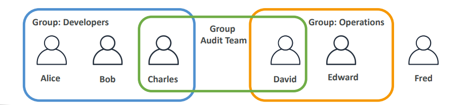
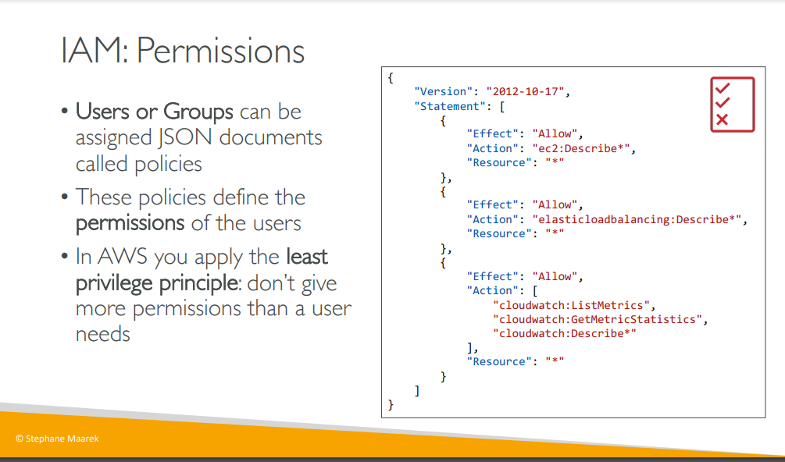
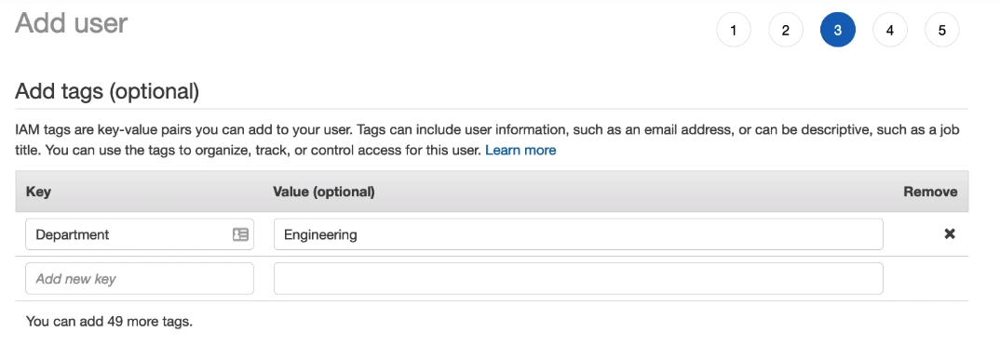
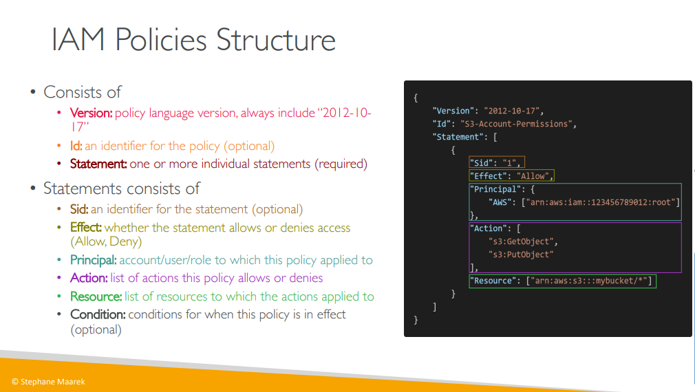

# IAM

- IAM - Identity and Access Management
- It is a global service, not a regional service

## IAM: Users & Groups

- In IAM, we create users and can assign them to groups
- Root account is **only** used for setting up our AWS account, because it has all the permissions and you can do anything you want. So it is dangerous. The better way is to create a user with administaror permissions in IAM, ie- an Admin account (Good practice)
- Groups can contain only users, not other groups
- One user can belong to multiple groups. And at the same time, it is not necessary that a user should belong to a group. A user can standalone aswell (Not best practice)
  

## IAM: Permissions
* Any user placed within a group will inherit the permissions associated with that group

  
> Permisssons are defined thru policies
### Adding tags while creating user
  
* Tags are used just for our understanding, to know what the entity is being used for. 

## IAM Policies Inheritance
 
> An inline policy is just nothing but creating a custom policy

## IAM Policies Structure
  