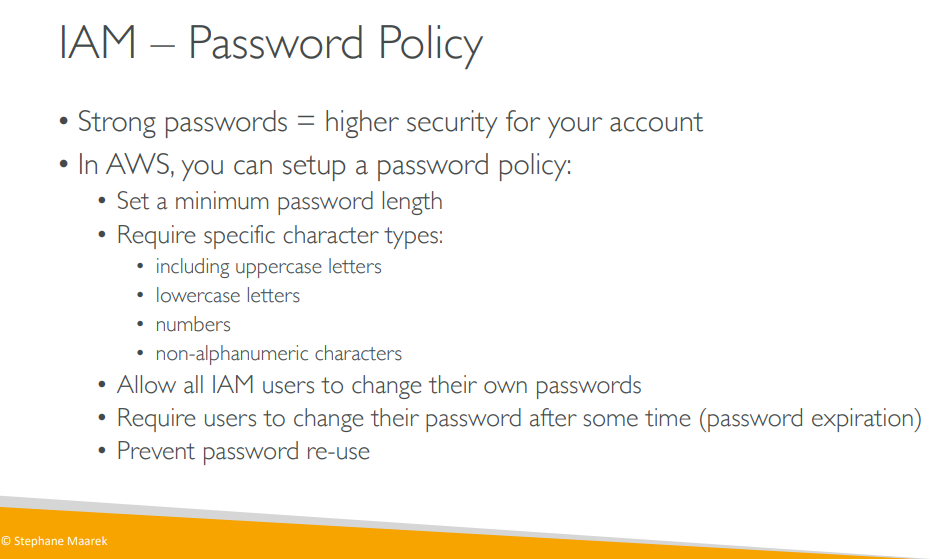
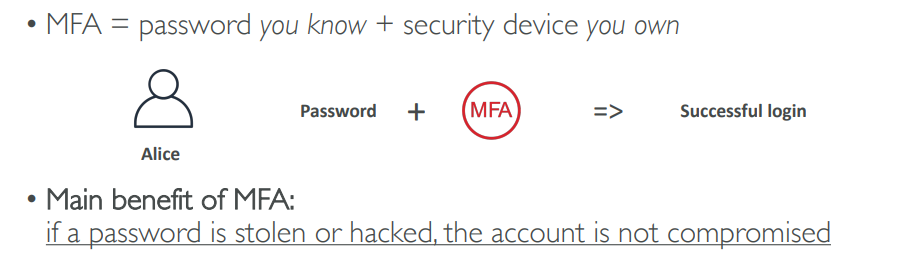
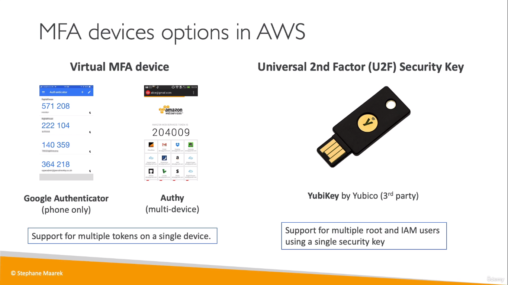
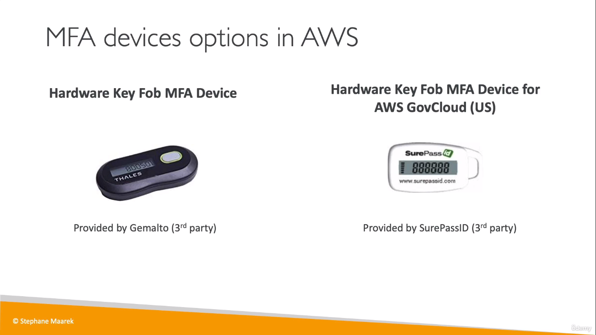

## IAM - Securing Account
* There are two methods to secure your account in AWS

### Password Policy
* First one is to create a Password Policy for your account which allows only Stronger passwords to be used
 

### Multi Factor Authentication (MFA) 
* Next one is to have **MFA** enabled on your account
  

## MFA devices
       

  
> you can enable only one MFA device per user.