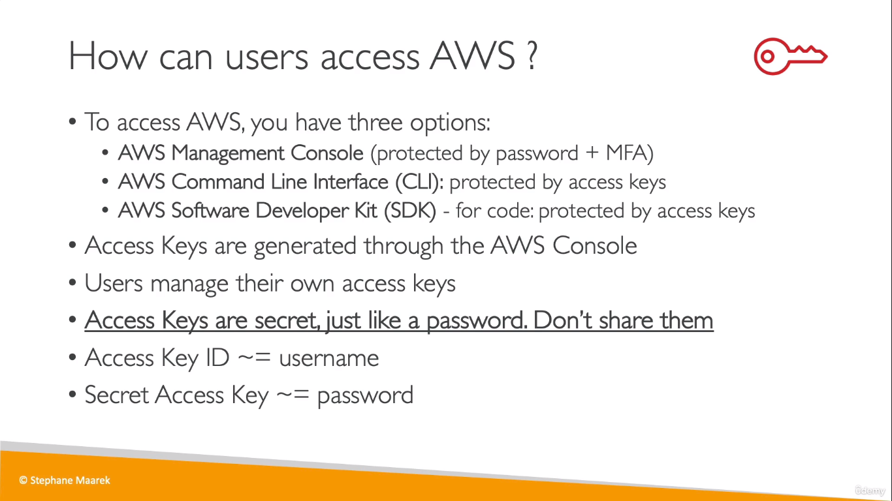
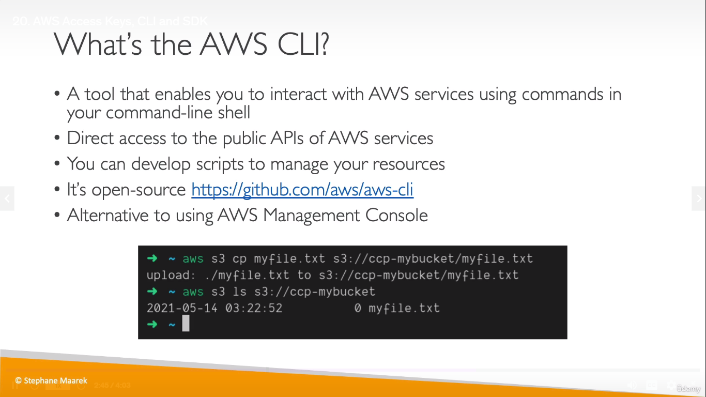
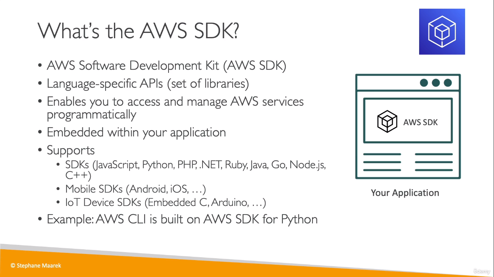

## AWS CLI
  
  
## AWS SDK  
* It is basically like a module in different programming languages that helps you interact with AWS
  

## CLI Commands
```
aws --version
```
* Displays the version of aws installed
```
aws configure
```
* Prompts for access key and region name, to connect to your AWS account
```
aws iam list-users
```
* Lists iam users
> You also can use the AWS Cloudshell (from the Managmenet Console) instead of the AWS CLI