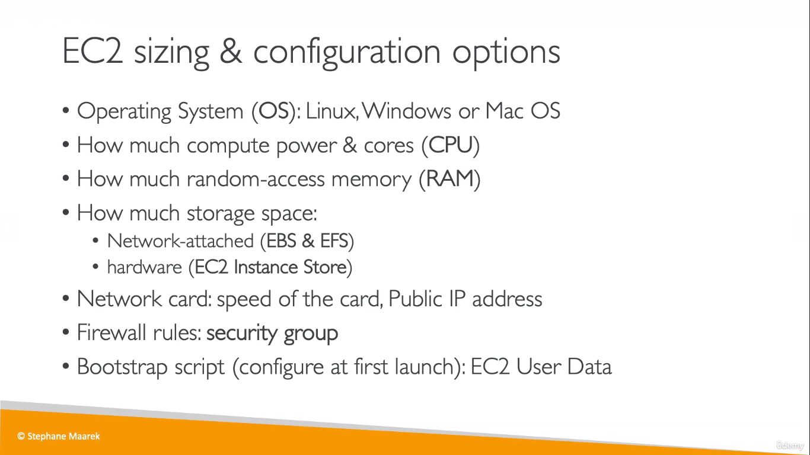
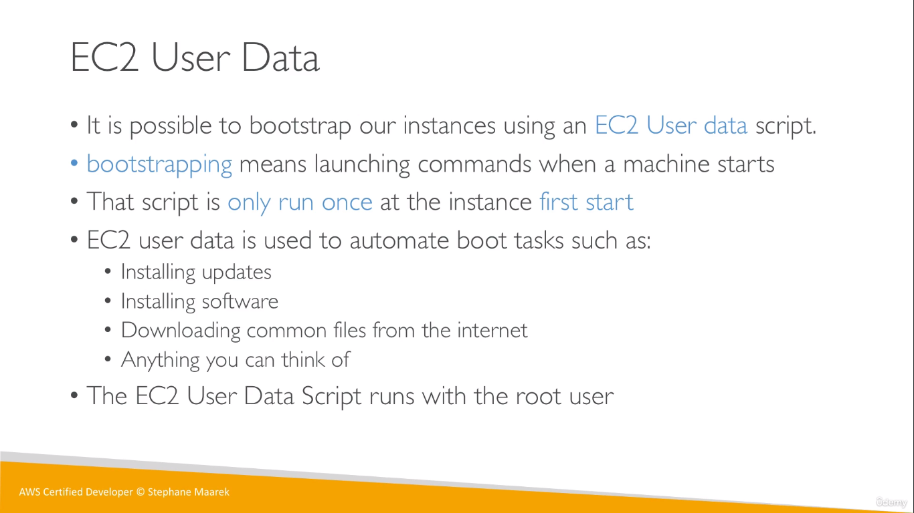

# EC2
* EC2 = **Elastic Compute Cloud** = Infrastructure as a Service (Iaas)
* It mainly consists in the capability of :
    * Renting virtual machines called _**EC2 instances**_
    * Storing data on virtual drives (EBS)
    * Distributing load across machines (ELB)
    * Scaling the services using an auto-scaling group (ASG)

## EC2 instance - sizing & configuration
  

## EC2 User Data (Script)
  
> The EC2 User Data Script runs with the root user in the virtual machine (as "sudo")

## Hands On Notes
* To start an instance first, we need to choose an AMI (Amazon Machine Image)
    * An **AMI** is a template that contains the software configuration (operating system, application server, and applications) required to launch your instance. 
* When you stop an instance and start it again, the _Public IPv4 address_ is changed 
> VPC - Virtual Private Cloud