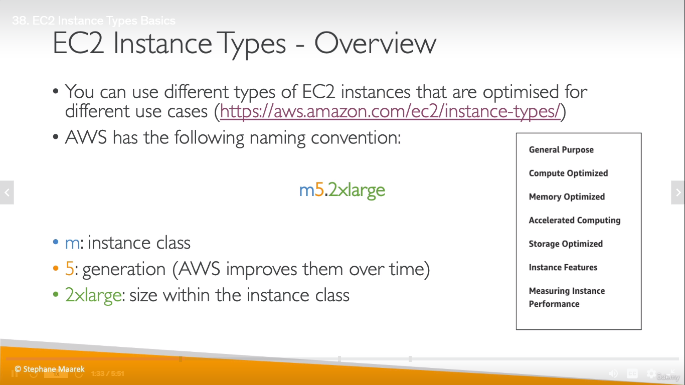
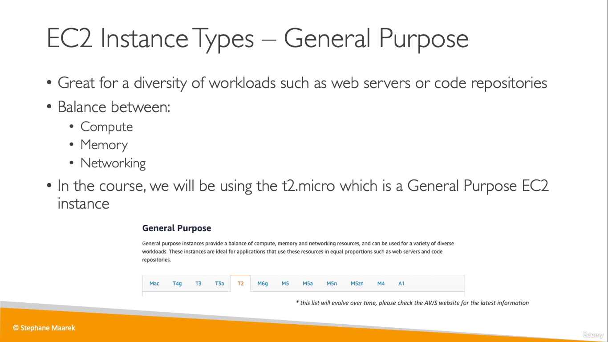
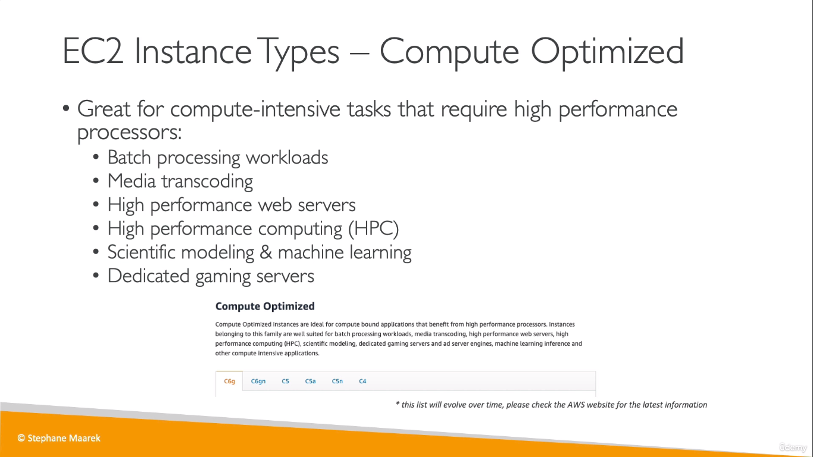
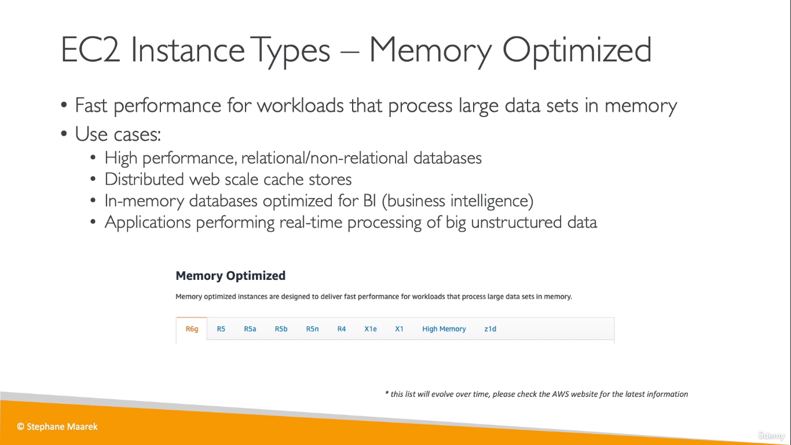
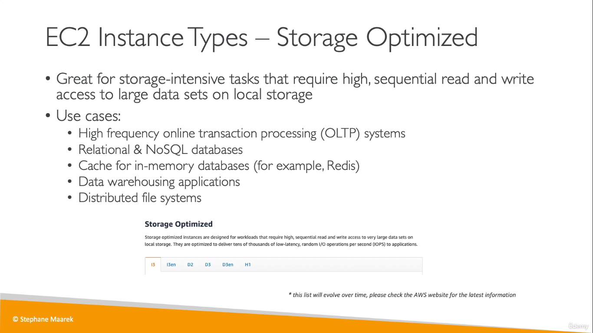
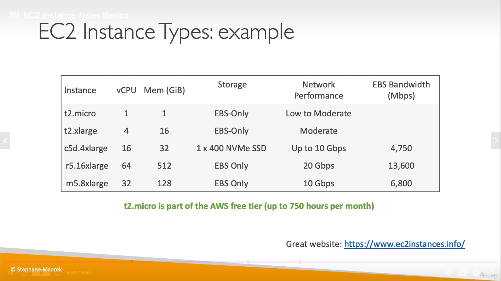

# EC2 Instance types
  
## General Purpose Instances
  
## Compute Optimized Instances
  
> The instance types usually starts with 'C'
## Memory Optimized Instances
 
> These instance types usually starts with 'R' (R for RAM)

## Storage Optimized Instances

## Examples
  