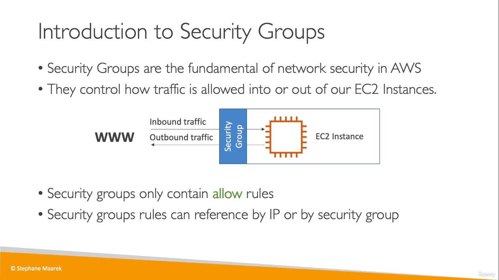
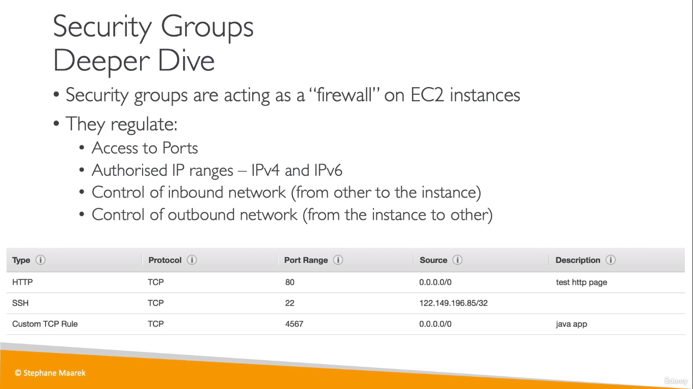
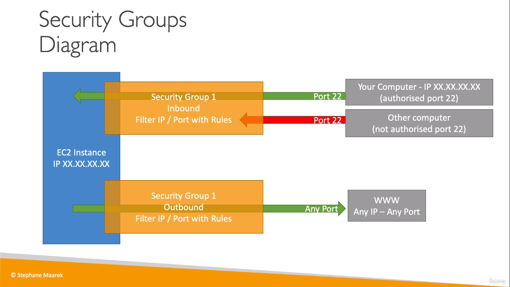
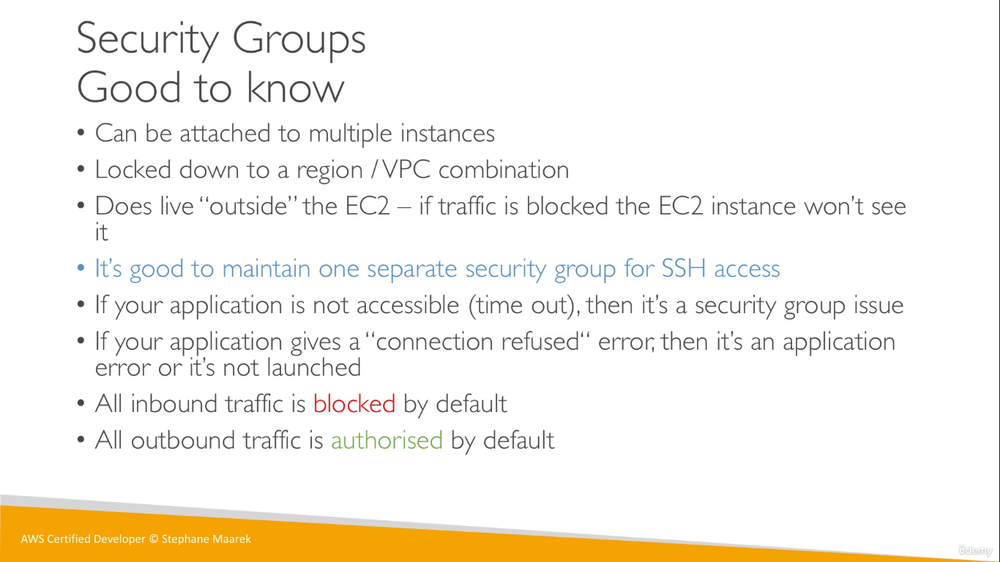
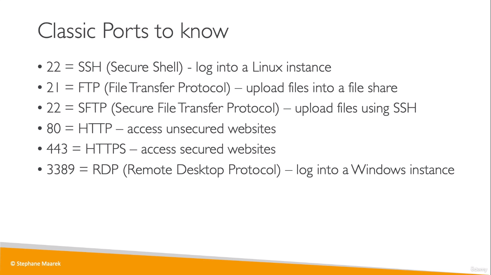

# Security Groups
* These are nothing but just a firewall for an EC2 instance
* These contain rules on what traffic needs to be allowed to the EC2 instance just like how we defined `ufw` rules in Linux
  
  
  
  
  

## Classic Ports
  

