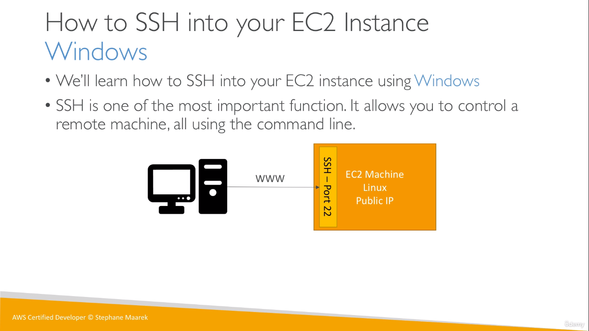

## SSH
  
* We SSH using the _Public IPv4 address_ of our EC2 Instance
* And **ec2-user** is the user that we use to login to our EC2 Instance

_Command for SSH using cmd_
```
ssh -i <path_to_private_key_file> ec2-user@<IPv4 address>

ssh -i C:\Users\User\Downloads\EC2Tutorial.pem ec2-user@3.89.127.62
```
* We also need to ensure that the private key file has the right permissions (for which we use `chmod` in Linux)
---
And **EC2 Instance Connect** (from the Managment Console) is another way to connect to your virtual machine
* However, it is also internally reliable on SSH, so you need to have allow SSH in the attached security group
* The VM (Amazon Linux 2 AMI) comes with the AWS CLI already installed
    * So, to run commands with the AWS CLI, we need to configure aws in the CLI
    * But, entering access key details is not the best practice as the EC2 instance can be accessed by other users in the same account aswell
    * So here, we attach an **IAM Role** with necessary permissions to our EC2 Instance