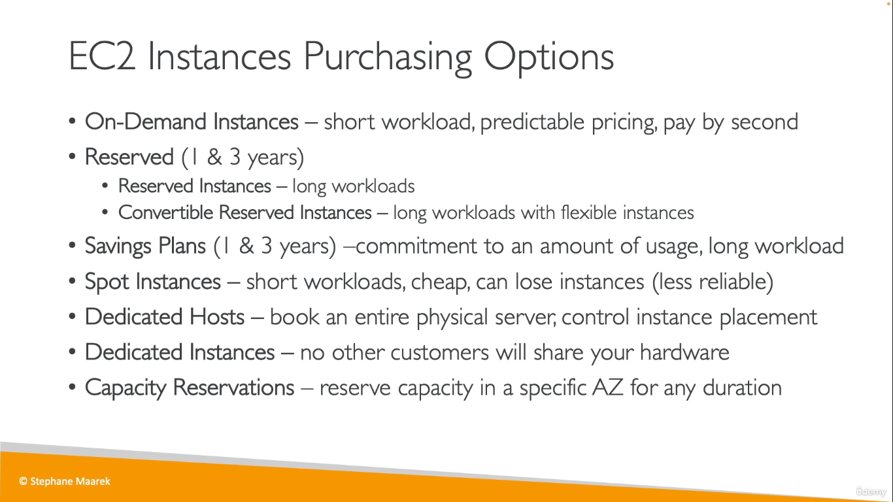
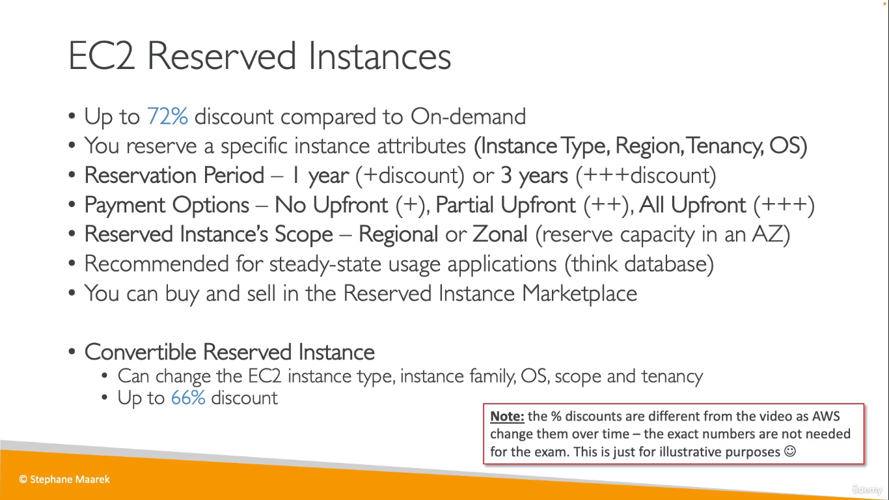
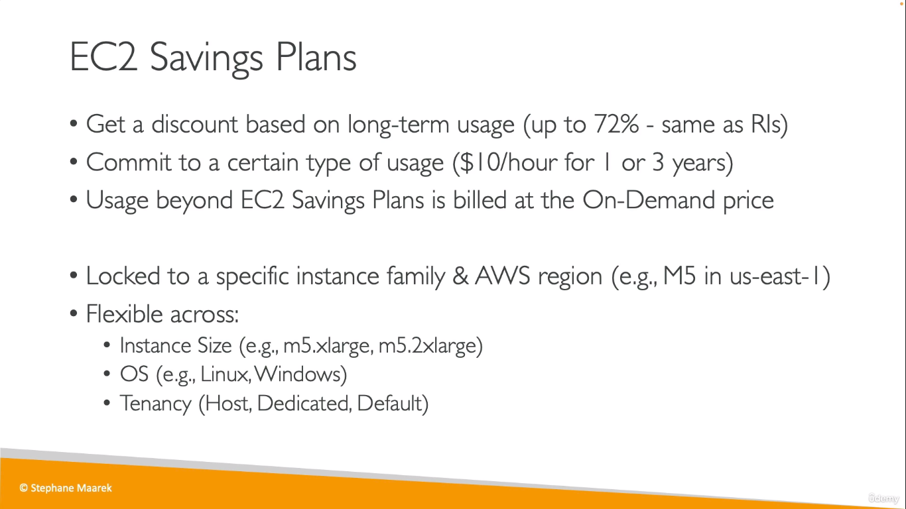
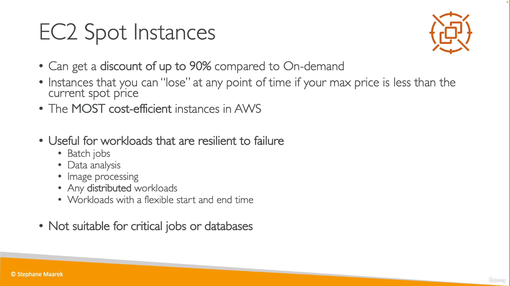
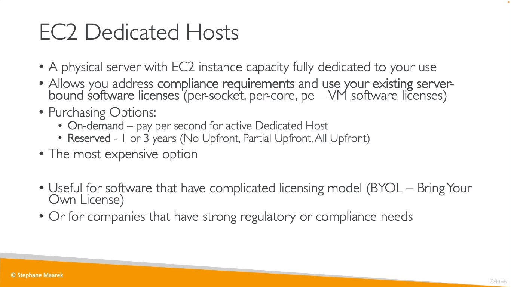
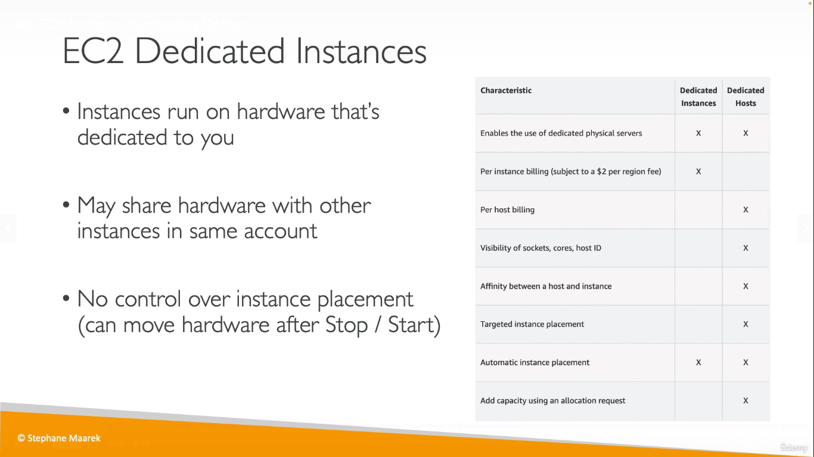
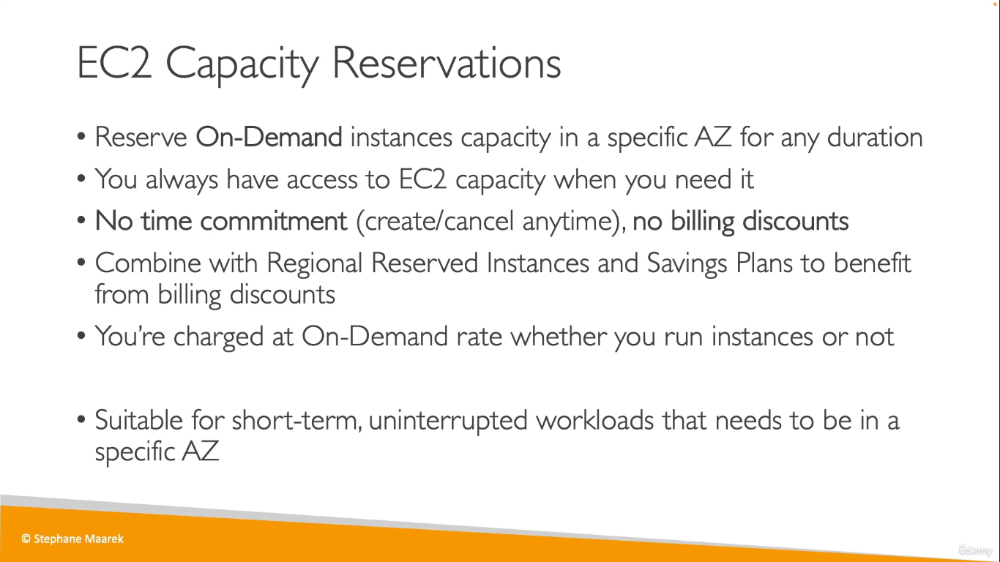

> Asked in EXAMS

 
## On demand
  
## Reserved Instances
  
## Savings Plan
  
## EC2 Spot Instances
  
* Biggest Discount
> You lose your instance id the bidded price is greater than your max price
## EC2 Dedicated Host
  

## EC2 Dedicated Instance
  
* In Dedicated Instance, your Instance runs on a hardware allocated for you but, in Dedicated Host, you get complete access to the physical server itself

## EC2 Capacity Reservations

