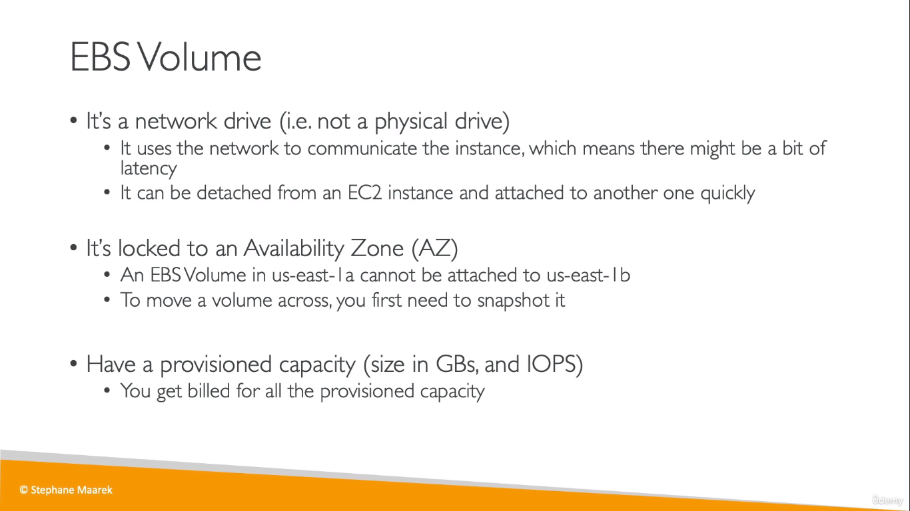
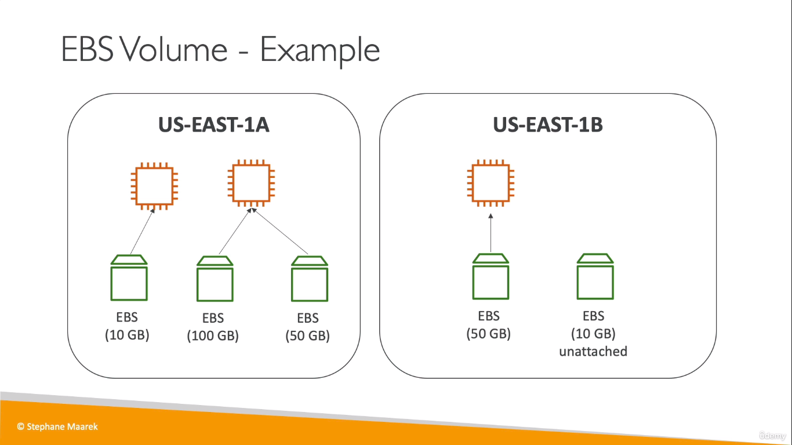
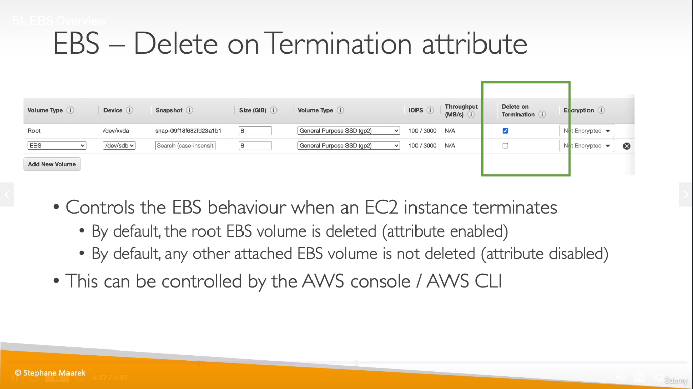
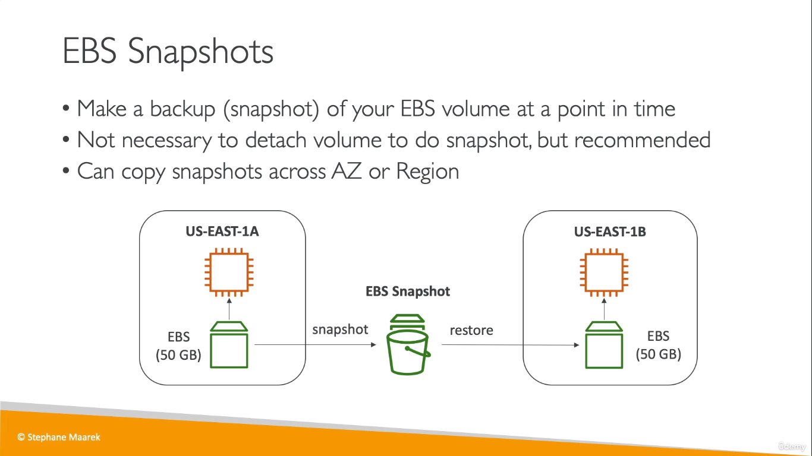

# EBS 
* **EBS** = Elastic Block Store
* An EBS Volume is a network drive (a Storage Device) you can attach
to your instances while they run
* It allows your instances to persist data, even after their termination
* You can mount the EBS volume to an EC2 instance and use all the previous data even though you terminated the last EC2 instance
* They can only be mounted to one instance at a time 
* They are bound to a specific availability zone. So, instances running in on AZ cannot use the EBS volumes created in another AZ. 

  
> IOPS - Input Output Operations per Second

  
* One EBS volume cannot be attached to multiple EC2 instances at the same time but an EC2 instance can have multiple EBS volumes at the same time

## _Delete On Termination_
  

## EBS Snapshots
* A snapshot is nothing but a backup of your EBS volume

 

## Archive & RecycleBin
  