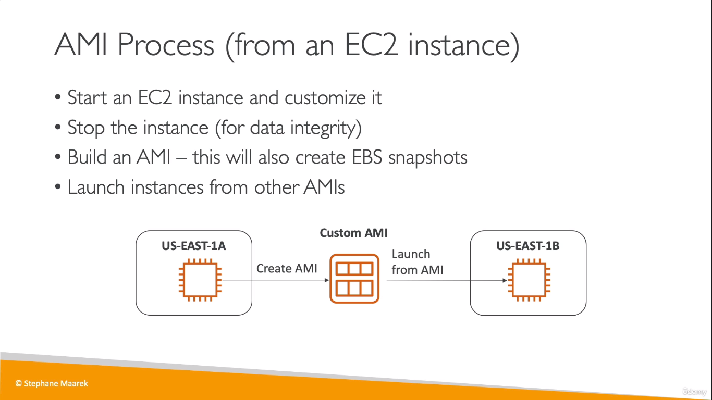
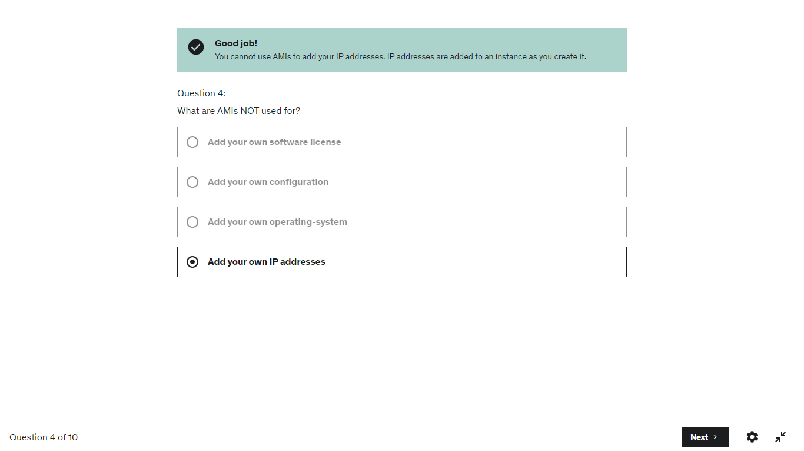

# AMI
* AMI = Amazon Machine Image

  
## Process of creating an AMI
* First, we create an EC2 instance from the default AMI by AWS itself
    * Here, while creating the instance, we use the _user data script_ to install packages (and hence modifying the default AMI)
        ```
        #!/bin/bash
        # Use this for your user data (script from top to bottom)
        # install httpd (Linux 2 version)
        yum update -y
        yum install -y httpd
        systemctl start httpd
        systemctl enable httpd
        ```
* Then, from the instance that is running now, we create our AMI (which now installs all the packages required on boot)
* Hence, the AMI is created from now which we can launch EC2 instances instead of using the default one by AWS
> Building an AMI from an EC2 instance will also create EBS snapshots of the volumes attached

  

---
AMIs can be used to:
* Add your own software licenses
* Add your own configuration
* Add your own OS
 