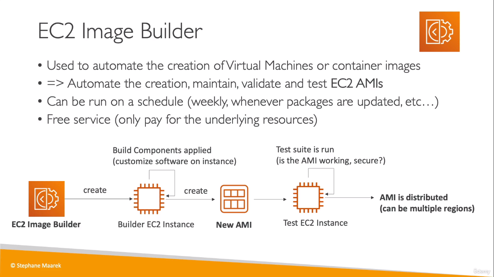

# EC2 Image Builder
* Used to automate building images from EC2 instances (like we did using GitHub Actions in FastAPI)
  
* In this image builder, you first create an EC2 instance from the default AMI like we did before
* Then, we customize it. For ex: Install new packages, update existing ones, etc...
    * This customization part is called creating a _recipe_
* Then, from the current instance a new AMI image is created which is then tested (if you opted for testing) and then it is available for you to use across different regions
* This can be done manually aswell like we've seen before but if we need to build (or update) the image on a regular basis so that our AMI stays up to date, we can make use of the **EC2 Image Builder**