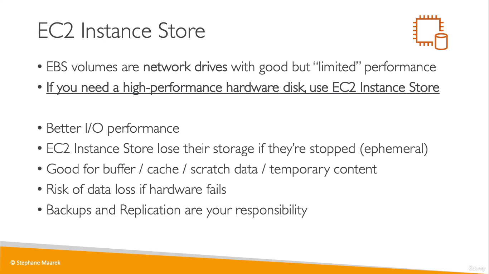

# EC2 Instance Store
**EC2 Instance Store** is nothing but physical hardware that gets attached with the EC2 Instance instead of EBS volumes which are network devices
  
* If an attached volume to an EC2 instance is a high performance drive, then it must be an _EC2 Instance Store_
> Shitty Name tho