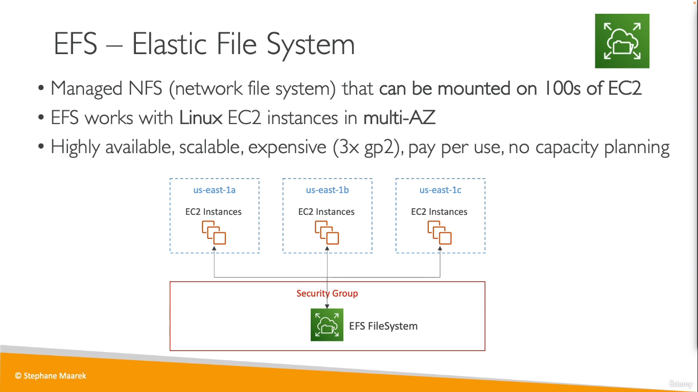
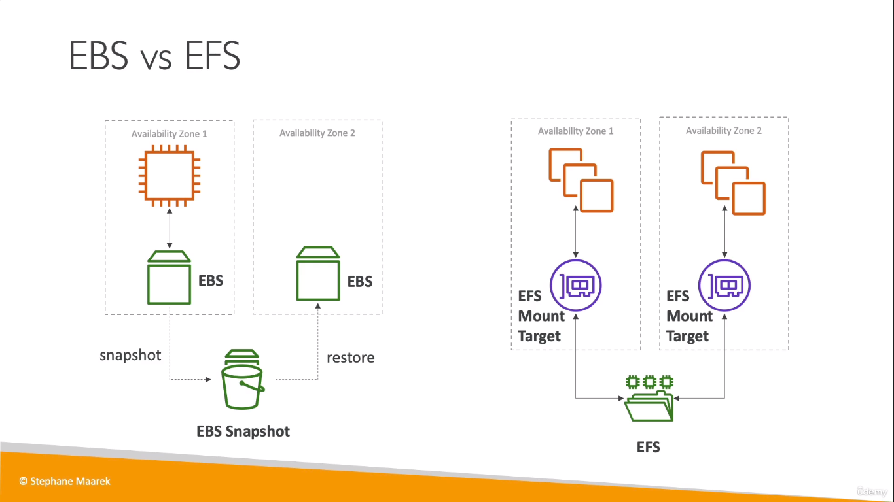
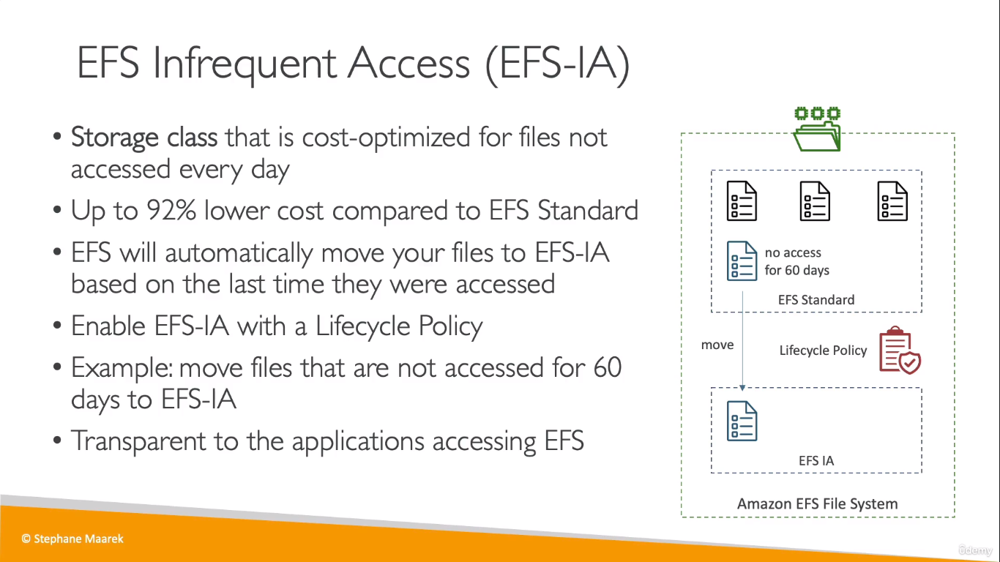

# EFS 
* EFS = Elastic File System
* Storage Device that can mount on multiple EC2 instances at the same time unlike EBS 

  

## EBS vs EFS
  

## EFS-IA
* A storage class of EFA, where files not freequently accessed are move to a storage class called _EFS-IA_ which has lower pricing compared to _Standard EFS_
  