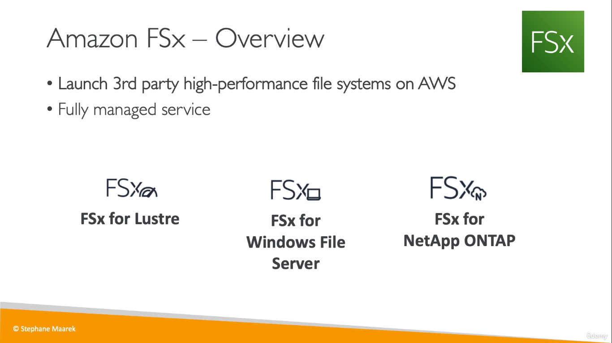
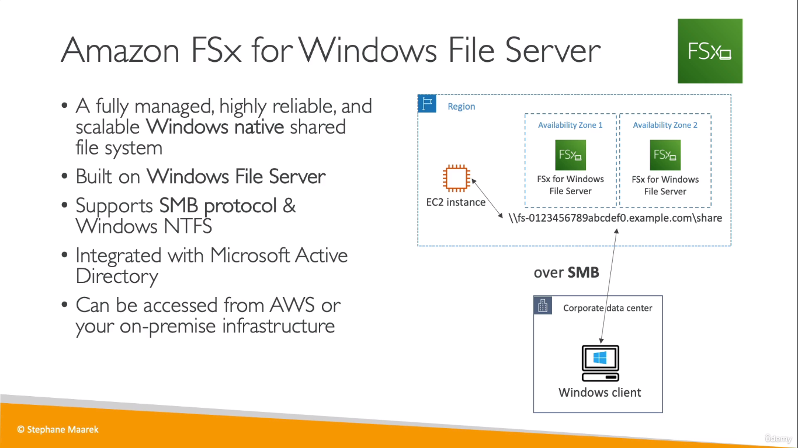
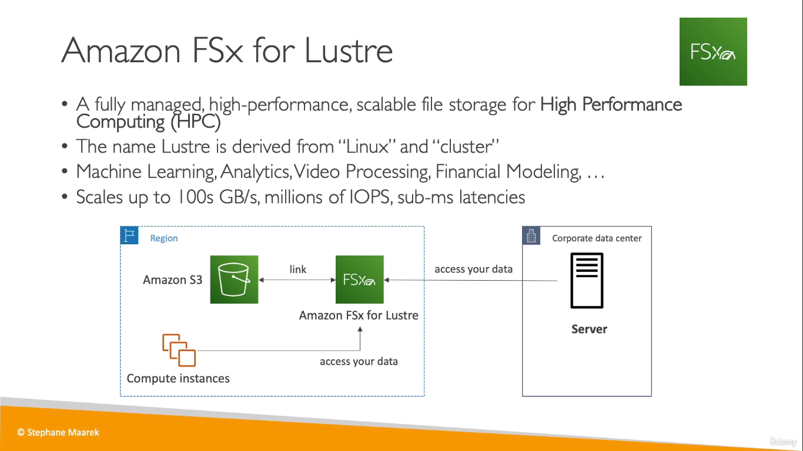

# FSx
* Amazon FSx makes it easy and cost effective to launch and run popular file systems that are fully managed by AWS. It comes in two offerings: FSx for Windows File Server (used for business applications), and FSx for Lustre (used for high-performance computing).
  

## FSx for Windows
  

## FSx for Linux
  