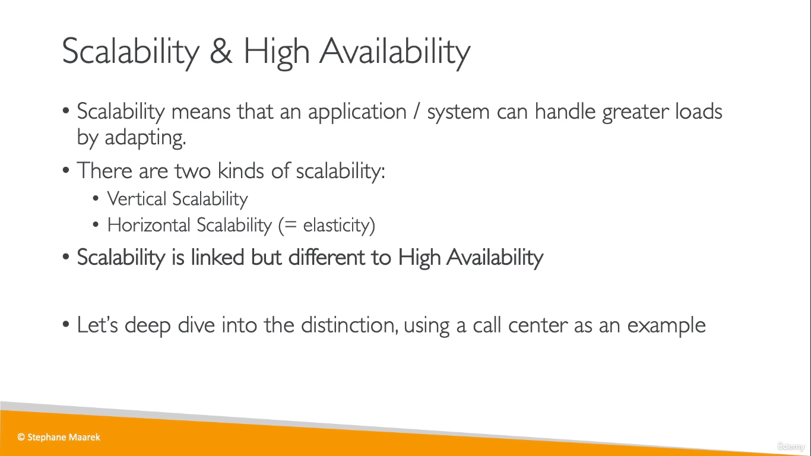
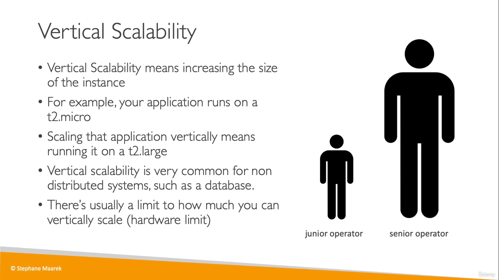
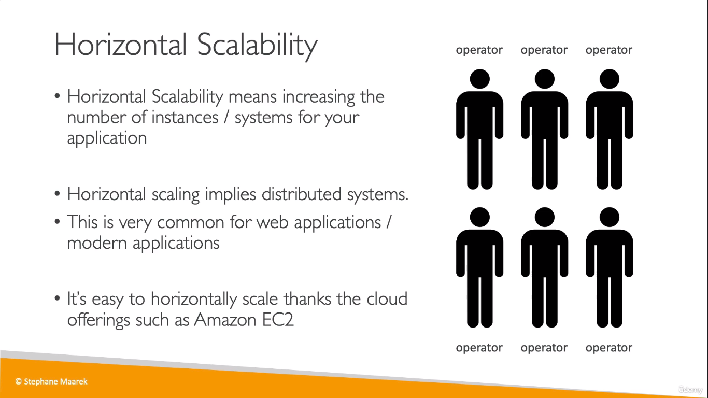
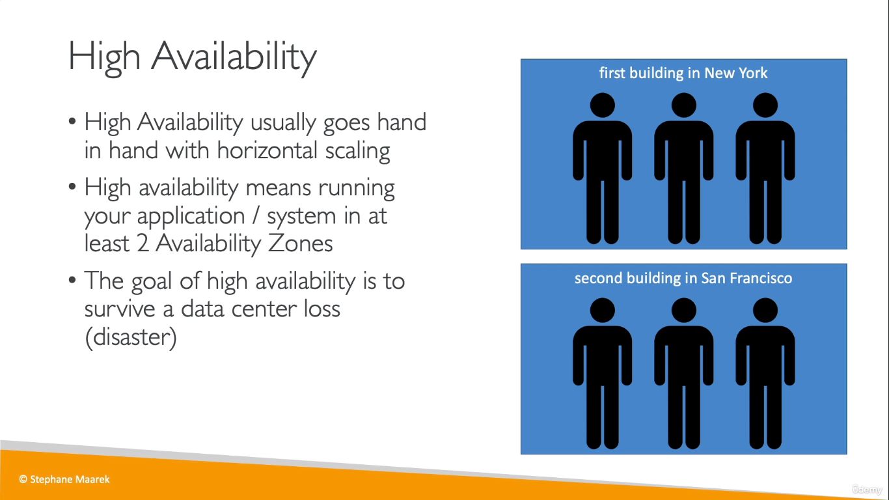
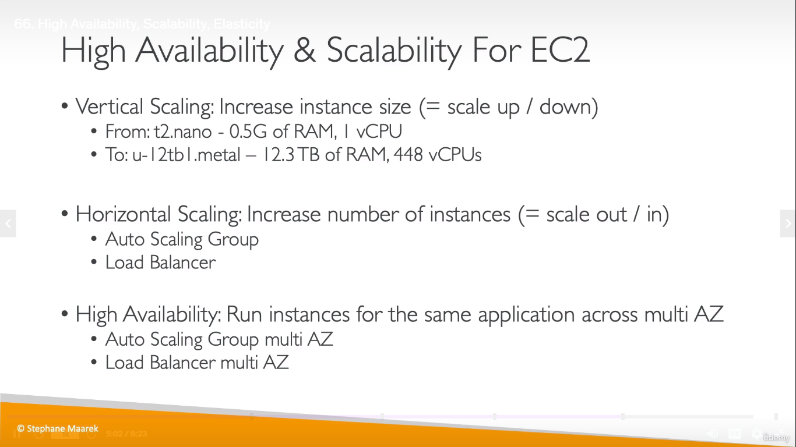
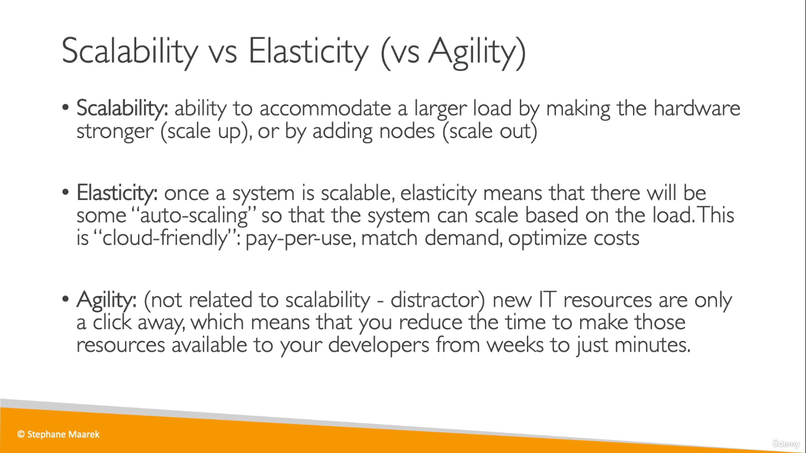

# Scalability
   

## Vertical Scalability
  

## Horizontal Scalability
  

## High Availability
  
> High Availability = Running instances in more AZs
___
* Scaling **out** = Increasing no. of instances
* Scaling **in** = Reducing no. of instances

  

## Scalability vs Elasticity vs Agility
  