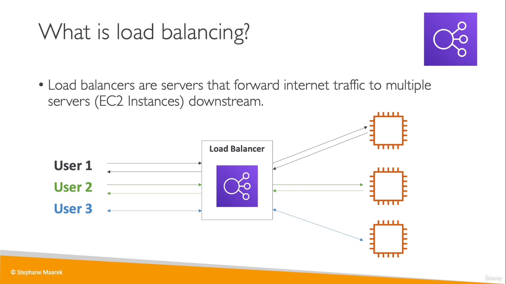
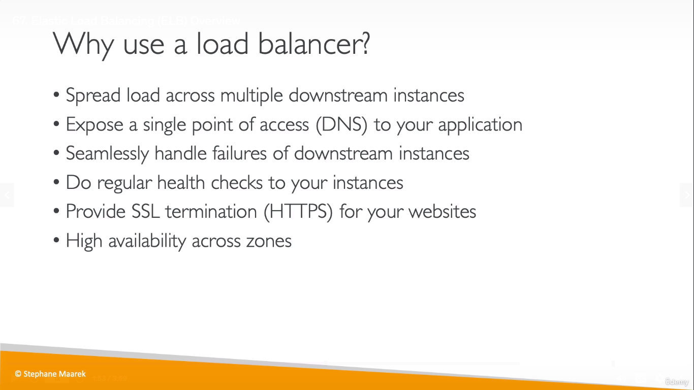
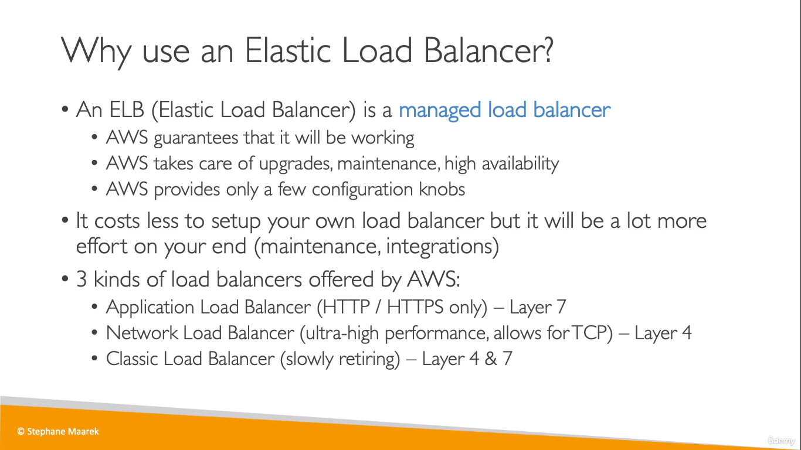

___
 
* A load balancer can contain EC2 instances that runs in different AZs but while configuring your LB, make sure to make your LB available across multiple AZs

* A load balancer listens on a specific port (port 80 in case of HTTP) and routes the traffic to what is called a _target group_
    * A **target group** is a group of EC2 instances (that might be running across multiple AZs) 

* If any of the instances running is found unhealthy, the load balancer routes the traffic and balances it across other healthy EC2 instances
___

* A _Network Load Balancer_ can handle millions of requests per second with low-latency. It operates at Layer 4, and is best-suited for load-balancing TCP, UDP, and TLS traffic with ultra high-performance.
 
    
___
> Out of scope :-  
* There is also another load balancer called the _Gateway Load Balancer_  
   * It is helpful when you need to analyze your IP traffic and send it to third party appliances