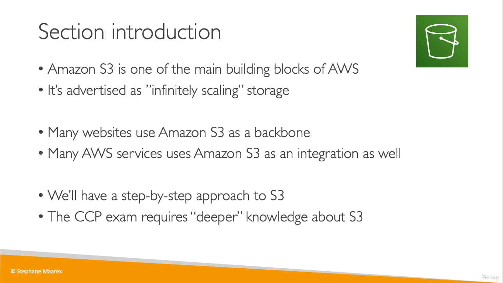
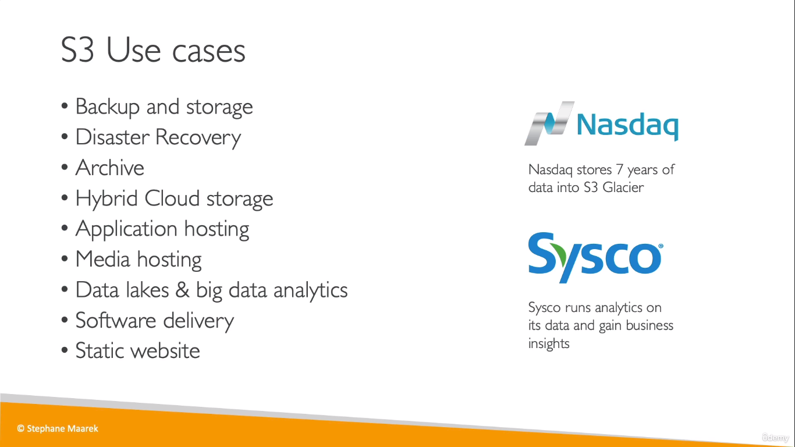
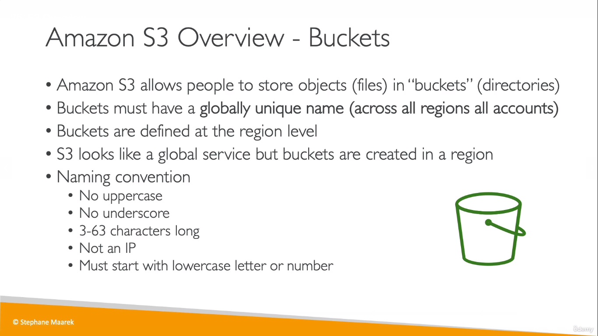
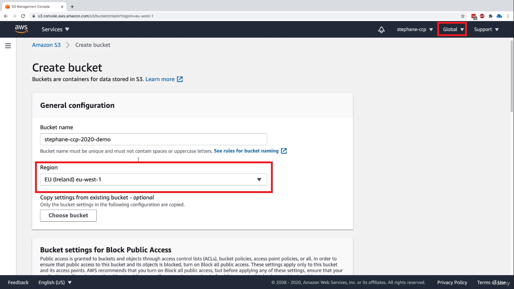
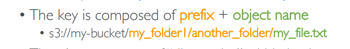
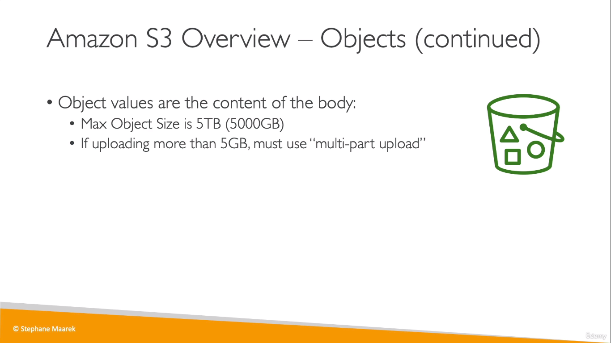
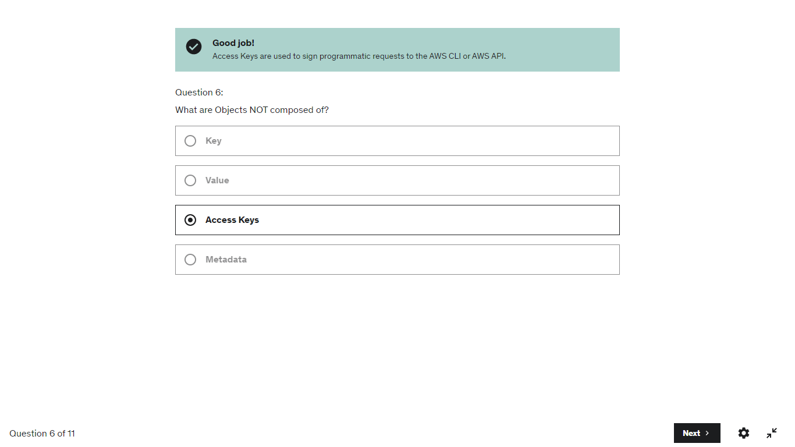

# S3
> # Crucial Topic For Exam
 
* EBS Snapshot is actually stored in an S3 Bucket 

  
  
* The bucket must have a unique name, not only within your AWS account, but completely unique
* The S3 Console in AWS is a global console, but while creating an S3 Bucket, it it linked to a region
  

## Objects
* Objects (files) have a Key  

* The folders are internally considered as objects. 
 
  

---
## Note
* To delete a bucket, you need to delete all the objects first
* And If _Bucket Versioning_ is enabled, then you need to make sure you _permanently delete_ the objects before deleting the bucket