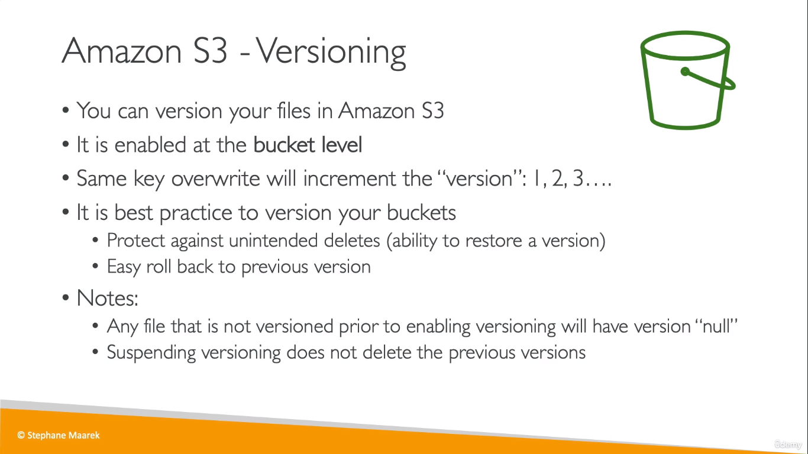
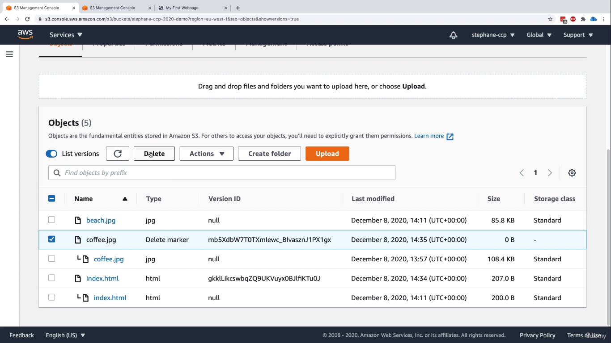

# S3 Versioning
  
* Even when you delete a root object (ie- the first and only version of the object), you can rollback the changes, if you have _Bucket Versioning_ enabled
    * Because,  internally, only a delete marker is placed

  