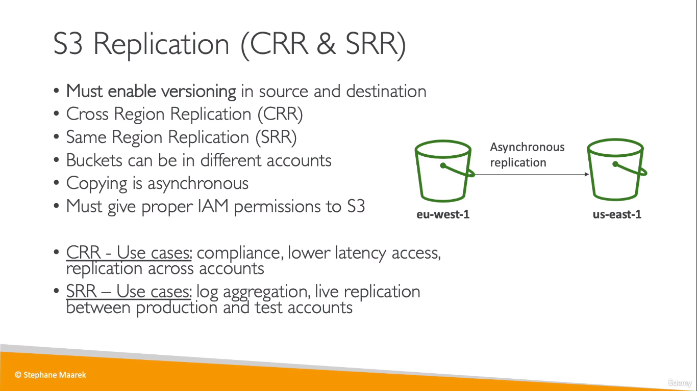
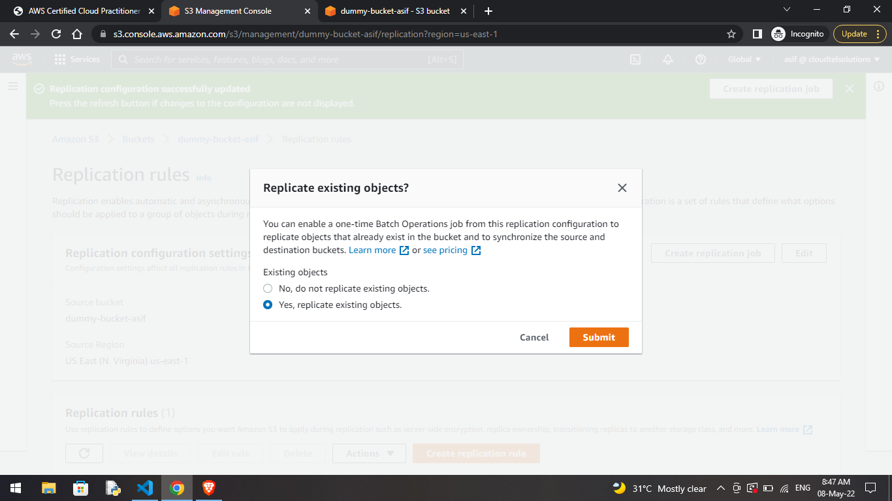
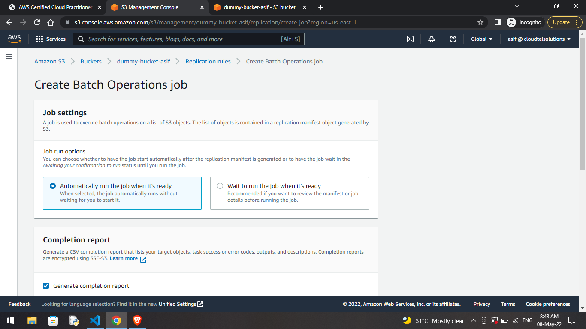

# S3 Replication

> asynchronous = happens in the background  
* In the tutorial, objects before enabling replication, are not replicated into the new bucket

* But now in the actual hands-on, you could actuallly replicate the old objects aswell using something called _Batch Operations jobs_
 
  

___
## Note
* Before deleting the replicated bucket, you need to delete the _replication rule_ that you added in the main bucket