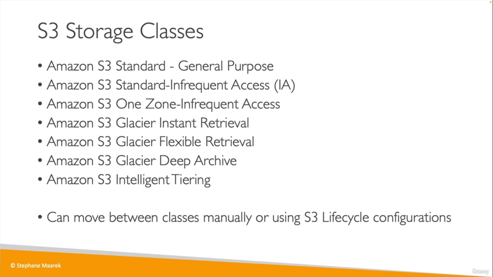
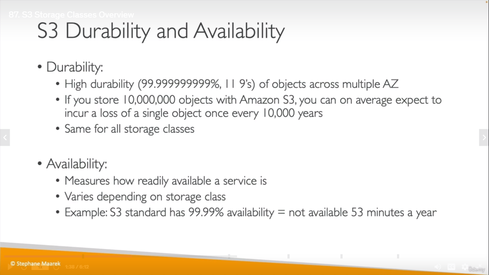
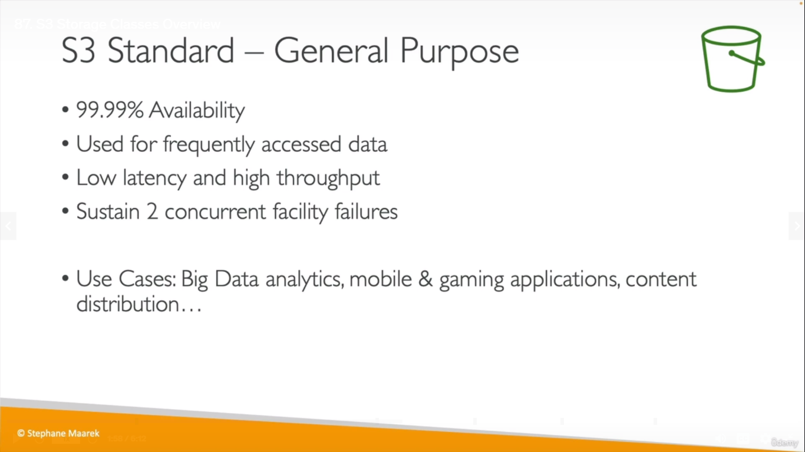
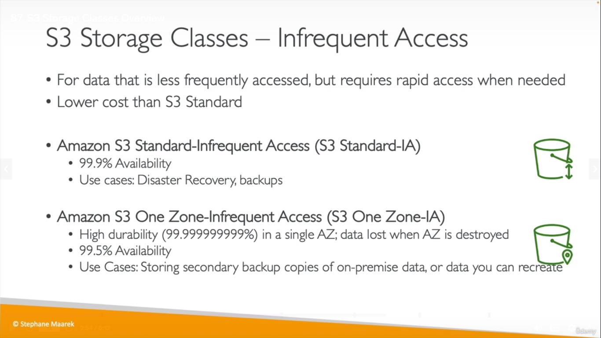
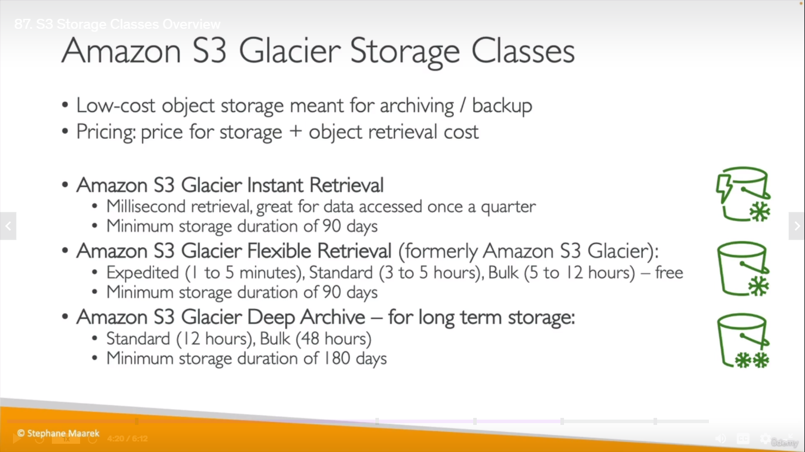
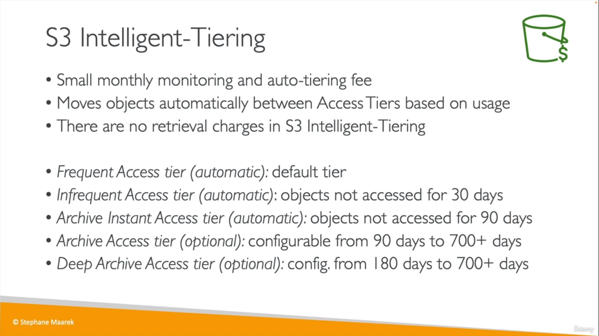
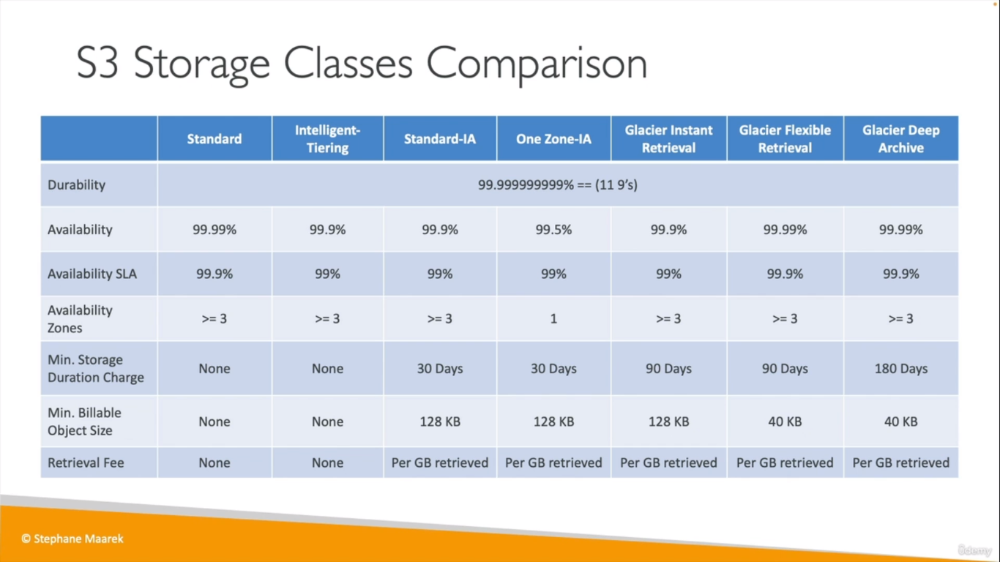
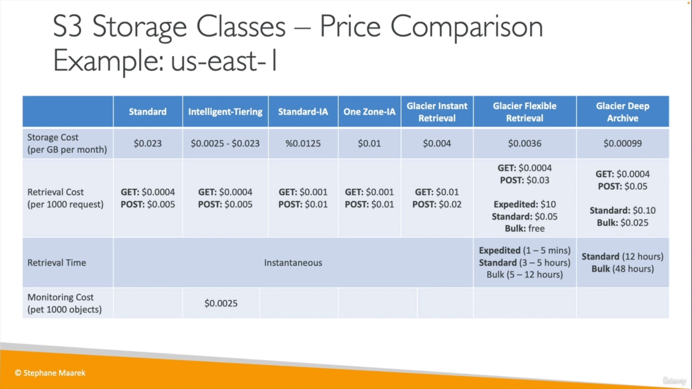
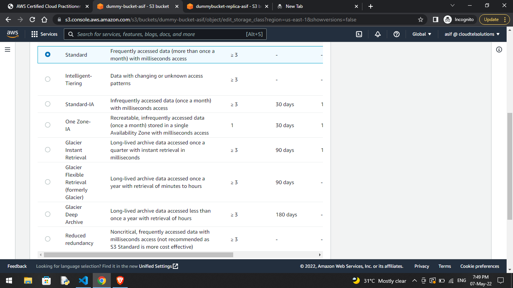

# S3 Storage Classes
  

## Durability vs Availability
  
___
## S3 Standard
  
## S3 IA
  
* Cost on retrieval
# S3 Glacier
  
# S3 Intelligent Tiering
  
> Note: In Intelligent Tiering, we move between the tiers within that storage class but with a **_Lifecycle Policy_**, we can move between different storage classes (based on how we configure the policy)
___
> For reference (not for exam)
  
  
 
  