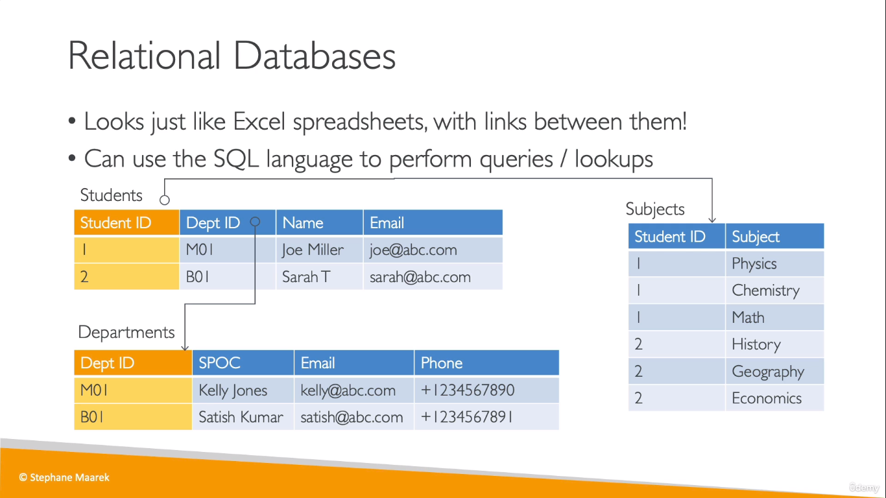
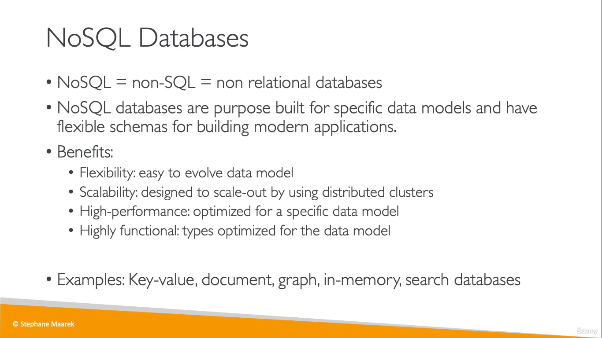
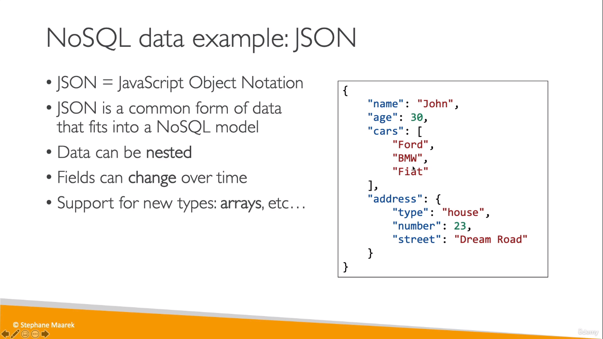
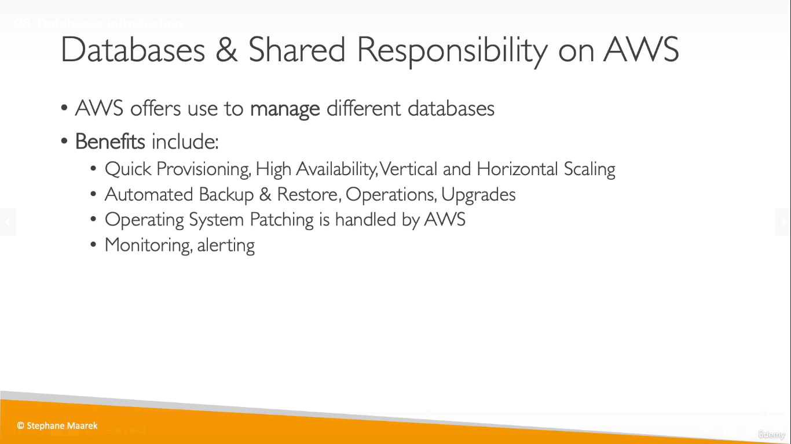

## Types of Databases

### Relational Database
  
* The idea behind relational databases is that you can define relations between multiple tables

### Non Relational Database
  
  

## Why AWS for databases?
  
* You can also run your database technologies on EC2, but you must
handle yourself the resiliency, backup, patching, high availability, fault tolerance, scaling… 