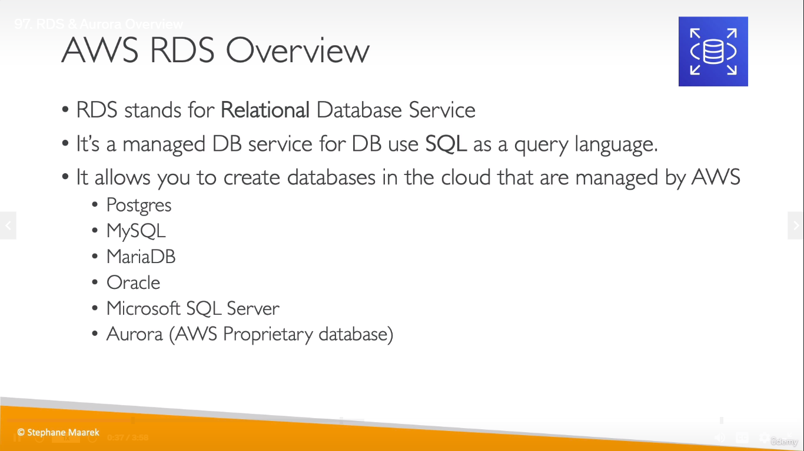
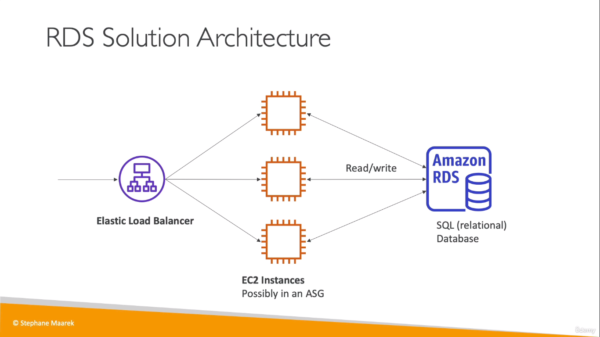
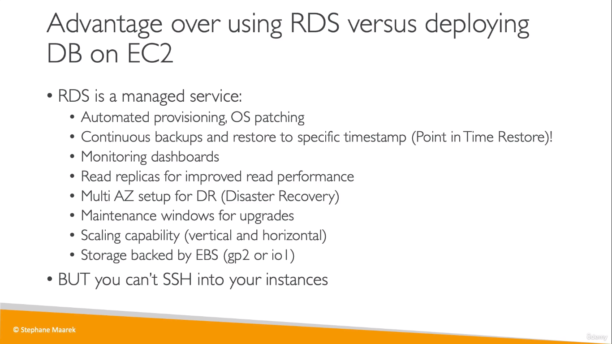
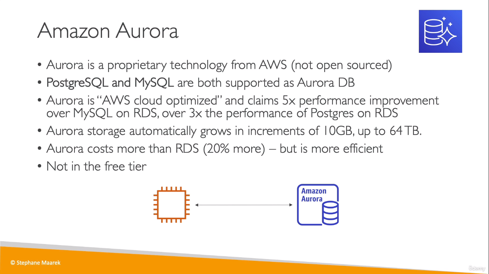
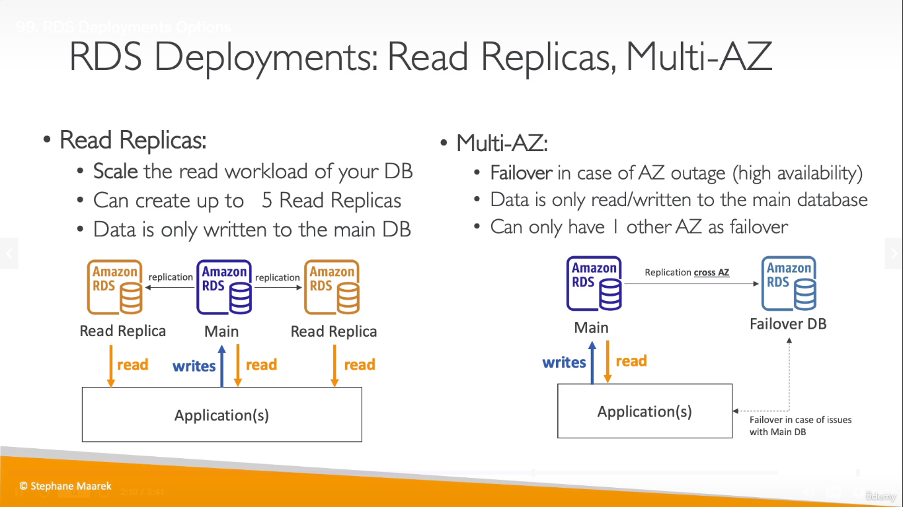
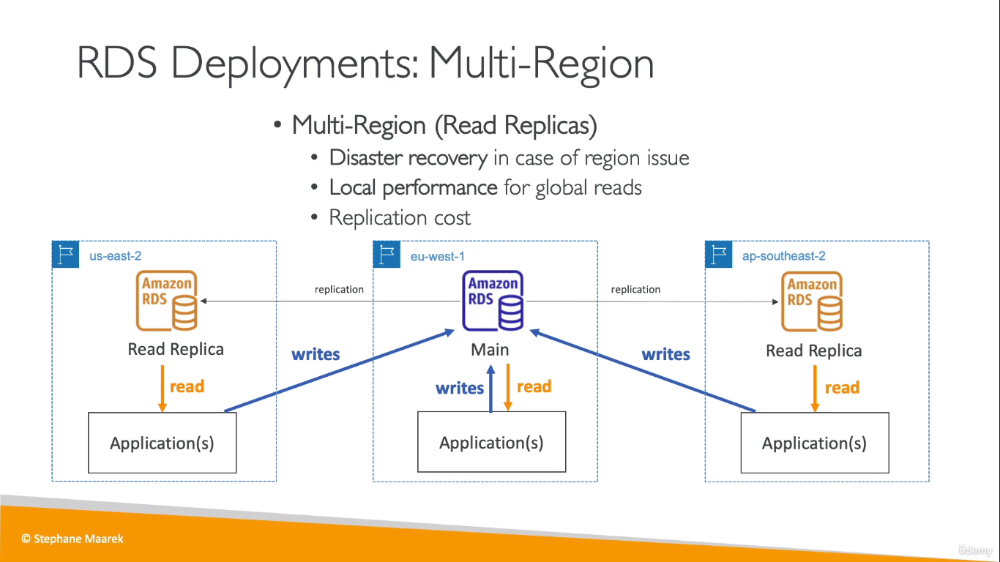

# AWS RDS 
RDS = Relational Database Service
  
  

## Why RDS?
 
* "RDS is good for OLTP"
> OLTP - On-line transaction processing
# Amazon Aurora
  
___
**RDS** and **Aurora** are going to be the two ways to create a Relational Database in AWS
* _ElastiCache_ is also for RDS, but it is just a cache service

# RDS Deployments

  

