# DB Services

## ElastiCache
* **In Memory Databases** = ElastiCache

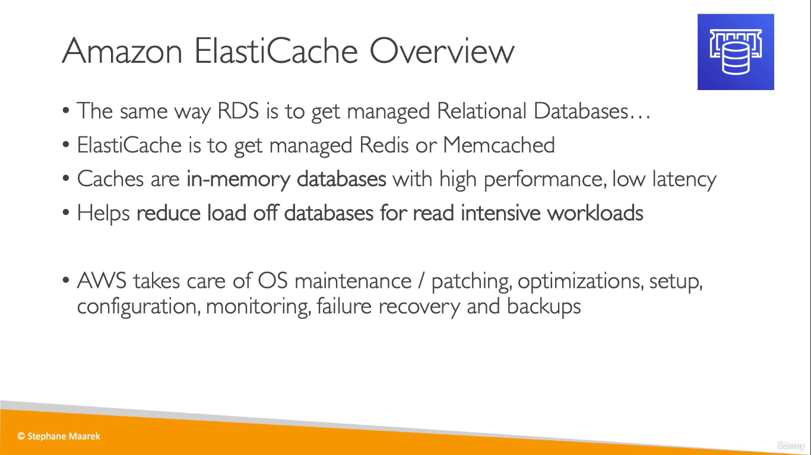  
  

## DynamoDB

* **Serverless**, **single digit millisecond latency** => Dynamo DB

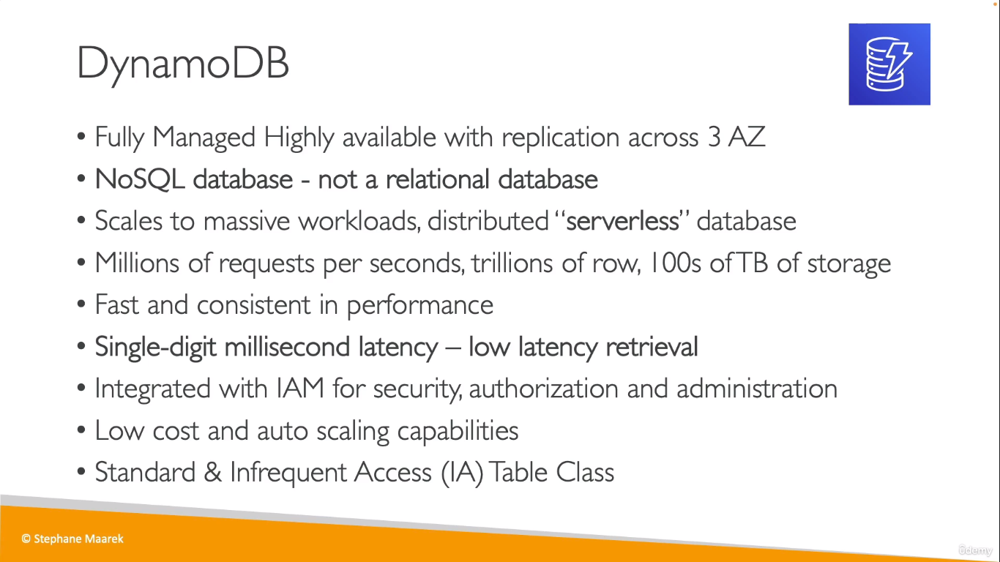  
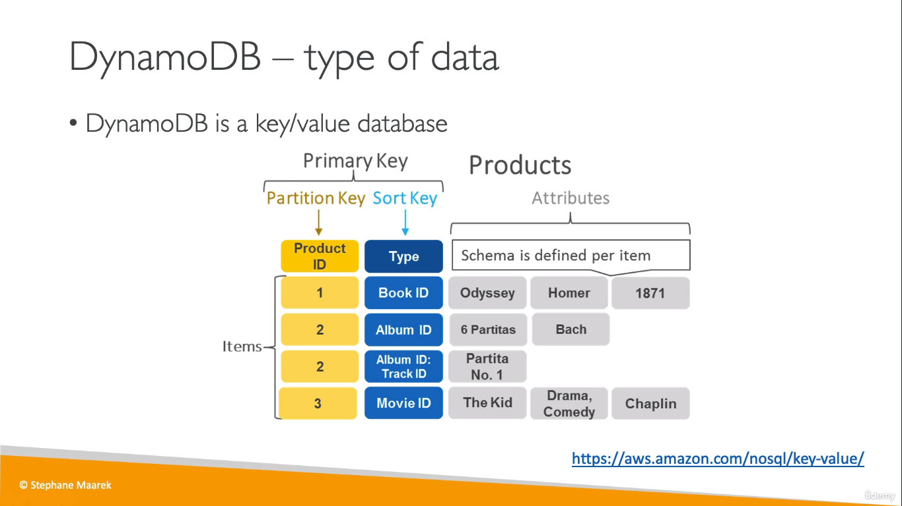  

### DynamoDB Accelerator - DAX
* In memory cache system for DynamoDB => DAX

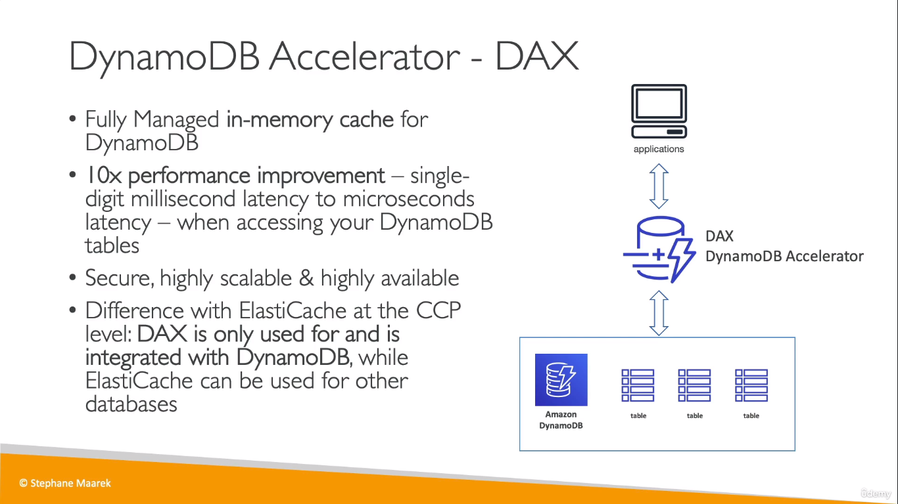  

### DynamoDB - Global Tables
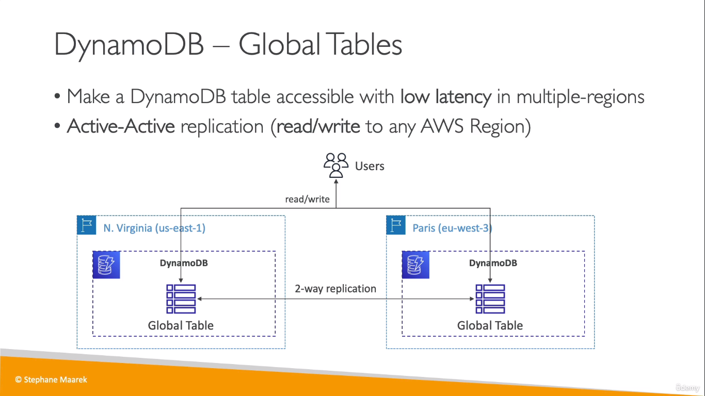  

___

## DocumentDB
* NoSQL version of _Aurora_

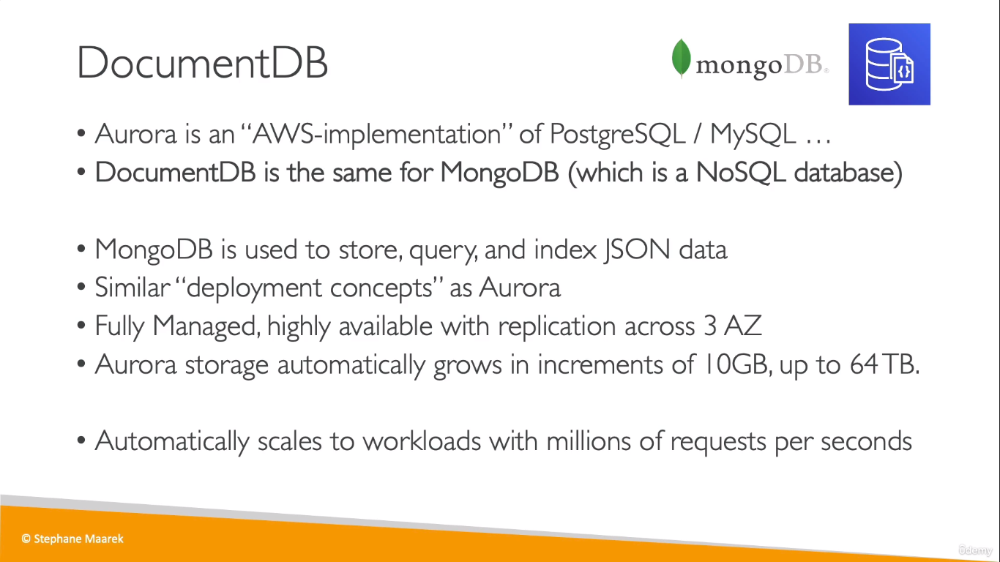  

## Amazon Neptune
* **graph** => Amazon Neptune

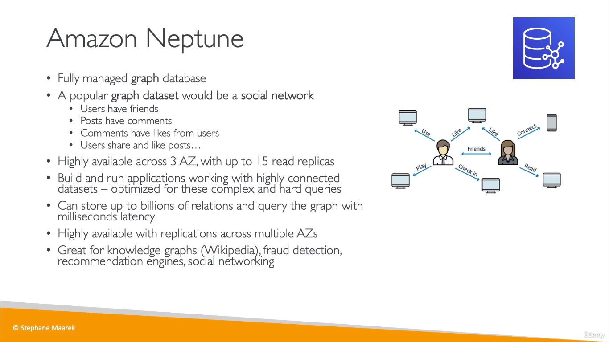  

## QLDB
Quantum Ledger Database
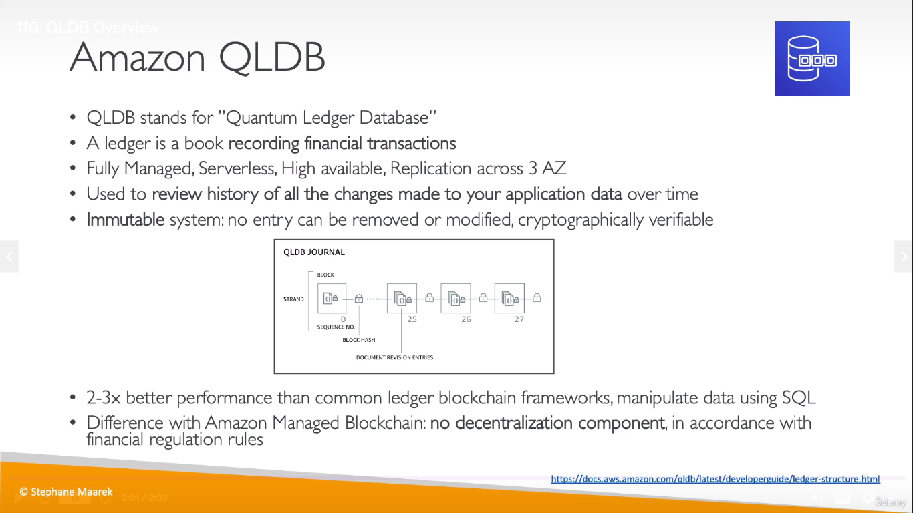  

## Amazon Managed Blockchain
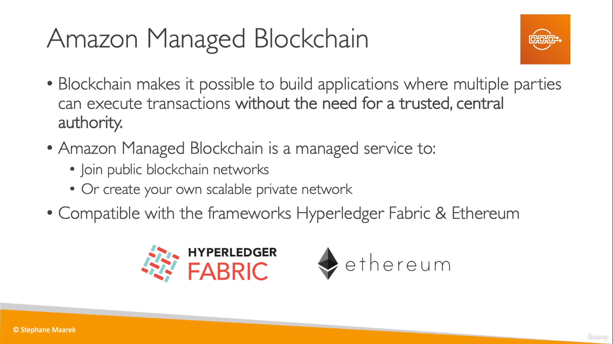  
* Amazon Managed Blockchain is a fully managed service that makes it easy to create and manage scalable blockchain networks using the popular open source frameworks Hyperledger Fabric and Ethereum. It allows multiple parties to execute transactions without the need of a trusted, central authority.
## DMS
**DMS** = Data Migrkvlkvation Service
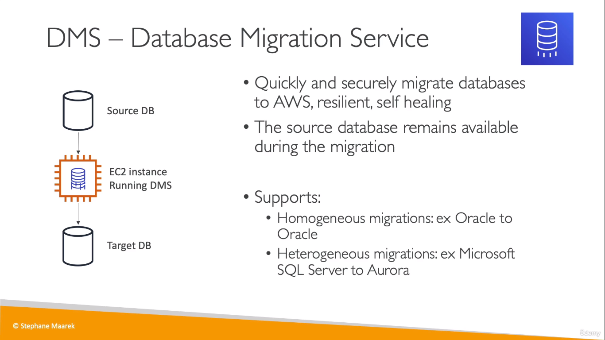  

## AWS Glue
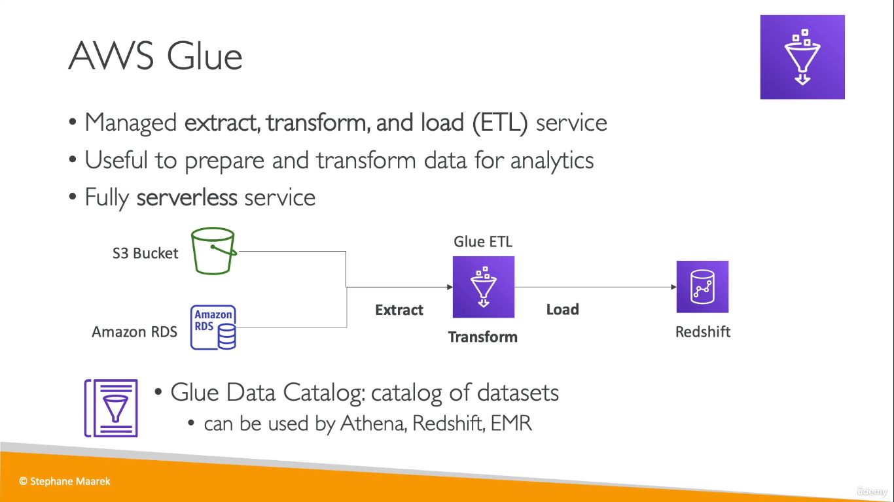  
* The AWS Glue Data Catalog is a central repository to store structural and operational metadata for all your data assets. For a given data set, you can store its table definition, physical location, add business relevant attributes, as well as track how this data has changed over time.