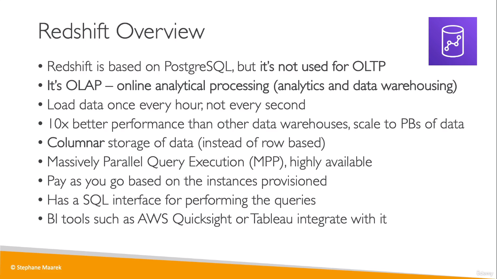
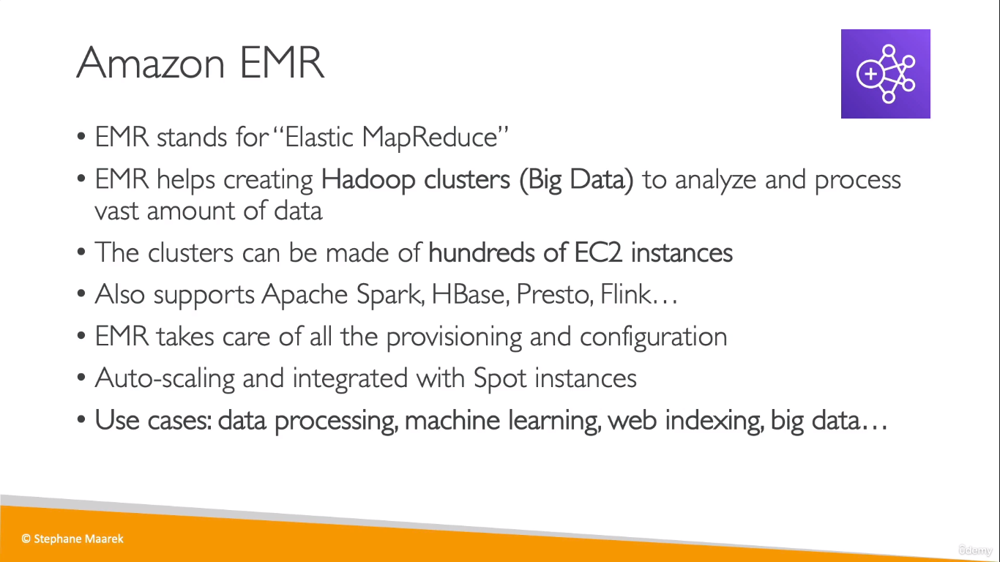
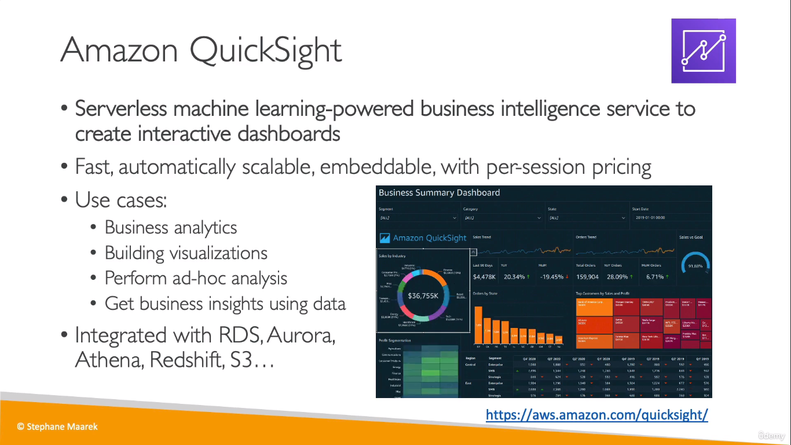

# Analytic Services

## Redshift
* **analytics**, **(data)warehouse** => RedShift
* **Columnar(storage)** => RedShift

> Database + Analytics Service 
## Amazon EMR
* **Hadoop Clusters** => Amazon EMR

  
* The clusters can be made of 100sof EC2 instances to analyze data

## Amazon Athena
* Analytics against S3 Objects

  

## Amazon QuickSight
* Go-to tool for BI in AWS

  
