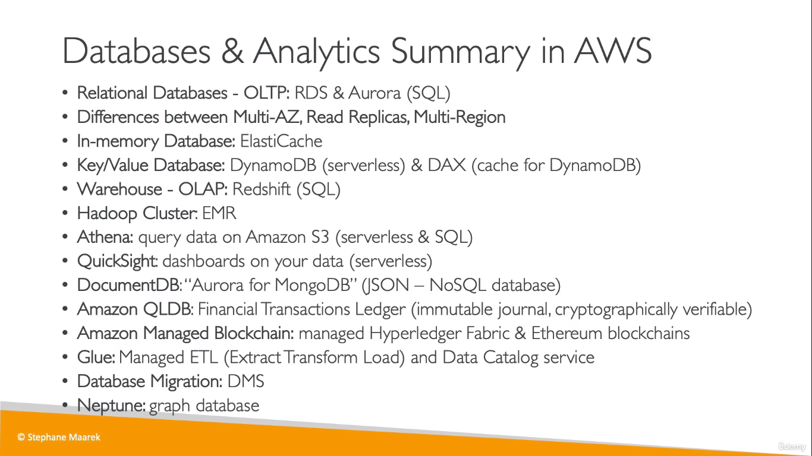
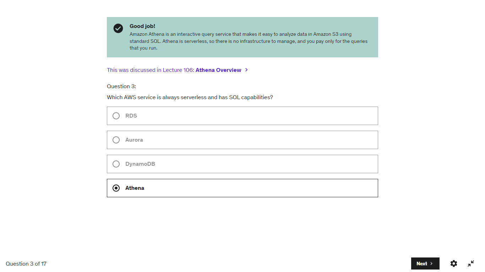
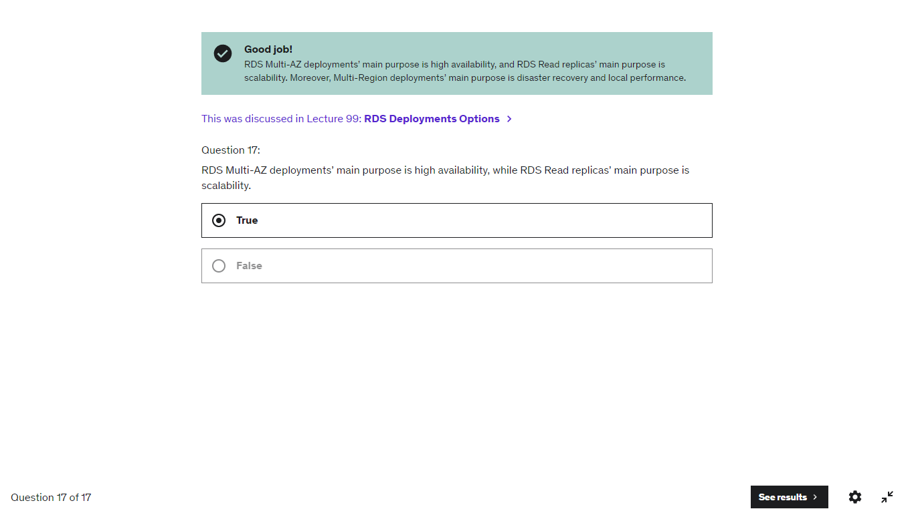

## Terms Used = Possible Topic

* **SQL** => Relational Databases
* **RDS** = Relational Database Service
* **In Memory Databases** => ElastiCache
* **Serverless**, **single digit millisecond latency** => Dynamo DB
* **analytics**, **(data)warehouse** => RedShift
* **Columnar(storage)** => RedShift
* **Hadoop Clusters** => Amazon EMR
* **MongoDB** => DocumentDB
* **graph** => Amazon Neptune
* **ledger**, **financial transactions** => QLDB 
* **Migration** => DMS
___
  
___
## Quiz Qs
  
* Athena - _Serverless_ Service
* DynamoDB - _Serverless_ Database
> Glue - Also _Serverless_ Service  
> QuickSight - Also _serverless_ service

  
