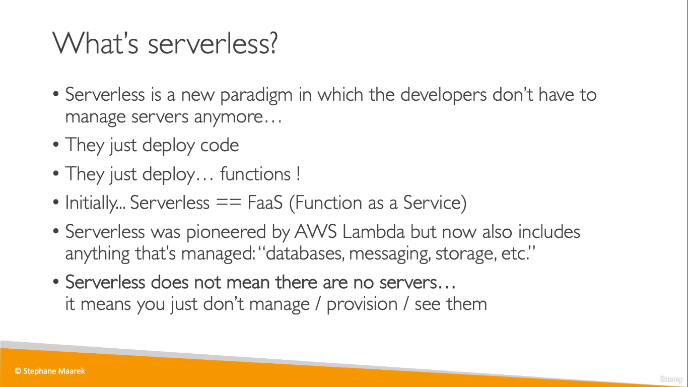
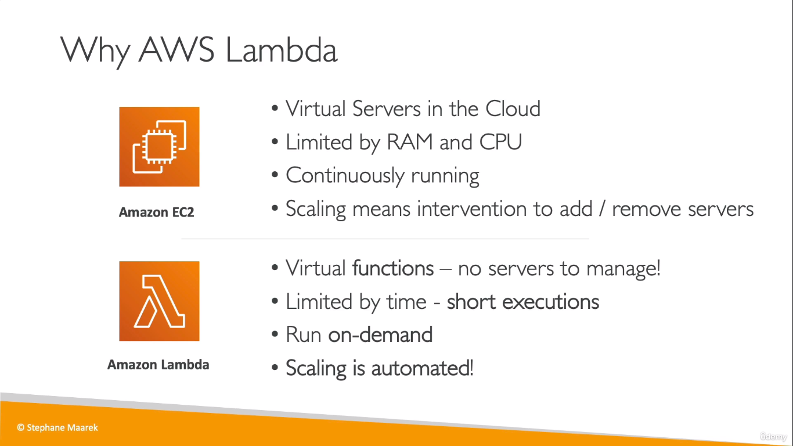
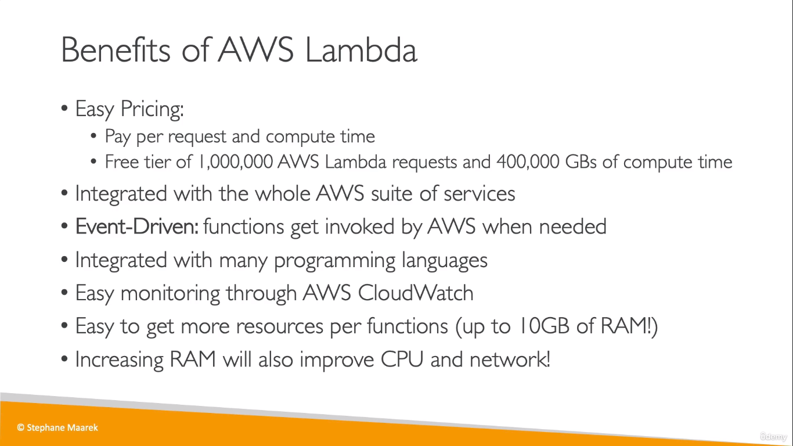
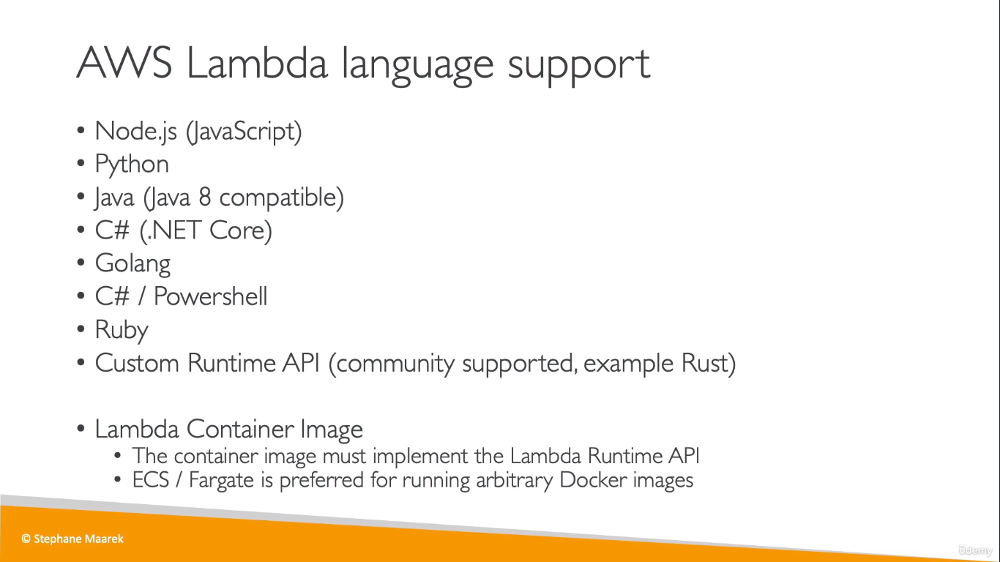
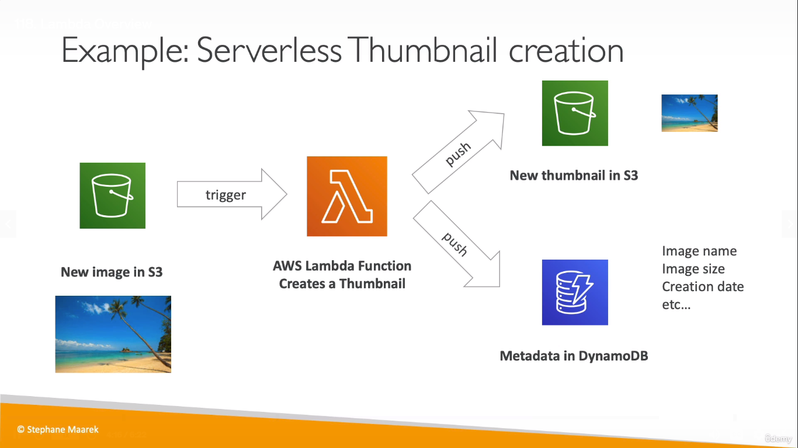
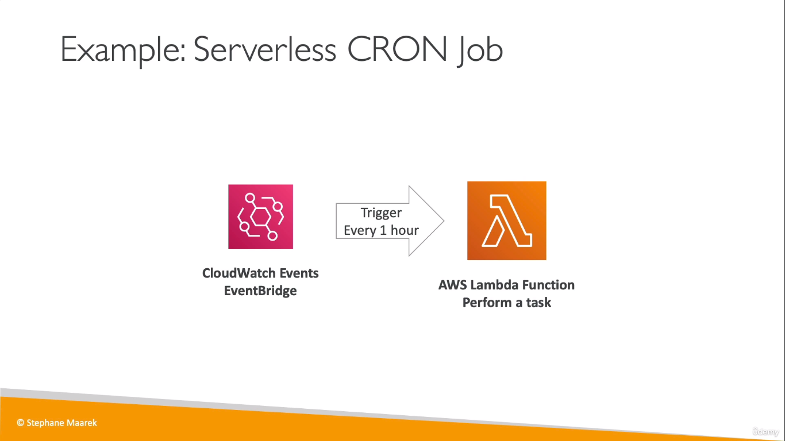
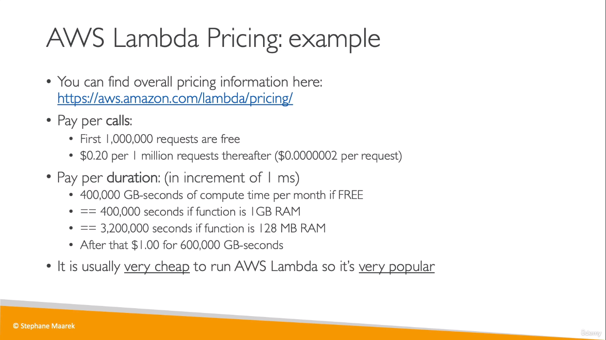

  
Serverless Services:
* S3
* DynamoDB
* Fargate
* Lambda

## Lambda
  

* "Event-driven" in Lambda means that functions are invoked when needed. They are triggered
  
  
  
* CRON allows you to define a schedule. And based on that schedule, a script is run
* _CloudWatch Events_ is used to trigger the Lambda Function for a CRON job

  
* Cost for each invocation of the Lambda Function, and compute time thereafter
* While creating a lambda function, a role is also created which allows the lambda function to write to _CloudWatch Logs_