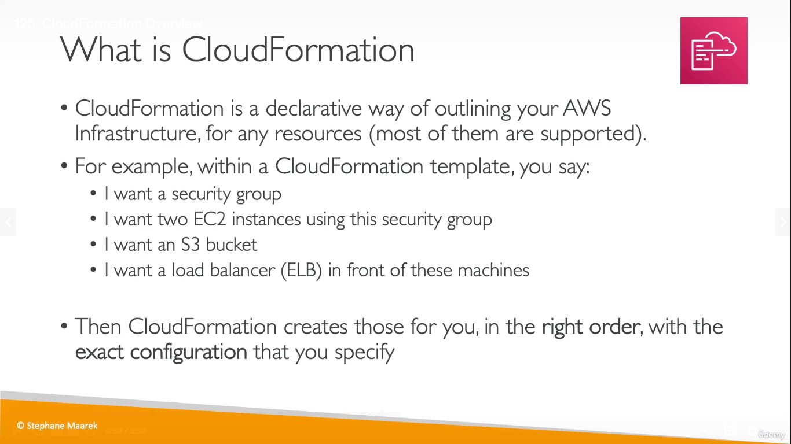
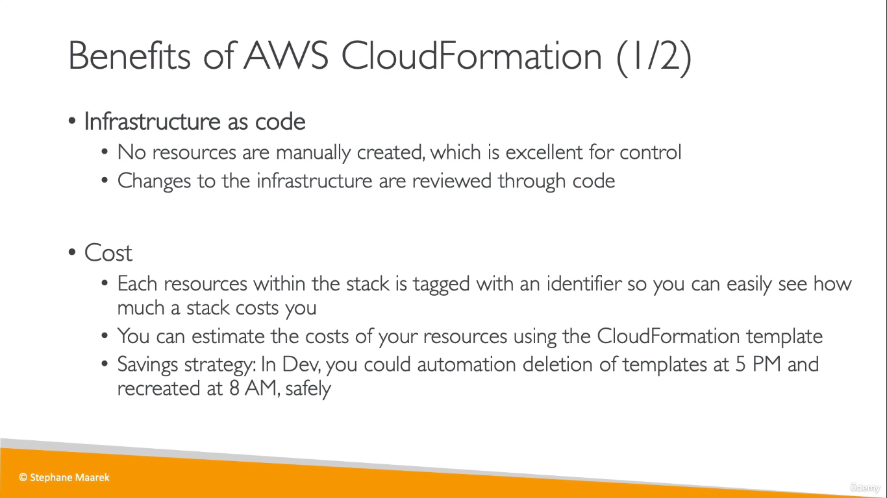
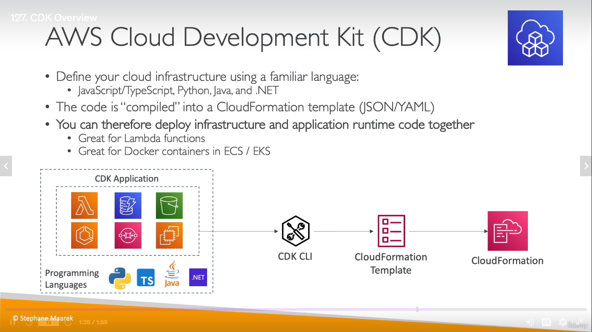

# CloudFormation
  
  
  
* _CloudFormation is going to be used when we have to repeat an architecture in different environments, different regions or in different AWS accounts_
* You create a template for CF in a YAML/JSON file
* The template contains the architecture that needs to be provisioned
* Basically, with that one click, the architecture is created, instead of you going and initializing and configuring every single resource/service

## AWS CDK
* CDK = Cloud Development Kit
* Used to define the cloud infrastructure with a preferred programming language rather than JSON/YAML
  