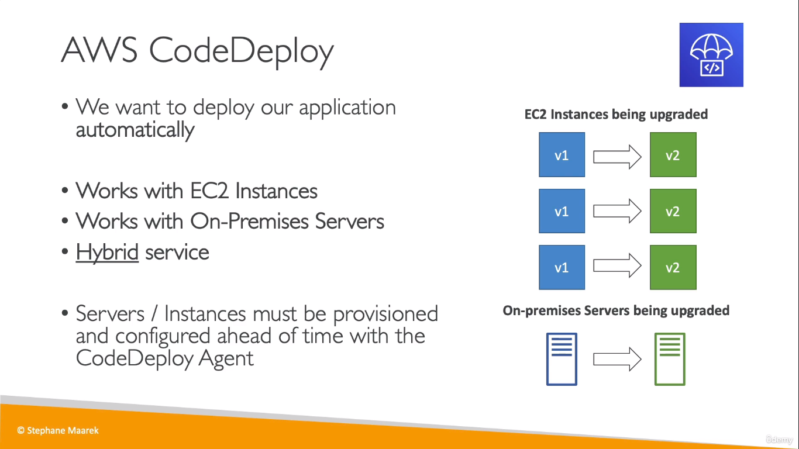
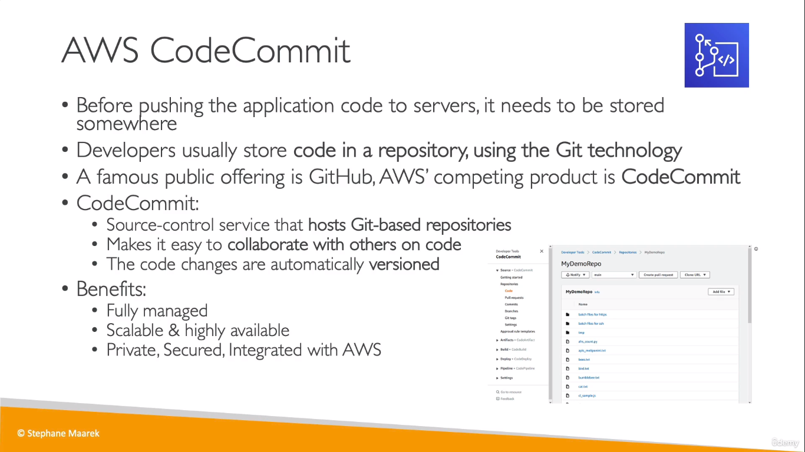
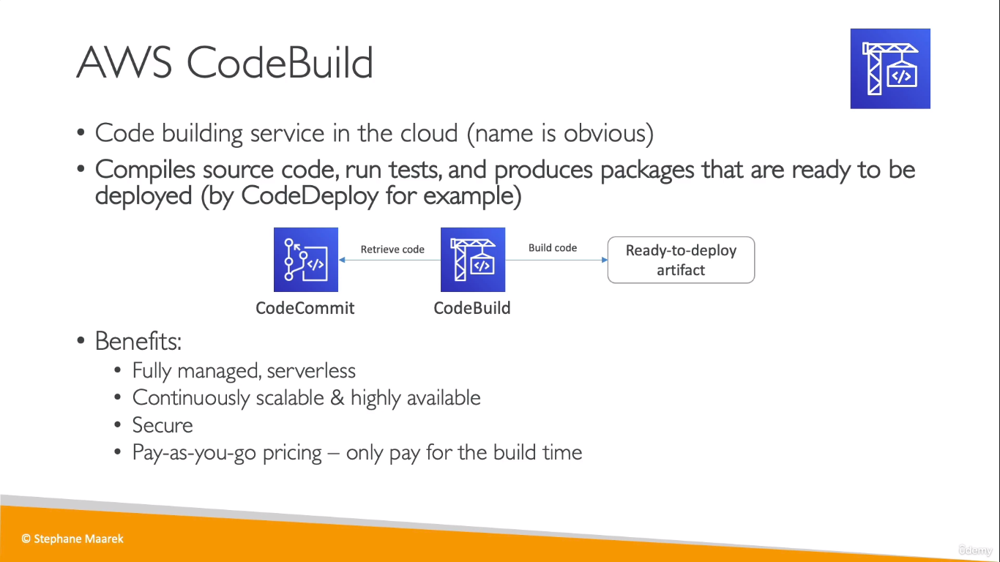
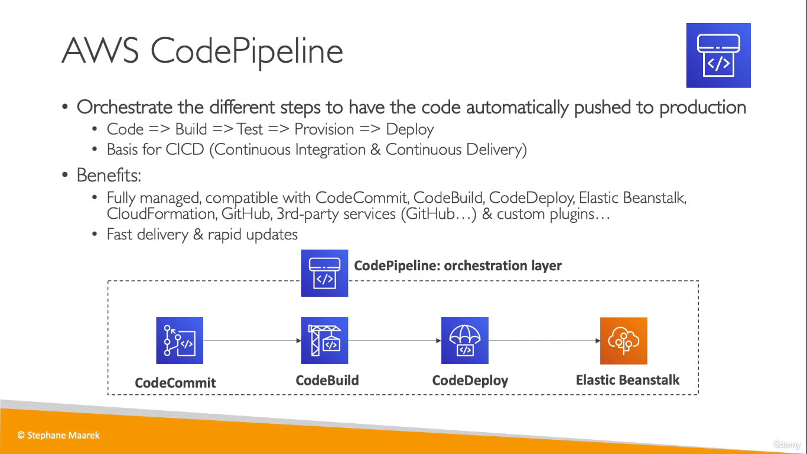
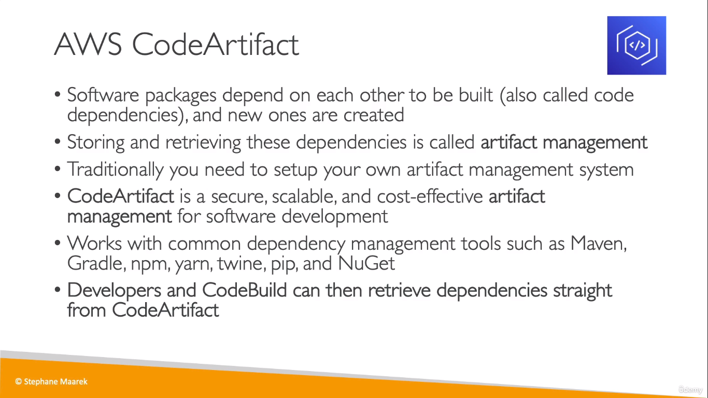
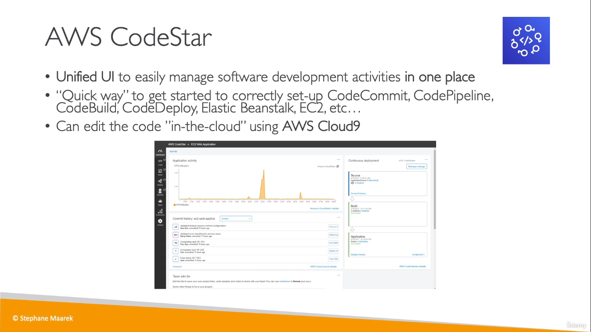
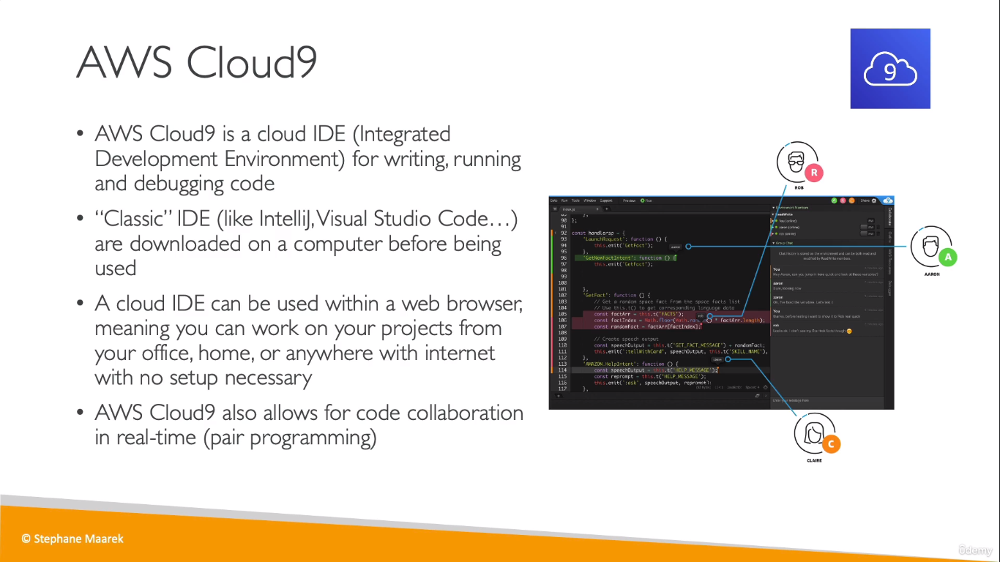
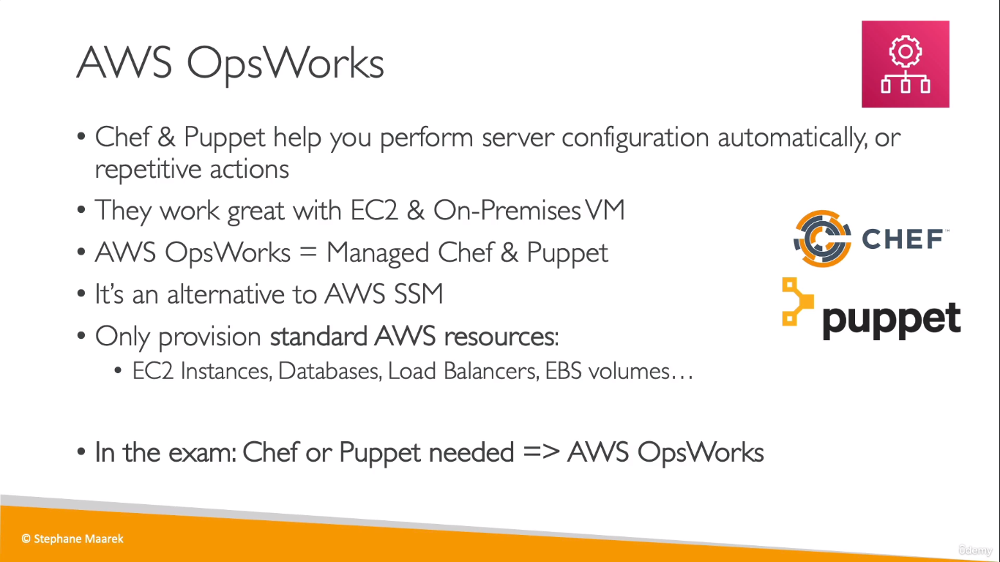

## CodeDeploy
  

## CodeCommit
* AWS Version of GitHub

 

## CodeBuild 
  
* Serverless Service

## CodePipeline
* AWS Version of GitHub Actions

  

## CodeArtifact
  

## CodeStar
* UI to start and manage a project with all other _developer services_ in one place

  

## Cloud9
  
___
## AWS OpsWorks
  