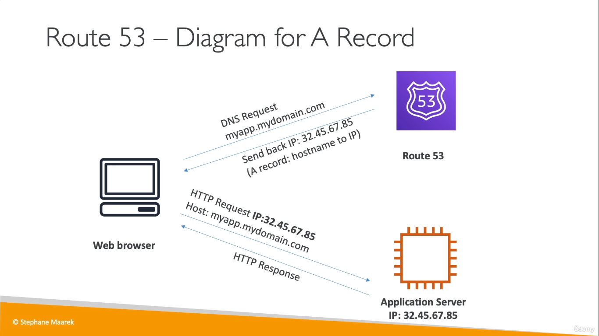
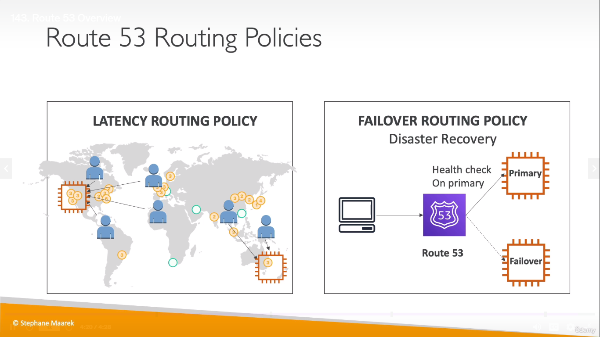

# Route 53
  
  

## Routing Policies
  
  
* _Route53_ is a global service
* In _weighted routing policy_, the users are routed to the Ec2 instances based on the weight assigned to them
* In _latency routing policy_, they are routed to the instances that are closer to them for decreased latency
* In _failover routing policy_, the users are routed to the failover instance only if the primary instance is not healthy 
> In Route53, you pay for the DNS ($0.50/month)

___
## Reference

* In Route53, you distribute traffic across multiple regions where as in ELB, you balance the load in the same region across multiple EC2 instances. Read [more](https://stackoverflow.com/questions/57321793/elastic-load-balancer-elb-and-route-53-in-aws#:~:text=Route53%20can%20distribute%20traffic%20among,traffic%20to%20only%20healthy%20resources.)
