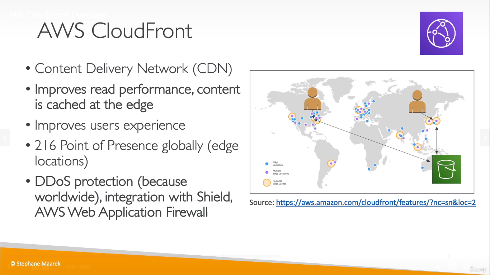
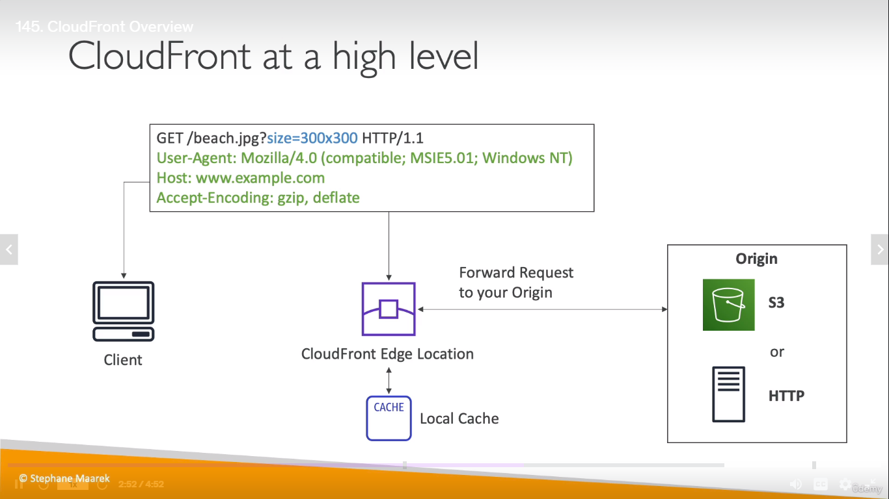
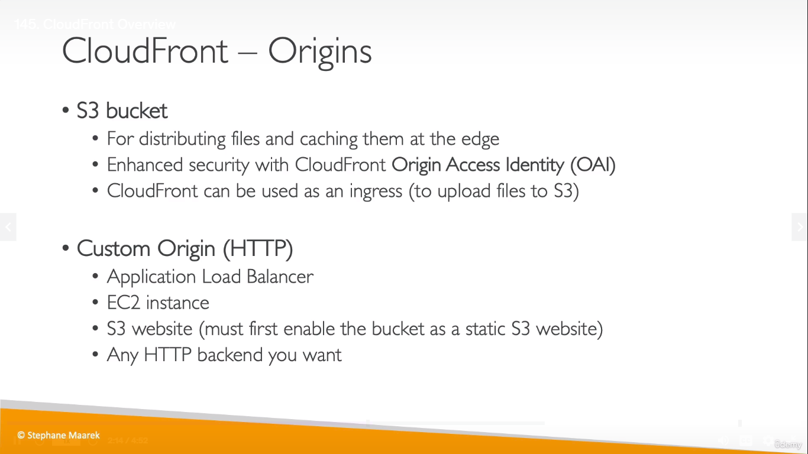
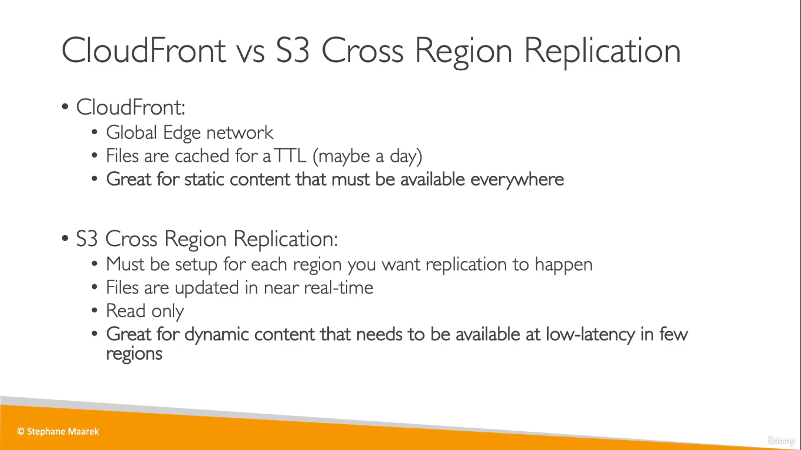

# CloudFront
  
* When a user in a region tries to acess content from an S3 bucket as in the example, it checks if the content is cached in the Edge location near the user
* Else, it is fetched from the S3 bucket which is located in another region
* So, the next time when another user in the same region as the user1 tries to access the S3 bucket, the content is served directly from the Edge Location as it was cached from the previous request

  
## Origins
  
> _Origins are resources from where content can be cached from_

  

## CloudFront vs S3 CRR
   
___
## Notes
> Tagline : CDN -> CloudFront

> Point of Presence is same as Edge Location