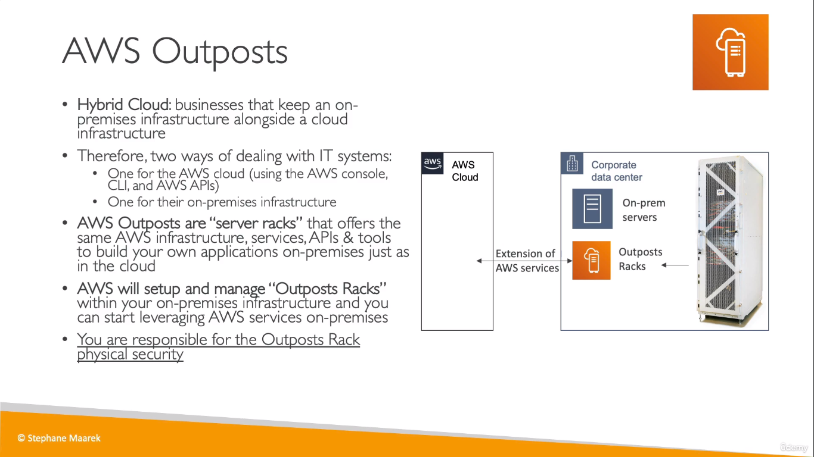
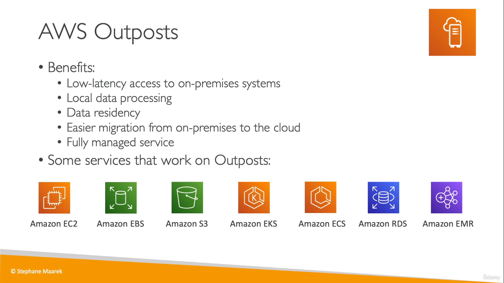
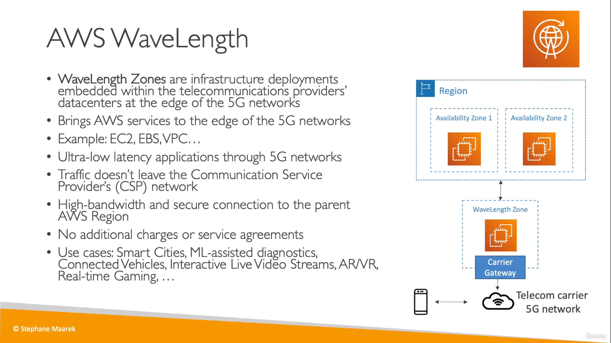
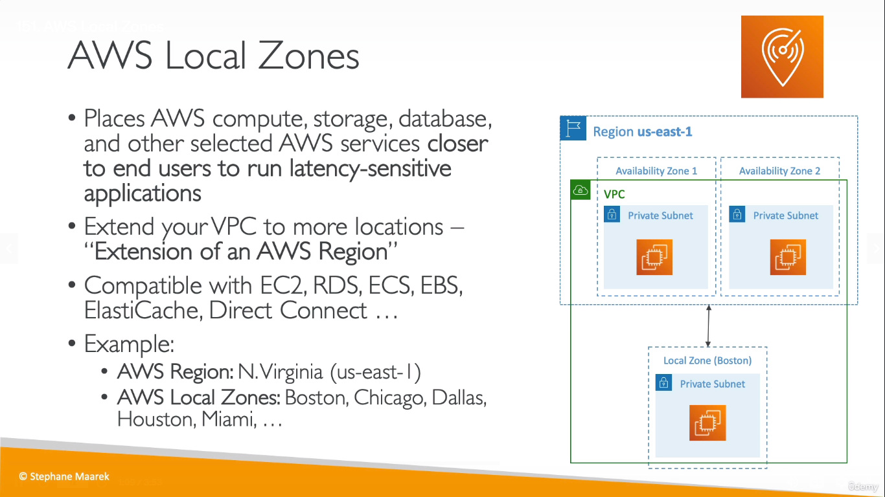
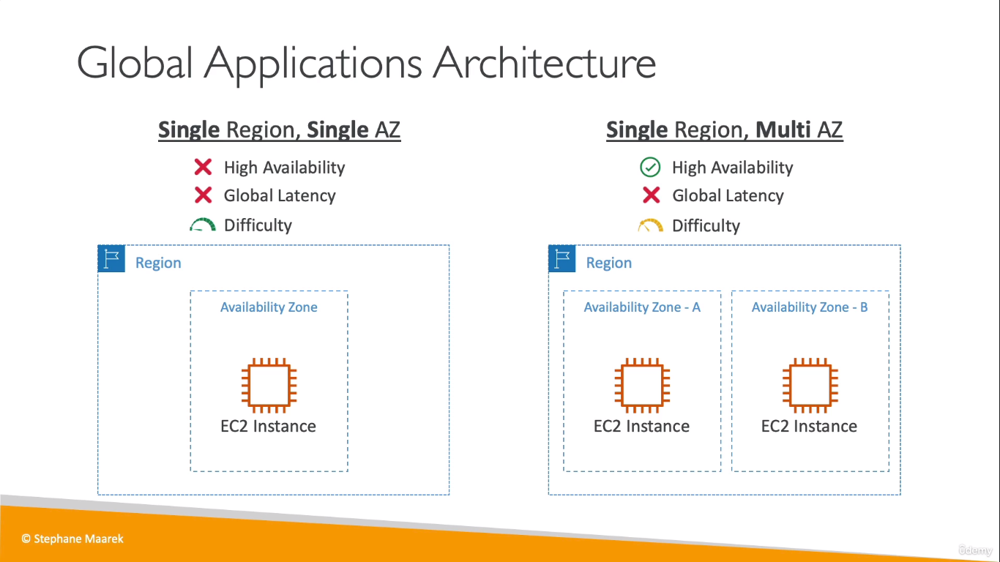
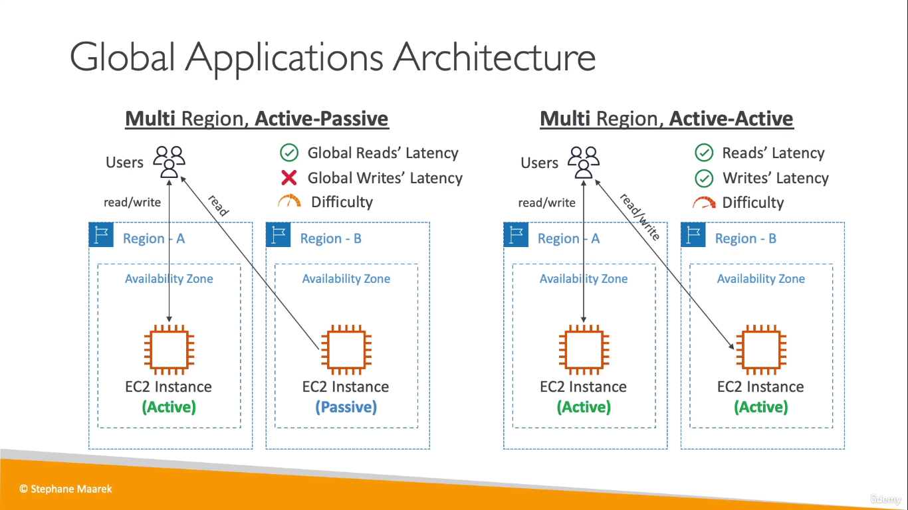

## AWS Outposts
* Physical servers by AWS that comes in with the AWS infrastrcture and services just as in the cloud

  

  

## AWS Wavelength
  
* AWS Wavelength iw an AWS Infrastructure offering optimized for mobile edge computing applications. Wavelength combines the high bandwidth and ultra-low latency of 5G networks with AWS compute and storage services to enable developers to innovate and build a whole new class of applications.
> Tagline: 5G -> AWS Wavelength

## AWS Local Zones
  
> Not every region has a local zone 

## Global Architecture

  
  