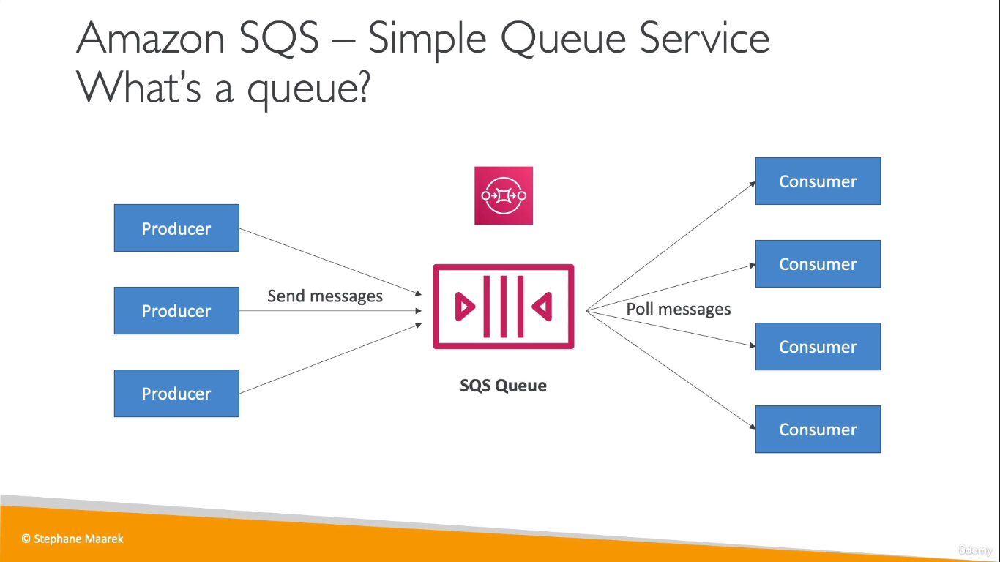
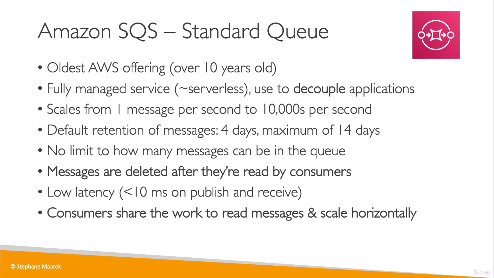
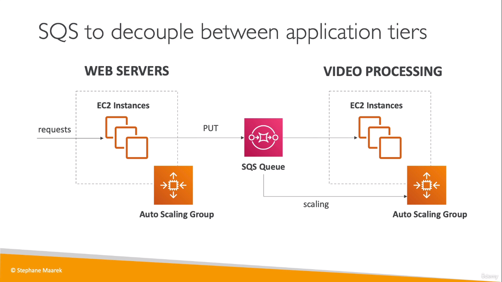
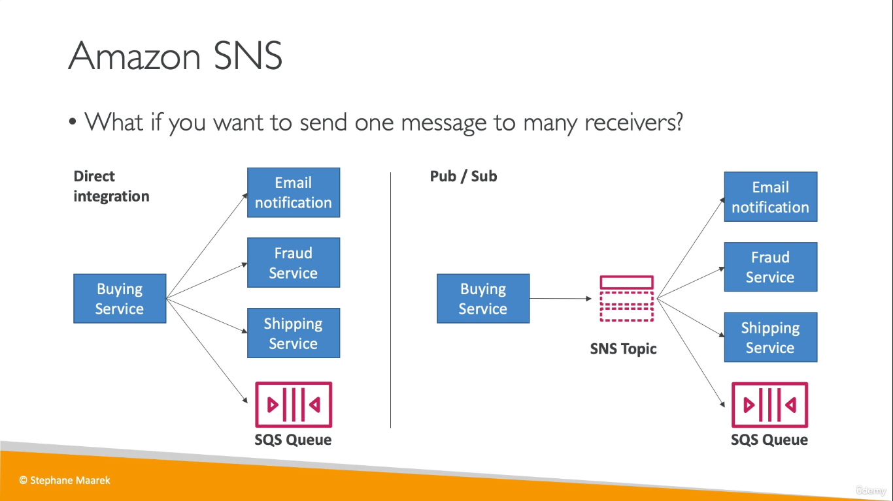
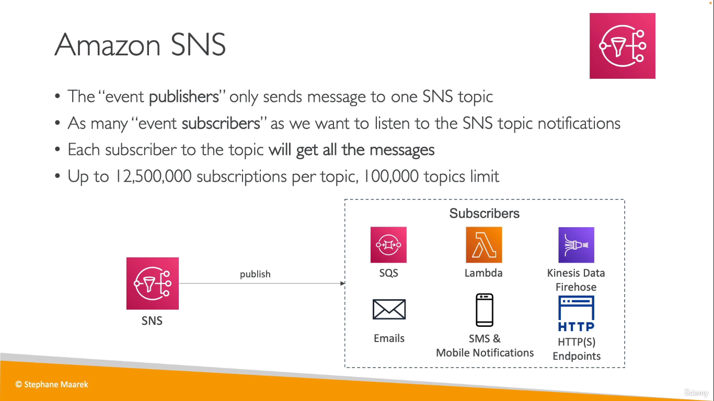
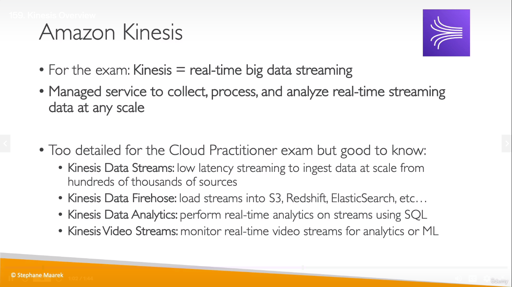
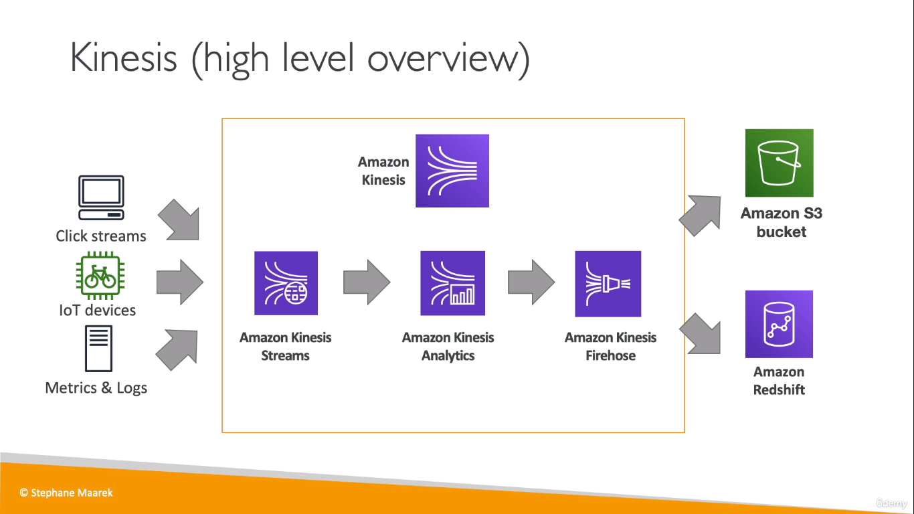
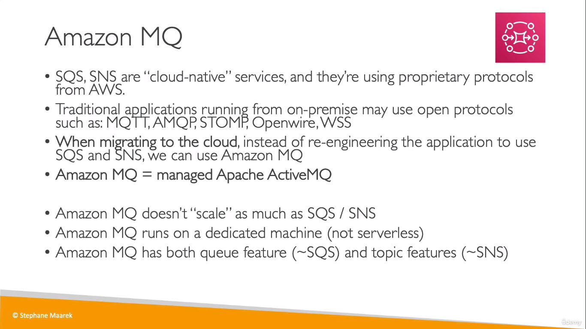

## SQS

  
* It can be imagined as a hotel scenario
* Where the customers send orders to the queue
* Any chef who's free, reads the order from the queue, deletes the order and goes for preparing it 

  

  
* Here the second ASG is scaled based on the requests/messages recieved from the first layer

## SNS
* SNS = Simple Notification Service
* It is a notification service, where as a publisher, we publish a message to an _SNS topic_ and the subscribers who have subscribed to that speicific _SNS topic_ receive the message
* We can have multiple _SNS topics_

  

  

## Kinsesis
  

  

## MQ
* Service used by companies who've migrated to the cloud from on-premises and were using open protocols 

  