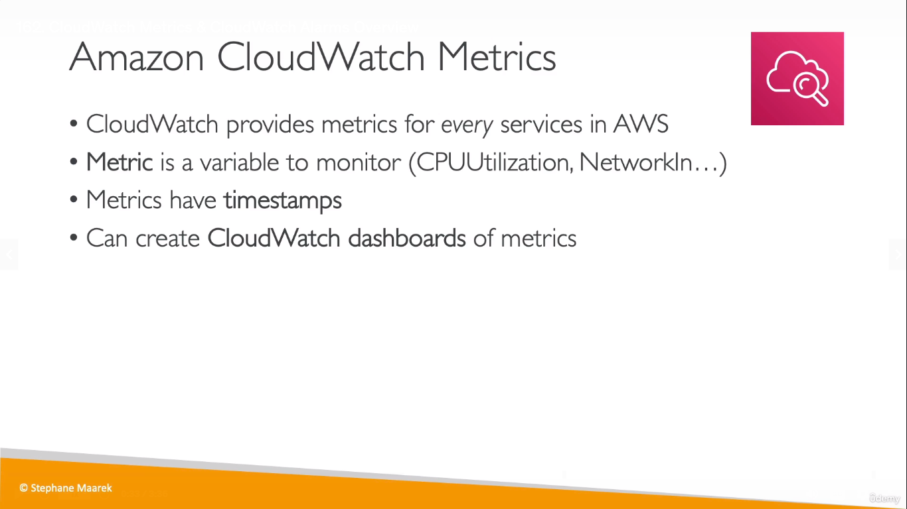
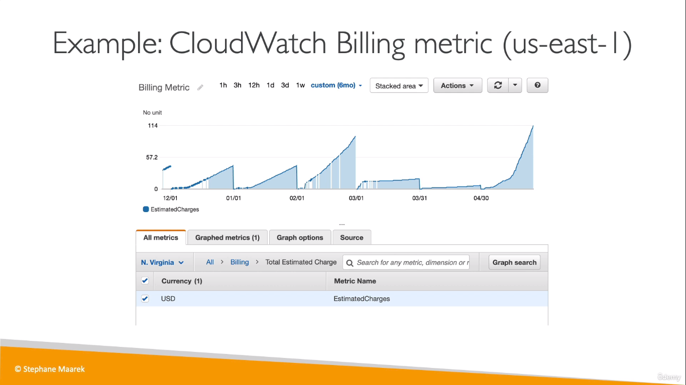
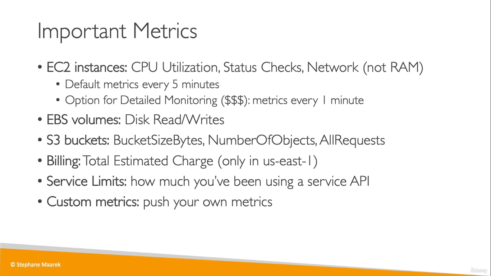
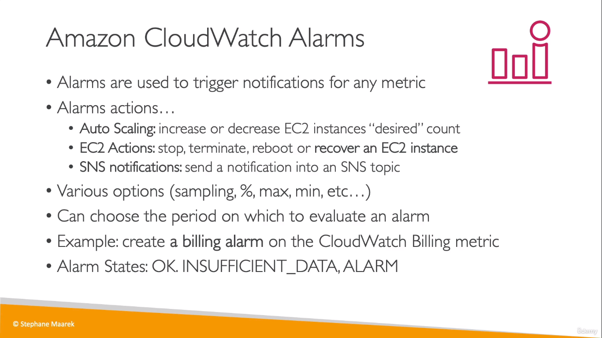
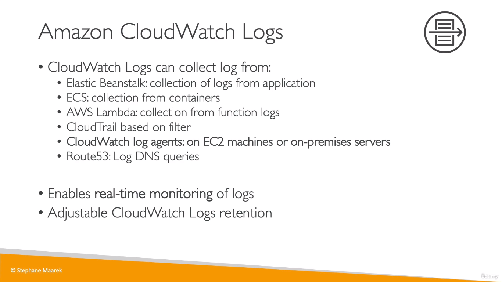
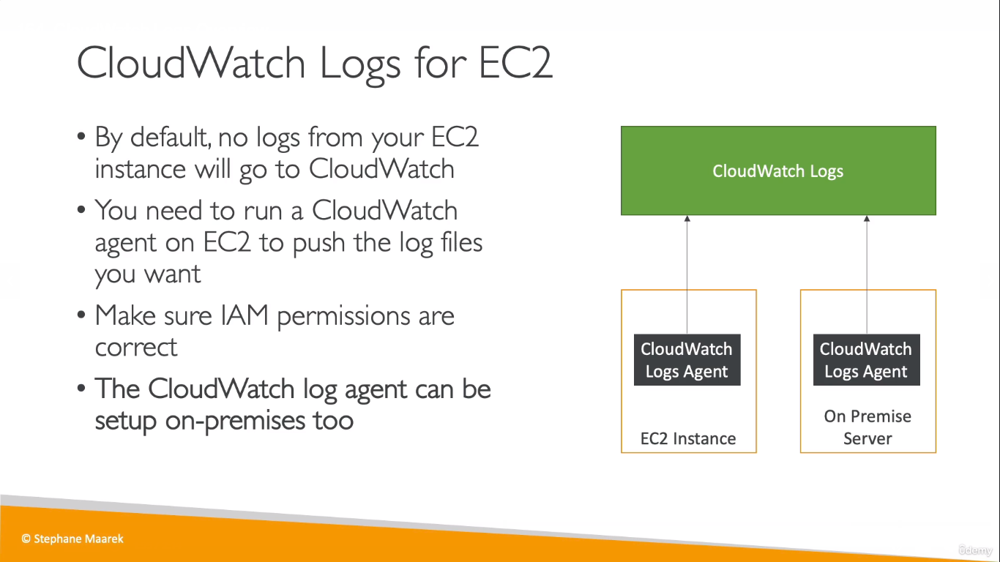
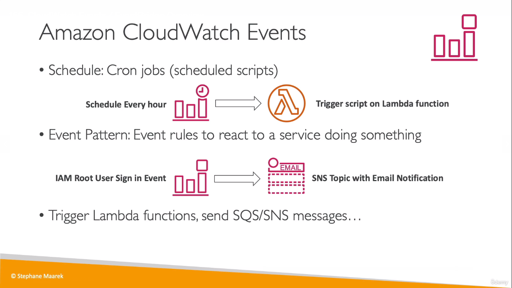
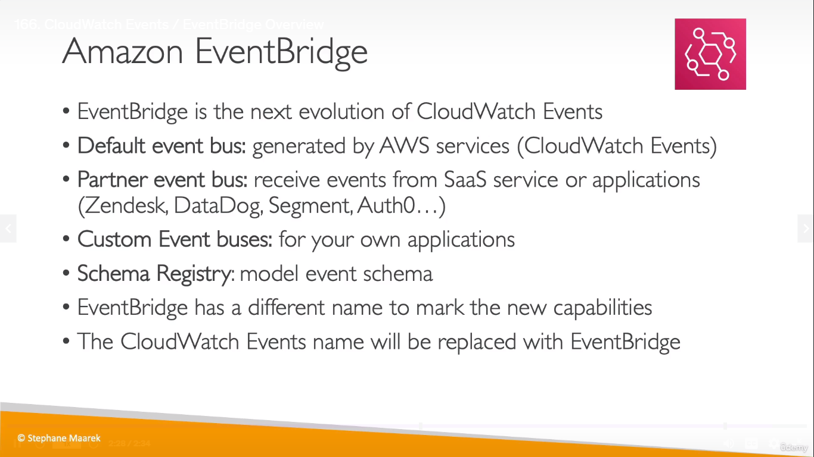

## CloudWatch Metrics
  
* _CloudWatch dashboards_ can be used if you need to see all your metrics at once

  

  
* Billing Metrics/Alarm is only available in us-east-1 (N.Virginia)
## CloudWatch Alarms
  
* Period means time period. You can choose to monitor your service for a period of every 6 hours for example. 

## CloudWatch Logs
  

  

## CloudWatch Events / EventBridge

* Events are something that happens within our AWS account. For example, if an EC2 instance is terminated, then using _CloudWatch Events_, we can set up an _Event rule_ to react to that event such as sending a notification through email with SNS and so on.. (For _Event Pattern_)

### Amazon EventBridge
 
* Same as CloudWatch Events but with extra functionalities such as to receive events from 3rd party services
___
> * Metrics for Monitoring  
> * Alarms to alert if limit exceeded