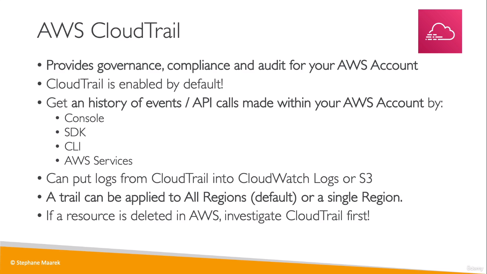
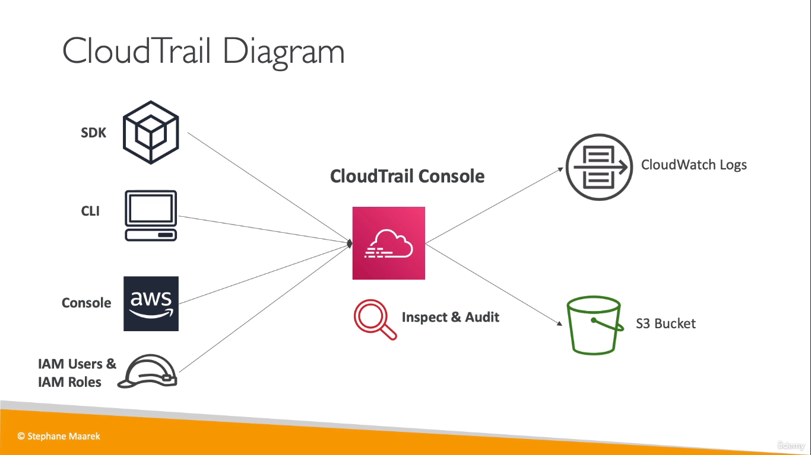
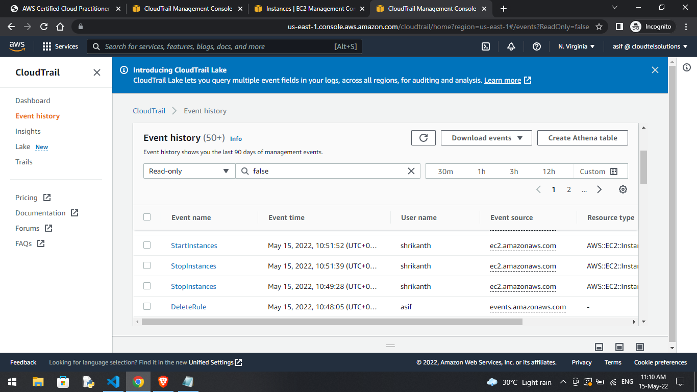
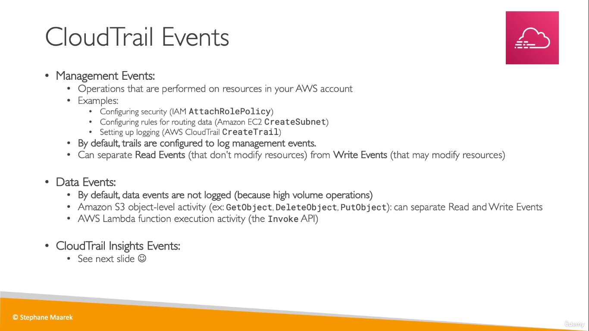
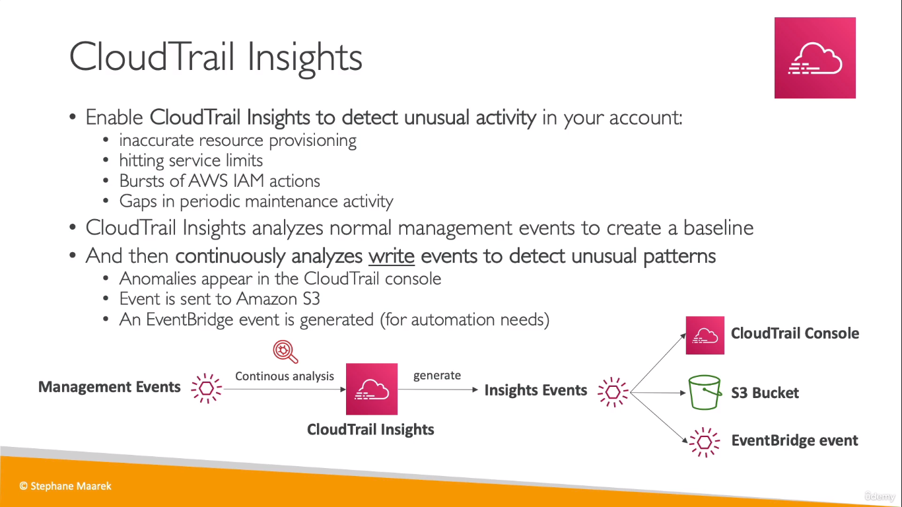
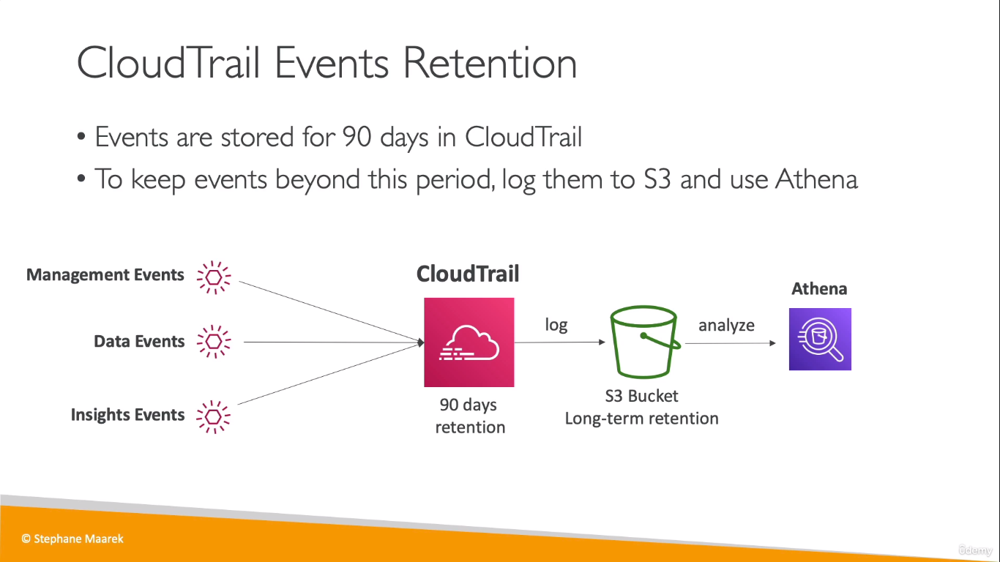

# CloudTrail
* Used to take a look at all the events happening in the AWS account

  

  

## CloudTrail Events
  
* Logging Management Events is free but Data Events and Insights Events are paid

  

  
* To retain CloudTrail logs, 
    * you can create an S3 logging bucket and push it there OR 
    * create a _log group_ and push it to CloudWatch Logs

## CloudTrail vs CloudWatch Logs
CloudWatch focuses on the activity of AWS services and resources, reporting on their health and performance. On the other hand, CloudTrail is a log of all actions that have taken place inside your AWS environment