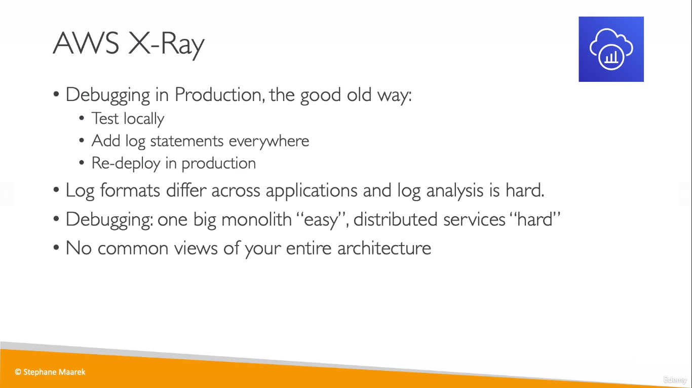
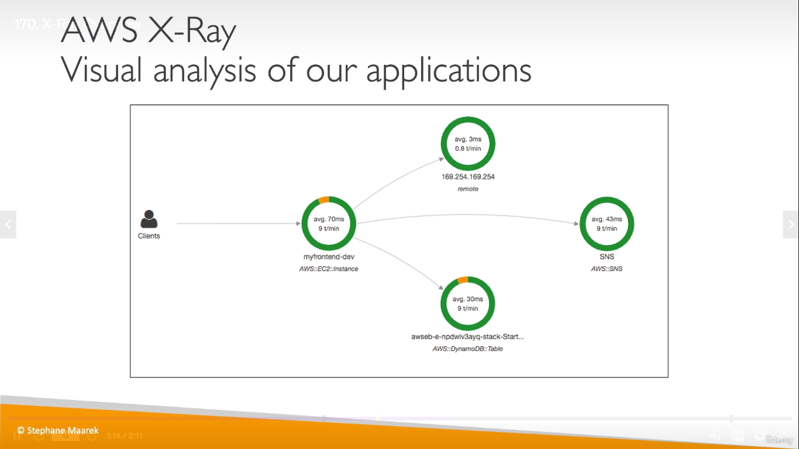
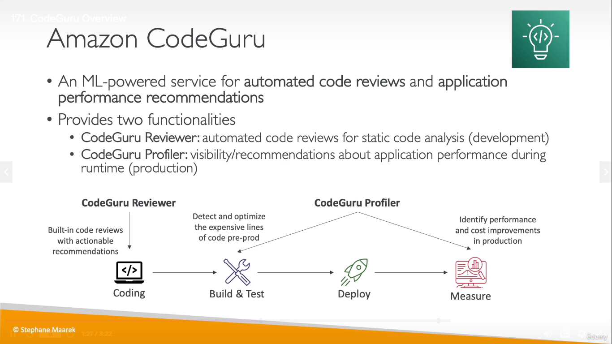
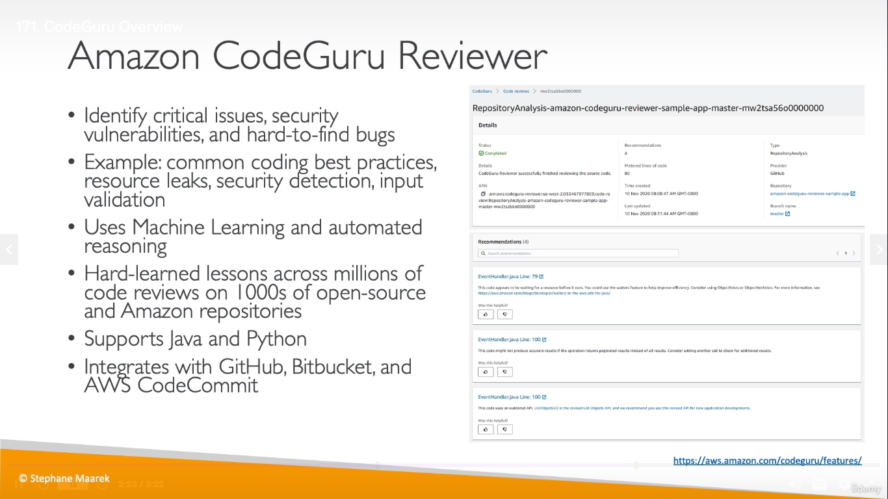
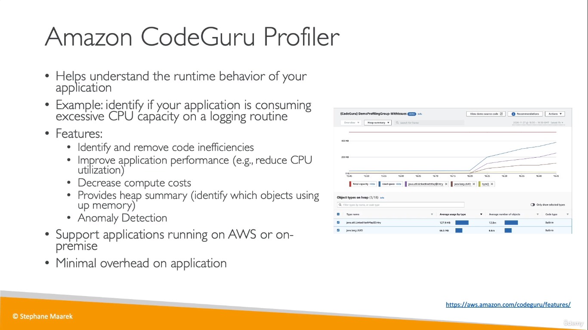
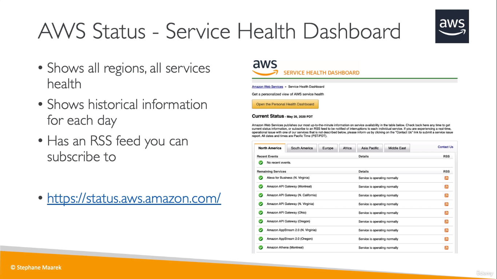
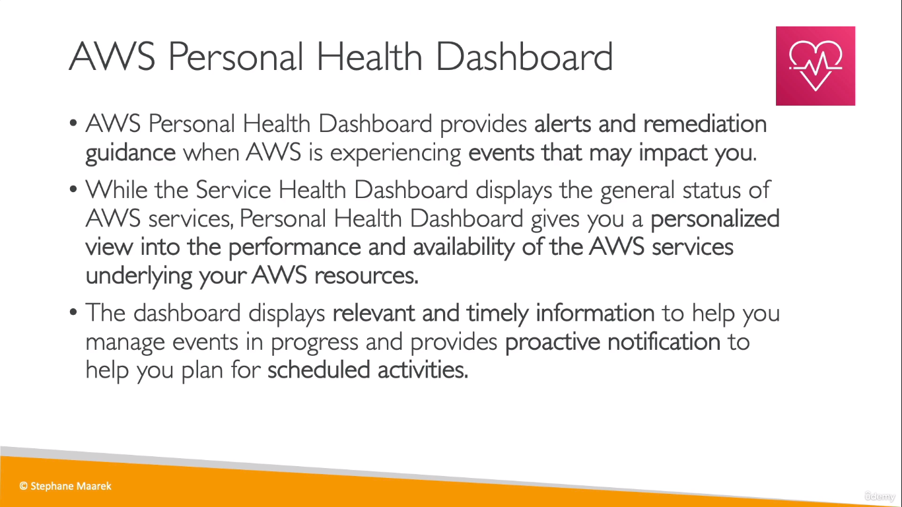

## X-Ray
* Used to easily trace your applications

  
* AWS X-Ray helps developers analyze and debug production, distributed applications, such as those built using a microservices architecture.

  

  

## Amazon CodeGuru
* ML-Powered **Code Reviewer** and improves **application performance**

  

  

  

## Service Health Dashboard
* It is the dashboard to know that if the AWS Services have been working properly (from the side of AWS)

  

## Personal Health Dashboard (PHD)
* Personalized version of the Service Health Dashboard
* Provides info on how you will be affected by the downed services and what you can do for a workaround

  

  