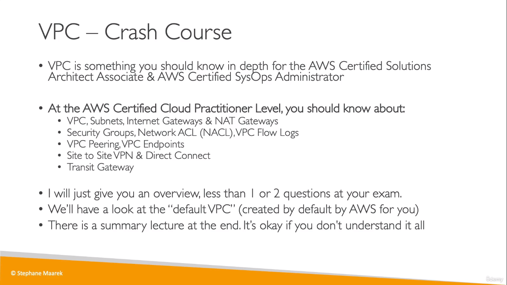
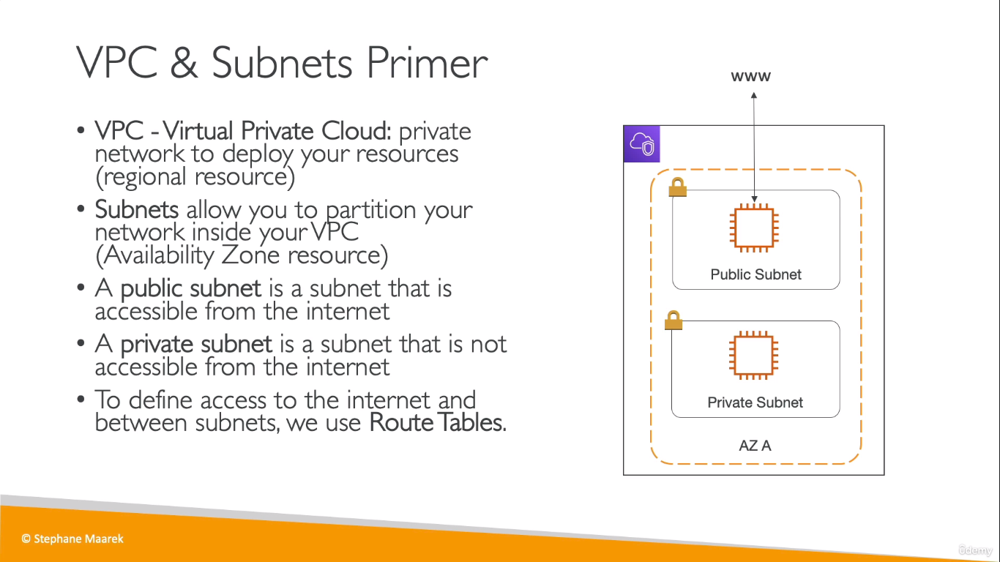
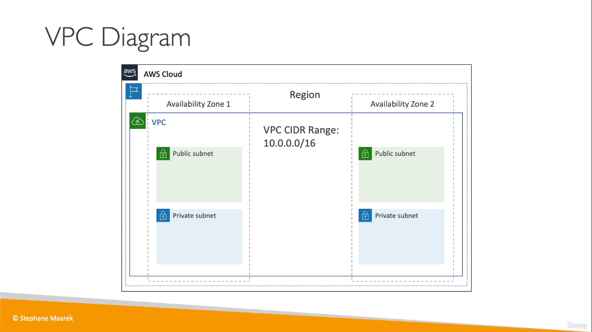
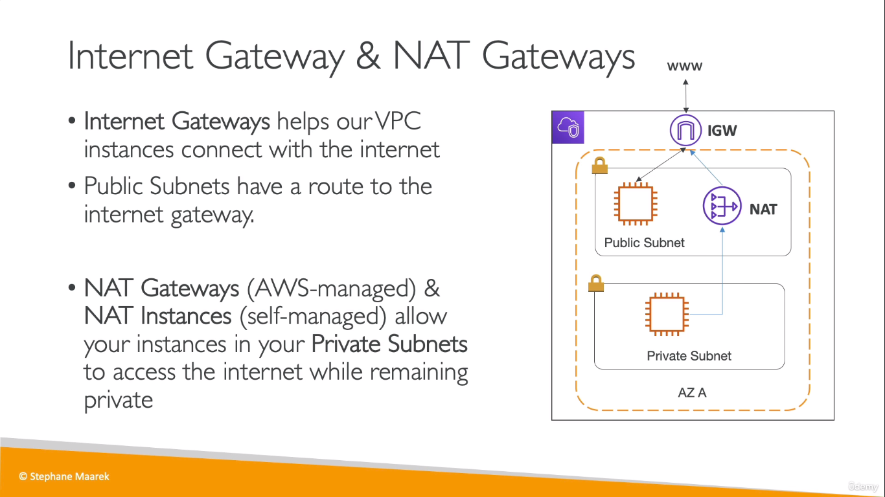

# VPC 
  

 
* Subnets are tied to a specific AZ
* Resources like databases can be placed inside the private subnet

  
* A _CIDR Range_ is the range of IP addresses allowed inside your VPC

## Internet Gateway and NAT Gateway
  
* NAT Gateways - AWS Managed
* NAT INstances - Self Managed
> A VPC can have only one Internet Gateway
