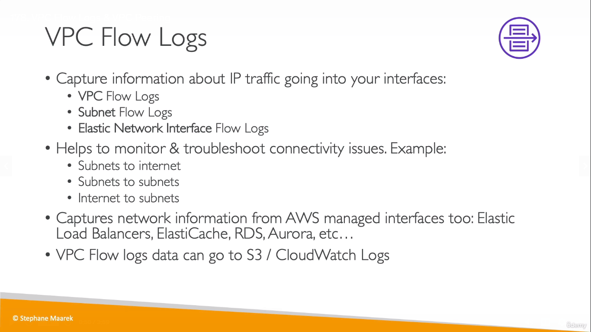
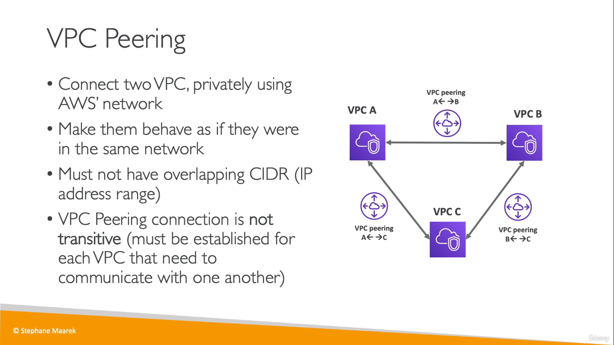
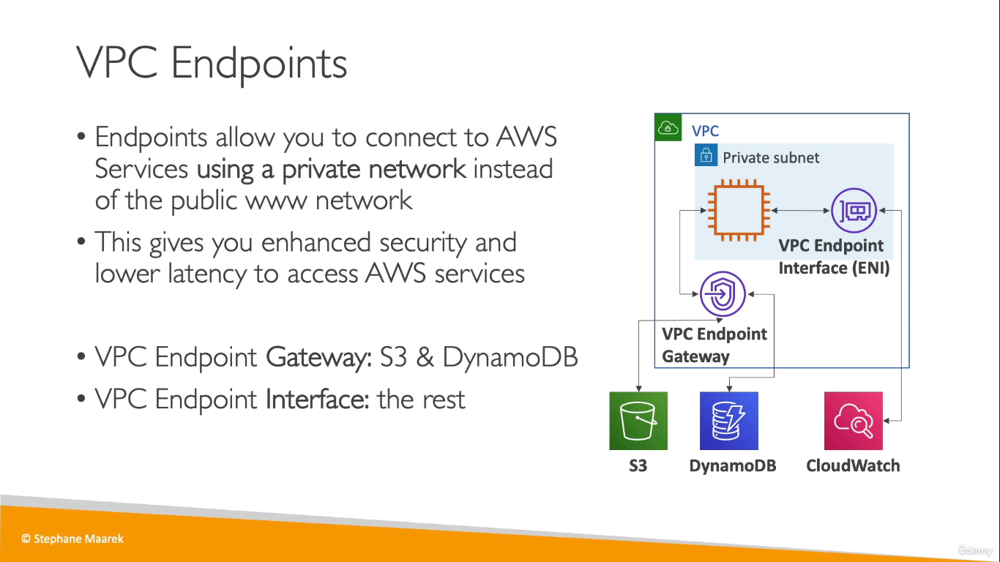
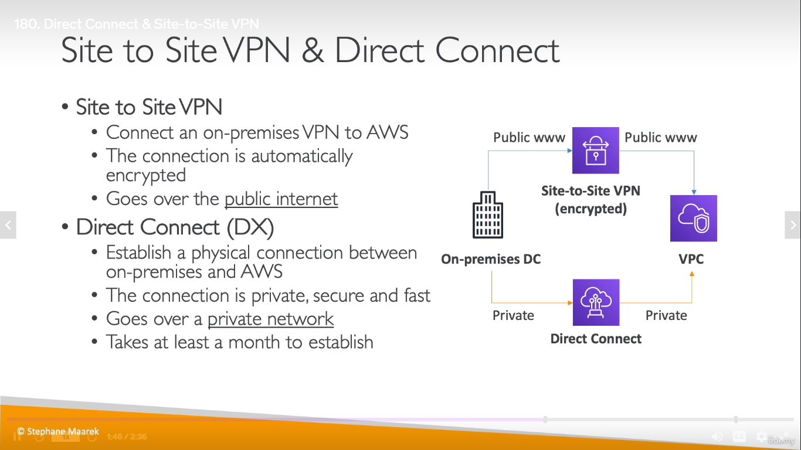
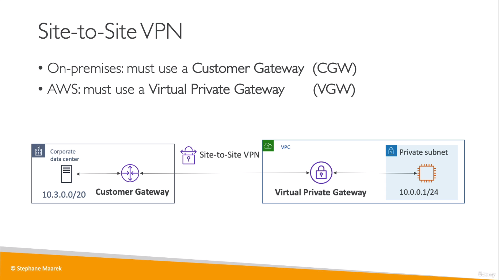
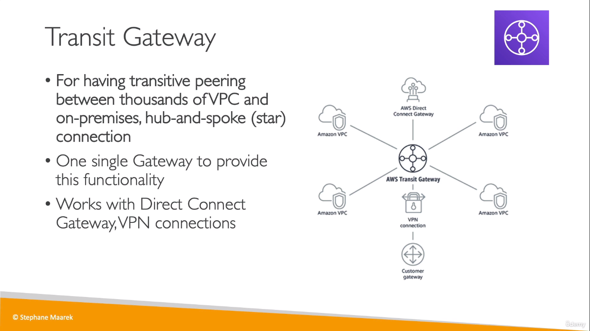

## VPC Flow Logs
* Used to log info about IP traffic

  

## VPC Peering
  
> Transitive meaning:   
If A = B and B = C,   
It doesnt mean that A is also = C

## VPC Endpoints
* Used to AWS Services using private network

  

## Site to Site VPN & Direct Connect
* These are used to connect on-premises data centres to VPC

  

  
> Tags:   
CGW, Customer Gateway  
VGW, Virtual Private Gateway

## Transit Gateway 
* Used for connecting large amount of VPCs together

  
