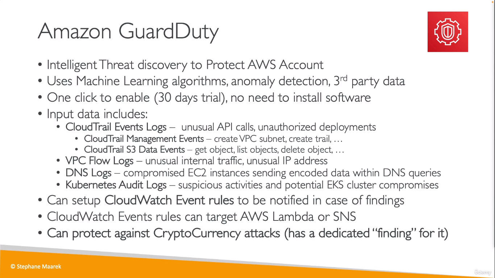
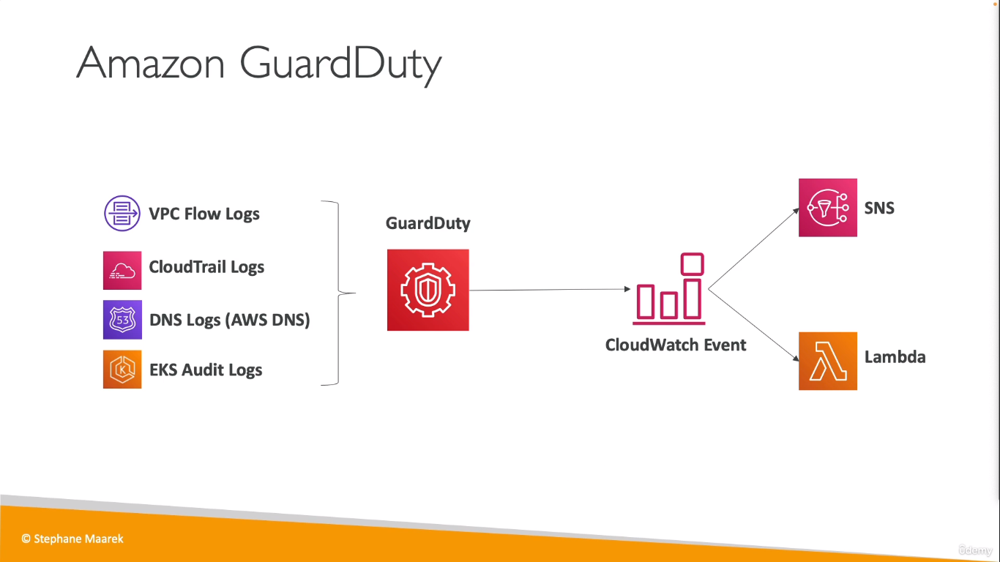
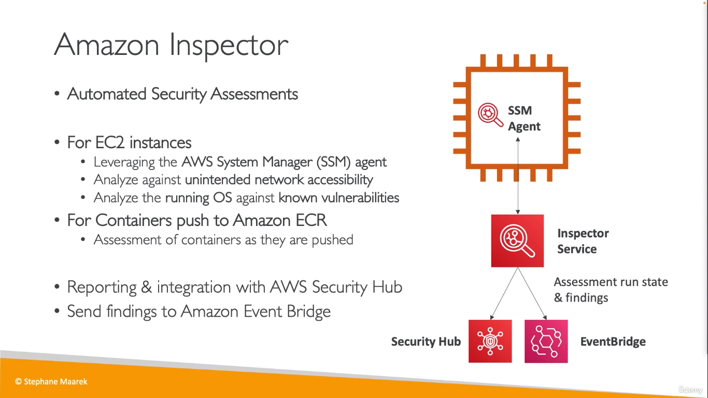
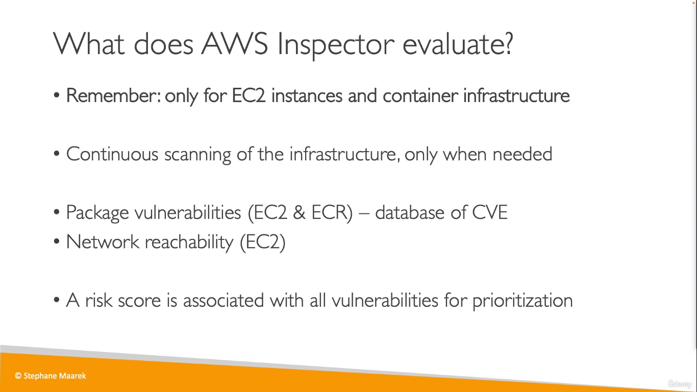
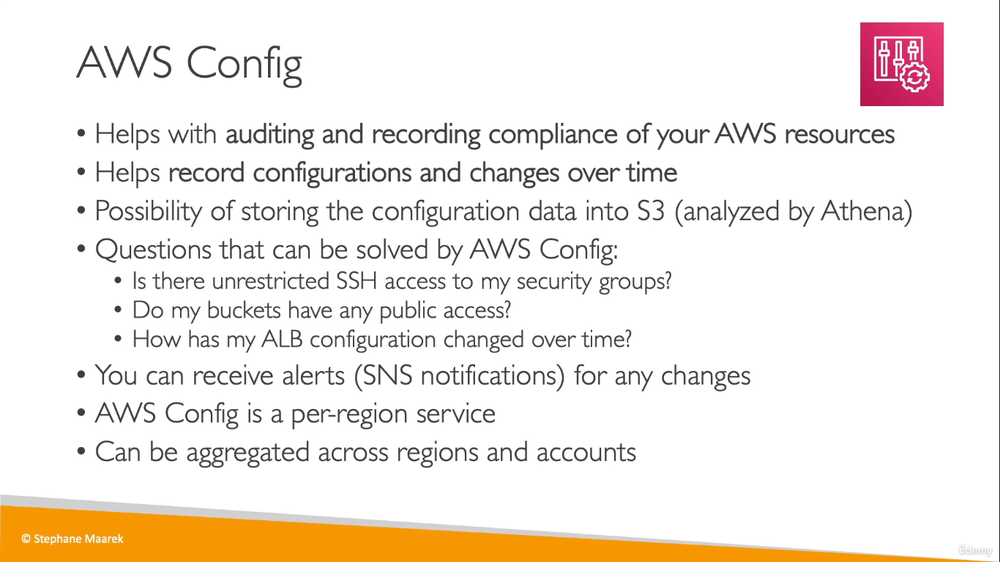
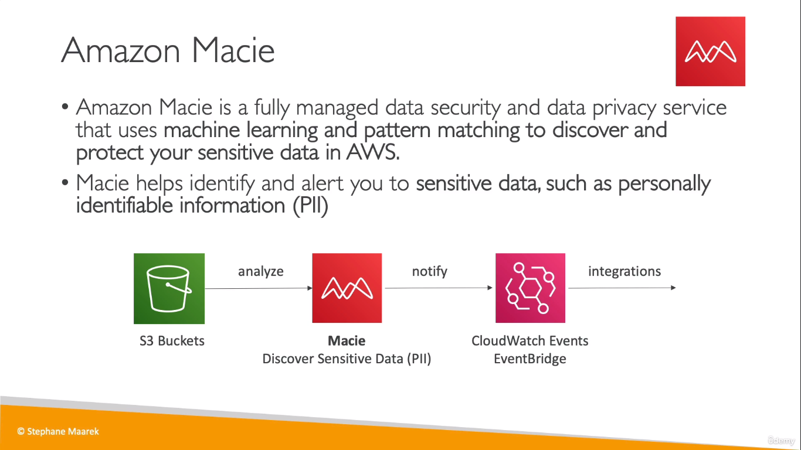
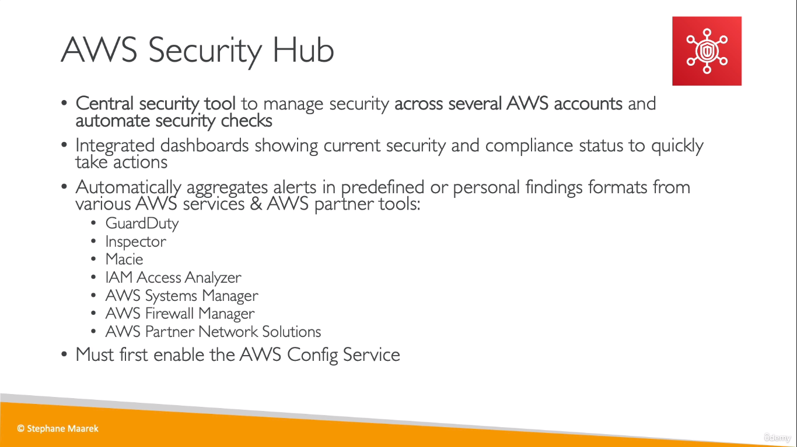
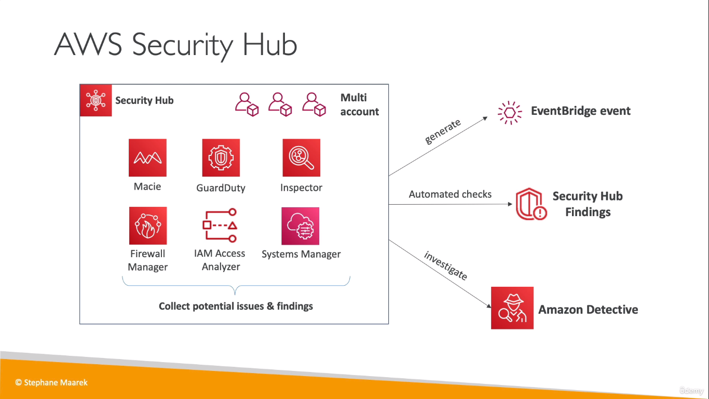
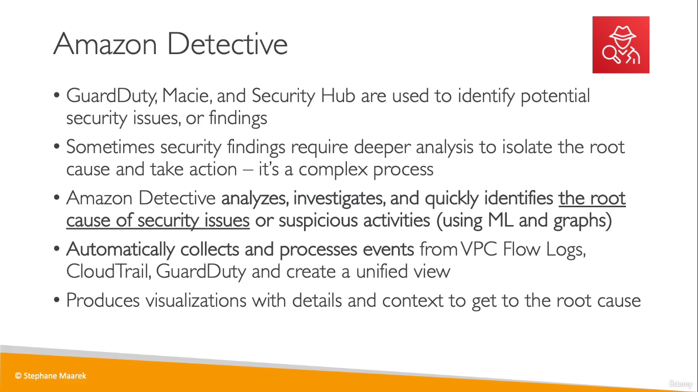

## Amazon GuardDuty
  
  

## Amazon Inspector
  

  

## AWS Config
* Used to record configurations for your AWS resources that you may change overtime

  
> Need to set it up before it starts to record the changes

## Amazon Macie
* Used for identifying possible leak of personal information

  

## AWS Security Hub
  

  

## Amazon Detective
  

