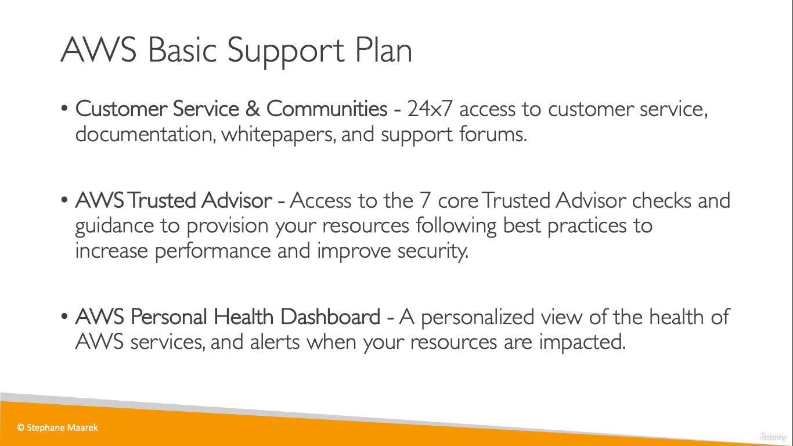
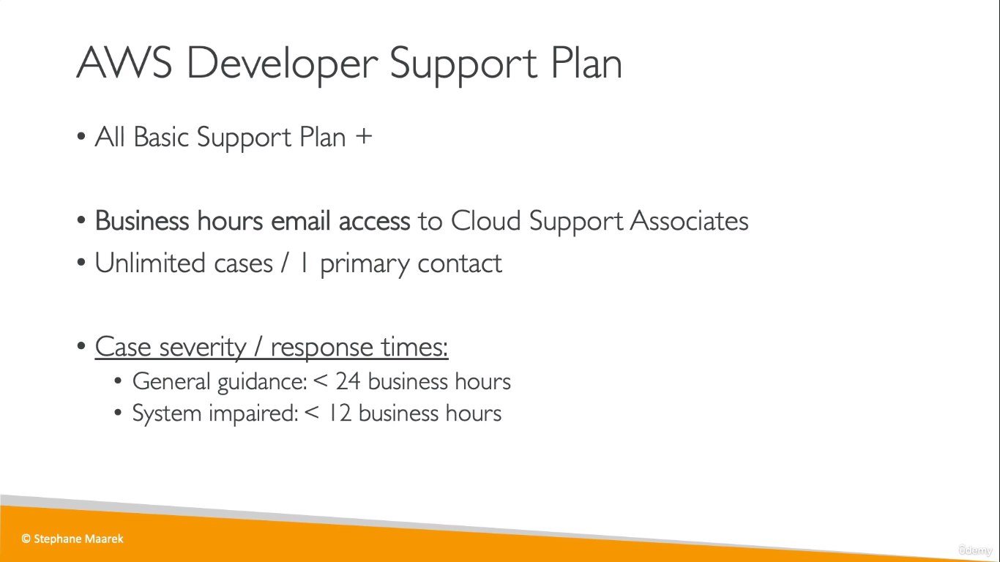
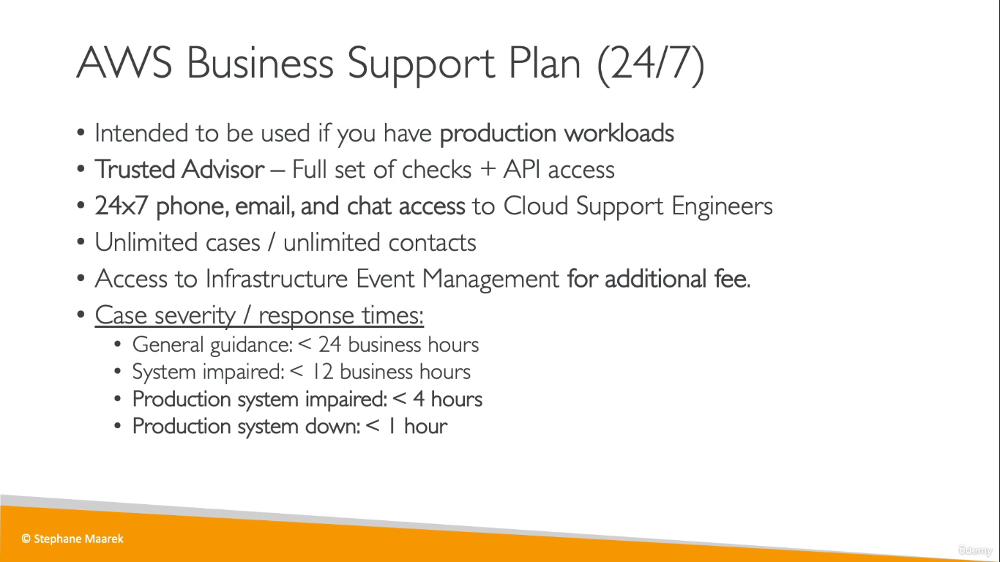
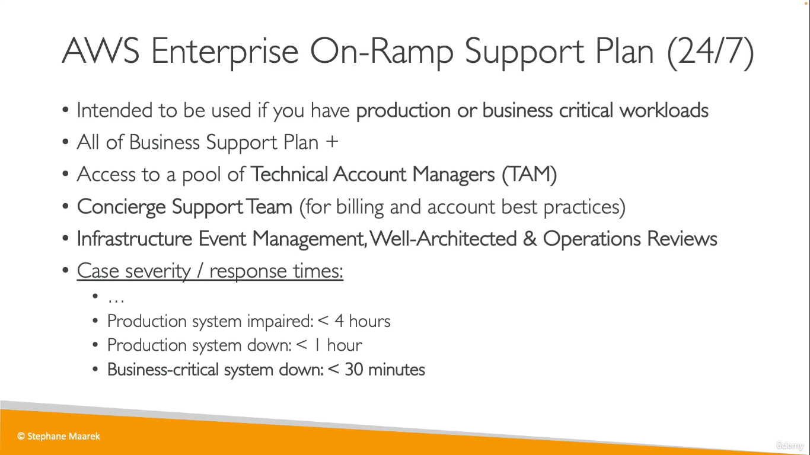
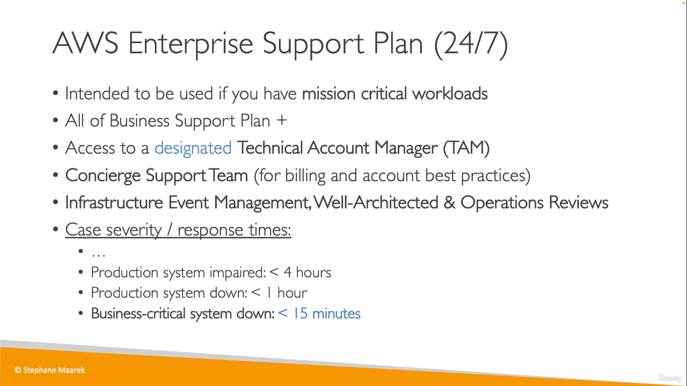

  
1. One-on-one responses to account and billing questions 
2. Support forums 
3. Service health checks
 4. Documentation, technical papers, and best practice guides

  
* Developer plan only supports general architectural guidance

  
* Business plan provides architectural guidance contextual to your specific use-cases

  
  
* Enterprise plan also provides access to online training with self-paced labs
* This plan supports architectural guidance contextual to your application.