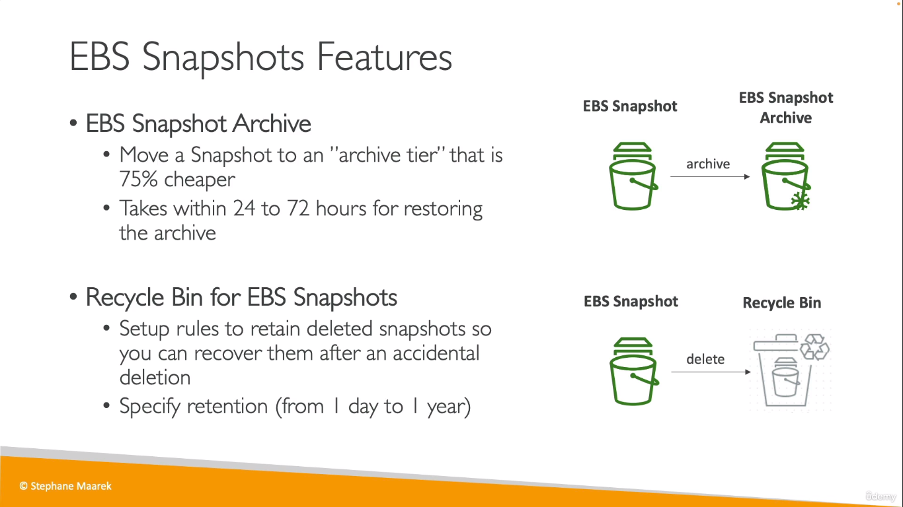
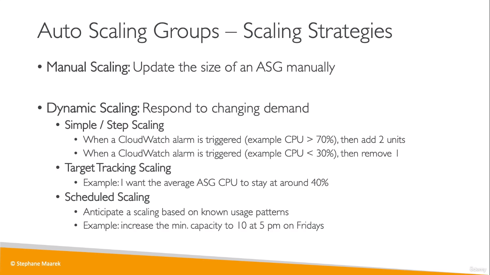
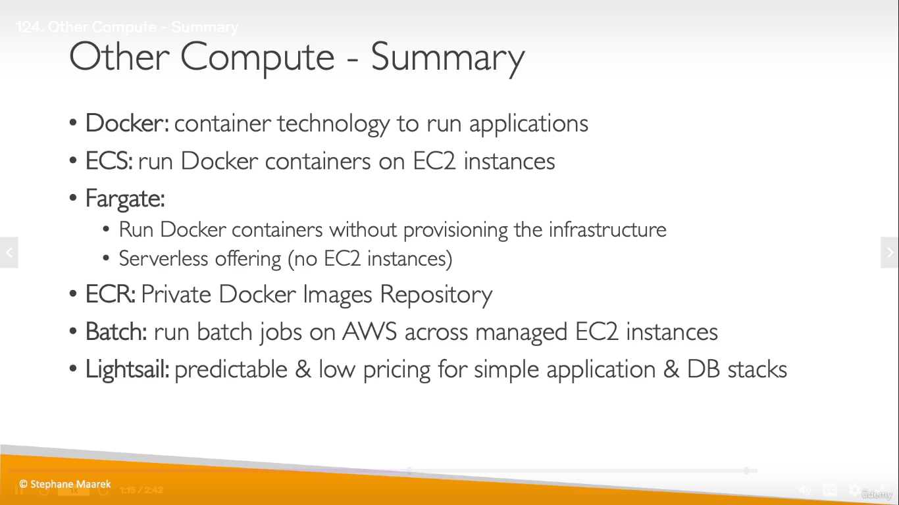
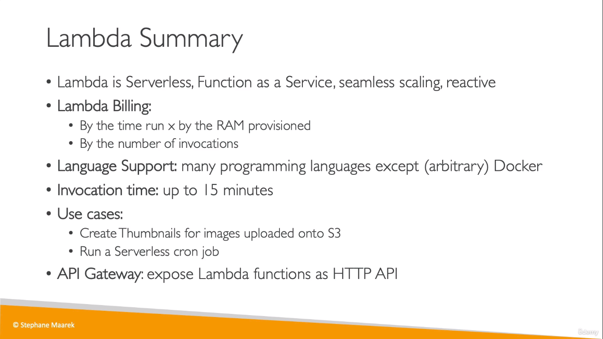
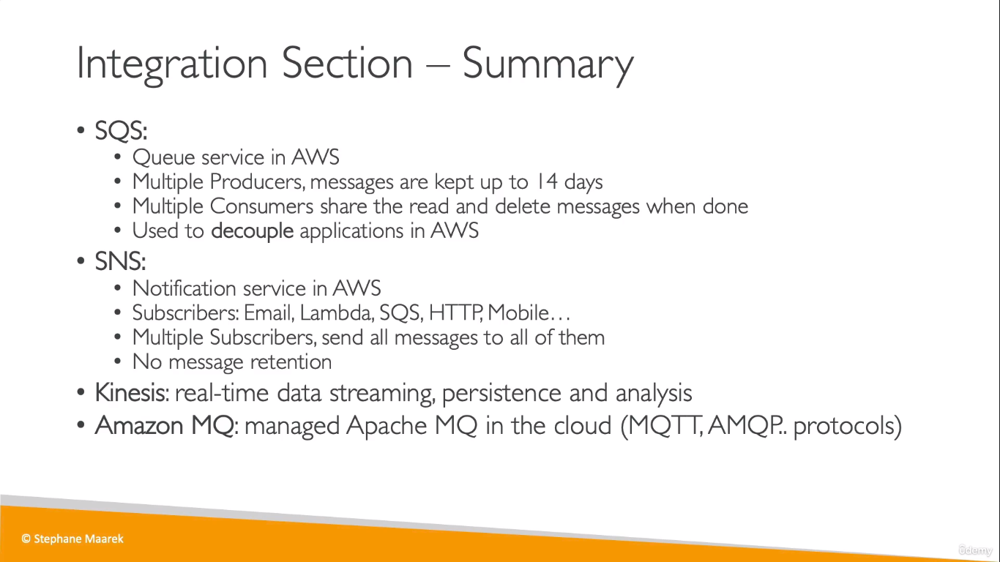

# Notes

## Cloud Computing

- Deployment Models of Cloud -> Public, Private, Hybrid
- Types of Cloud Computing - IaaS (EC2), PaaS (Elastic Beanstalk), SaaS (Rekognition)
- Capital expenditures (CAPEX) are a company's major, long-term expenses to buy, maintain, or improve its fixed assets while operating expenses (OPEX) are a company's day-to-day expenses.
- Priced for **Compute time**, **Storage** and **Data transfer OUT of cloud**
- A **region** is a cluster of data centers. Most AWS services are region-scoped
- Each region consists of 2-6 **Availability Zones** (AZ). Each availability zone (AZ) is one or more discrete data centers with redundant power, networking, and connectivity
- Amazon has 216 Points of Presence (205 Edge Locations & 11 Regional Caches) in 84 cities across 42 countries
- Global AWS Services -> IAM, Route53, WAF, CloudFront

## IAM

- Any user placed within a group will inherit the permissions associated with that group
- Permisssons are defined thru IAM policies
  > An inline policy is just nothing but creating a custom policy

* IAM users can have policies directly assigned to them aswell

### IAM Policy Structure

  

---

- Setting up a **strong password policy** or an **MFA Device** are two ways to secure your account in AWS
- MFA Devices: Virtual Devices (Apps in Smartphones) or Physical Devices
- One MFA Devicer per user
- You can access AWS through 3 methods: AWS Management Console or CLI or SDK. Authentication for CLI and SDK is done through access keys
- **SDKs** are set of libraries in some programming languages that allows you to access AWS services within your application (embedded)
- **IAM roles** are a secure way to grant permissions to entities you trust

## EC2

- Elastic Compute Cloud
- EC2 Configurations: OS, CPU, RAM, Storage (EBS, EFS, InstanceStore), NetworkCard؟ , SG, Bootstrap Script (UserData Script)
- Bootstrap Script is run only once at the instance **first start**
- When you stop an instance and start it again, the Public IPv4 address is changed
- EC2 Instance Example : m5.2xlarge
  - _m_ - instance class
  - _5_ - generation
  - _2xlarge_ - size within instance class
- EC2 Instance Types: General Purpose, Compute Optimized, Memory Optimized, Storage Optimized
- Security Groups (SG) acts as a layer of firewall for EC2 instances.
  - SGs live outside the EC2 instance
  - SGs are Scoped to Region
  - SGs contain only _allow_ rules. (Other than the authorised rules, evrything else is implicitly denied)
- Ports: 22-SSH, 21-FTP, 22-SFTP, 80-HTTP, 443-HTTPS, 3389-RDP (log into Windows Instance)
- **ec2-user** is the default user that we use to login to our EC2 Instance from the default AMI for Linux
- **EC2 Instance Connect** and SSH are two ways to connect to our EC2 Instance.
  - EC2 IC is internally reliable on SSH, so you need to allow SSH in the attached security group
- EC2 Linux/Windows - Billing per second (after first minute). All other OS Billing per minute
  > \#### **Refer EC2 Instance Plans** ####
- Instance Family, Instance Size, OS, Tenancy and Region are some of the instance attributes that come into play when choosing an instance plan for EC2
- a 3 years term would always be more cost-effective than a 1-year term. 

* **EC2 Dedicated Hosts** allows you to use existing server-bound software license
* **EC2 Spot Instances** have the biggest discount

## EBS

- Elastic Block Store
- **Network Drive** that can be attached to one EC2 instance at a time
- Can opt to retain data even after the EC2 instance is terminated; Can be used as boot volumes
- Scoped to a specific AZ. So, instances running in one AZ cannot use the EBS volumes created in another AZ.
- An EC2 instance can have multiple EBS volumes attached to it
- EBS Volumes can be used across AZs or Regions by taking a snapshot
- EBS Snapshots are stored incrementally, which means you are billed only for the changed blocks stored.
  

### Other

- **EC2 Instance Store** is a _high performance hardware_ disk that is attached to an EC2 instance
  - Not reliable, so used for temporary content storage
- EFS, a managed, shared NFS (Network File System) that can be mounted on multiple EC2 instances across multiple AZs;EC2 instances can access EFS across AZs, regions, and VPCs; can directly be used with on-premises system
  - EFS is expensive
  - EFS IA (Infrequent Access) storage class available; You will pay a fee each time you read from or write data stored on the EFS IA
  - EFS One Zone storage class is used to store data in a single AWS Availability Zone. 

## AMI

- Images that you can create for EC2 instances where you can add your own software, config, OS and stuff for faster boot time (since all the software is pre packaged)
- Bound to specific region but can be copied across regions
- **EC2 Image Builder** is a service that can be used to automate the creation of AMIs
  - Can be run on a schedule basis
  - Free service; billed for underlying resources

> Take a look at Amazon FSx

- FSx Lustre - For High Performance Computing (HPC)
- Fsx for Windows File Server

## Scaling

- **Vertical Scaling**: Increase Instance Size (Scale up/down)
- **Horizontal Scaling**: Also known as Elasticity; Increase number of instances (Scale out/in);
- **High Availability**: Instances running across multiple AZ
- **Agility**: Resources are avaiable very quickly to the developers

## LB & ASG

- **Load balancers** seamlessly handle failures by balancing workload among the healthy EC2 instances (by performing health checks regularly)
- LB can contain EC2 instances that runs in different AZs, if LB is configured to be available across multiple AZs
  > A target group is a group of EC2 instances across which the the load is balanced
- **ELB** is a managed load balancer; 3 types
  - **Application Load Balancer** (ALB) - HTTP/HTTPS - Layer7
  - **Network Load Balancer** - Ultra-high performance - millions of request per sec - Layer 4 (TCP); best suited for TCP, UDP & TLS
  - **Classic Load Balancer** (Old LB) - Layer 4 & 7
  - **Gateway Load Balancer** - analyze your IP traffic and send to 3rd party appliances
- **ASG** automatically scales out/in according to match increased/decreased load
   \* Predicitve Scaling: Uses ML to predict future traffic patterns

## S3

- Buckets must have globally unique name.
- Buckets are scoped to a region
- Part by part upload if uploading more than 5GB
- S3 Objects (files) are composed of Key, Value & Metadata
- S3 stores data in a flat non-hierarchical structure

- Bucket policy can also be used to force objects to be encrypted at upload
- S3 can host static websites. The URL will be `<bucket-name>.s3-website<-or.><Region>.amazonaws.com`
- Enabling **Bucket Versioning** is good practice. It enables you to rollback to previous versions
- Enabling **Server Access Logging** allows you to log all the requests made to the S3 bucket. Logs are stored in another S3 bucket
- **S3 Replication** occurs only if versioning is enabled on both, source and destination buckets
  _ Cross Region Replication (CRR)
  _ Same Region Replication (SRR)
  > \#### **Refer S3 Storage Classes** ####
- **S3 Object Lock** - Blocks object version deletion
- **Glacier Vault Lock** - Locked for future edits
- Encryption: Server Side Encryption; Client Side Encryption
* Data Encryption is automatically enabled for Amazon S3 Glacier & AWS Storage Gateway & CloudTrail Logs
- Lifecycle Rules can be used, to define when S3 objects should be transitioned to another storage class or when objects should be deleted after some time.

## SnowFamily

- Used for data migration IN and OUT of **AWS** and Edge Computing
- **Snowball Edge** - Transfer TBs to PBs of data - Storage Optimized (For local computing) and Compute Optimized flavours - Cluster of devices used if more data needs to be transferred
- **SnowCone** - Small & Portable - 8TBs of storage
- **SnowMobile** - Transfer EBs of data - Preferred if transferring more than 10PBs of data
- AWS **OpsHub** - Software used for configuring and monitoring snowfamily devices (instead of CLI)
- AWS **Storage Gateway** - Storage Service that allows on-premises to use AWS Cloud;  provides three different types of gateways – Tape Gateway, File Gateway, and Volume Gateway

## DB & Analytics

- Databases in AWS can be quickly provisioned and scaled
- **RDS** - Relational Database Service
  - Managed DB Service used to create databases and uses SQL
  - Suitable for OLTP systems
- **Aurora** - AWS's own database; Cloud Optimized; Supports MySQL and PostGres and claims better performance
- **Read Replicas** - used to scale read workload of RDS DB - Upto 5 Replicas possible across Regions - Writing supported to the main DB only
- **Multi-AZ RDS Deployment** - Acts as failover database; Increases availability;
- **ElastiCache** - In memory databases
- **DynamoDB** - NoSQL low latency with low latency retrieval; schemaless database; supports document models; High Availability
  - **DAX** - DynamoDB Accelerator - in memory cache for DynamoDB
  - DynamoDB **Global Tables** - replica tables in multiple regions. Active-active replication, ie- writing to any table will reflect in the main table aswell
- **DocumentDB** => AWS implementation of MongoDB (a NoSQL Database) | Just like _Aurora_ is for My/PostgresSQL
  - highly available with replication across 3 AZs
- **Neptune** - A graph database
- **QLDB** - Quantum Ledger Database
  - Immutable system that is used to review all the changes made to your application data
- Amazon Managed Blockchain - Compatible with _Hyperledger fabric_ & _Ethererum_
- **DMS** - Database Migration Service; Supports both homogenous and hetero migration; Source database remains available during migration
- **Glue** - Managed ETL Serverless Service
  _ Used to prepare and transform data for analytics
  _ Glue data catalog - catalog of datasets like table definitions that can be used by Athena, Redshift....
  > ETL - Extract, Transform & Load
- **Redshift** - OLAP
- **EMR** - creates Hadoop Clusters (BigData) to analyze data
- **Athena** - performs analytics against S3 objects
- **QuickSight** - ML powered BI service to create dashboards

## ECS & Lambda

- In ECS, we must provision and maintain the EC2 instances
- ECR (Elastic COntainer registry)is where ECS/Fargate looks for your docker images to run
- Batch jobs are used to run batch computing jobs defined as docker images and run on ECS
- LightSail - Service which provides enhanced UI For babies who are new to cloud and have 0 experience; Used for simple web applicatons and websites (with wordpress)
  
- Lambda is event-driven and cheap

---

- **API Gateway** - Fully Managed Service for developers to create and monitor APIs
- Serverless Services: S3, Fargate, DynamoDB, Lambda....

## CloudFormation

- CloudFormation Template is where you can create your infrastructure (as code) and store it in a template
- Easy to destroy and recreate infrastructure
- CF Template is usually in YAML/JSON File
- **AWS CDK** - Cloud Development Kit; Used to define the cloud infrastructure with a familiar programming language rather than JSON/YAML

## BeanStalk

- Developer friendly service to deploy application
- No need to manage infrastructure (but stil can configure if needed) | PaaS
- Has health monitoring for underlying infra

- CodeDeploy - Hybrid Service
- OpsWorks - Chef & Puppet
- CloudFormation and BeanStalk are free services

## SSM

- Systems Manager
- Hybrid service, used to manage EC2 & on-premises systems
- Provides operational insights about the state of the infrastructure
- Can be used to run one single command across a fleet of EC2 instance and similarly automation of patching and stuff
- Requires SSM agents running on the systems
- More Secure because **SSM Session Manager** does not require port 22, unlike EC2 instance connect, to SSH into the instance

## Global infrastructure

- Decreased Latency, Disaster Recovery and Attack protection are 3 reasons why your application should be global
- **Route 53** - A managed DNS Service used to route traffic across multiple regions; Domain registration also available
  - Simple Routing Policy - No health Checks
  - Weighted Routing Policy - Routing based on weights assigned to EC2 instances
  - Latency Routing policy - Based on low latencykv
  - Failover Routing Policy - routes to another instance if primary instance fails

## CloudFront

- CDN; Content is cached at the edge; DDos protection (because worldwide)
- S3 as an origin - Enhanced security with CloudFront **Origin Access Identity** (OAI)
- Great for static content whereas S3 CRR is great for dynamic content
- **S3 Accelerator** is used to increase transfer speeds of files (from client to S3) by transferring files first to the nearest Edge location which leverages the private AWS network instead of public network. 
* **AWS Global Accelerator** uses the AWS global network to optimize the path from your users to your applications
- **AWS Outposts** - Physical servers by AWS that comes in with the AWS infrastrcture and services just as in the cloud which can be used on-premises
- **AWS Wavelength** - infrastructure deployments embedded within the edge of **5G networks** for ultra low latency apps

* **AWS Local Zones** - Brings applications even closer by extending the VPC to more locations available only on specific regions like us-east-1 for latency purposes

## Cloud Integration

- SQS, SNS, Kinesis - used to **decouple** your application
* **Amazon MQ** - Service used by companies who've migrated to the cloud from on-premises and were using open protocols (Instead of SNS/SQS which are "cloud native")

## CloudWatch 
* Provides **metrics** to monitor for different AWS Services
  

* CloudWatch **Alarms** are used to trigger actions if any metric passes the actual/forecasted threshold that was set
  * The actions are Auto Scaling, EC2 Actions (terminate/reboot/..), SNS noti
* CloudWatch **Logs**; Need to run CloudWatch agent on instance if you want logs from EC2 instances or on-premises
* CloudWatch **Events**; Can be  used for scheduling CRON jobs or reacting on an event pattern such as _IAM Root User sign-in Event_
* CloudWatch Events = **Amazon EventBridge**; Can receive events from thirdparty services/apps aswell

## CloudTrail
* Records all the events/API calls happening in your AWS account. applied to all regions by default
* Can push logs to S3 bucket / CloudWatch logs cuz events are stored only for 90 days
* CloudTrail Events are of 3 types: Management Events, Data Events, CloudTrail Insights Events
* By default only management events are logged, not data events. data events happen at object level in S3 for ex
* **CloudTrail Insights** - used to analyze unusual activity 
* **AWS Xray** - helps developers analyze and debug production, serverless and distributed applications
* **CodeGuru**: ML-Powered **Code Reviewer** and improves **application performance**; Made up of twi sub services? CodeGuru Reviewer and CodeGuru Profiler
* **Service Health Dashboard** - dashboard to know that if AWS Services have been working properly (from the side of AWS)
* **Personalized Health Dashboard** - personalized version of SHD; Provides info on outage of services will affect you and a possible workaround

## VPC
* Virtual Private Cloud; Regional;
* Subnets are used to partition your network inside VPC; tied to a speciic AZ
* Public subnet has internet access whereas a private subnet does not (by default)
* **CIDR Range** - range of IP addresses allowed inside your VPC
* **Internet Gateway** - helps VPC to connect to the internet
* **NAT Gateway** (AWS Managed) & **NAT Instances** (self managed) allow instances in Private Subnet to access internet
* **NACL** - Network ACL; Firewall that controls traffic from and to subnet; has both ALLOW and DENY rules; Attached at subnet level
  * _stateless_, since return traffic must be explicitly allowed where as SG is _stateful_ as return traffic is allowed by default
  * A NACL contains a numbered list of rules and evaluates these rules in the increasing order while deciding whether to allow the traffic
* **VPC Flow Logs** - used to record logs of all the IP traffic; VPC/Subnet/Elastic Network INterface flow logs
* **VPC Peering** - Used to connect 2 VPC using private AWS network; Not transitive;
* **VPC Endpoints** - Used to connect to AWS Services using AWS Private Network
  * VPC Endpoint **Gateway** for S3, DynamoDB whereas VPC Endpoint **Interface** for rest of the services
* **Site-to-site VPN** & **Direct Connect** - used to connect to on-premises data centres to VPC; S2S VPN goes over the public network whereas DIrectConnect will establish a **physical** connection and will go over the private network
* **Customer Gateway** - used on the on premises data centre for S2S VPN whereas **Virtual Private Gateway** is used on the AWS side
* **Transit Gateway** - Transitive gateway of VPC Peering; Can connect multiple VPCs (including on-premises)

## Security
* AWS - Security **OF** the Cloud; User - Security **IN** the Cloud
* AWS Shield - protection againts DDoS attack; Standard (free) & Advanced (24/7 protection, protection against more sophisticated attack on Amazon EC2, ELB, CloudFront, AWS Global Accelerator and Route 53)
* AWS WAF - protection against web exploits on web application; Usually deployed on ALB, API Gateway & CloudFront
* Penetration Testing
* **AWS KMS**: Key Management Service; Manages Encryption keys for us
* **CloudHSM**: Hardware provisioned & managed by AWS; Encryption keys managed by user entirely

  
* **Amazon GuardDuty**: Checks for abnormal activities in AWS account by monitoring Logs from cloudWatch, VPC, DNS.. and using ML techniques
* **Amazon Inspector**: Security assesments (Package vulnerability & Network Reachability) for EC2 instances and containers 
* **AWS Config**: Used to record configurations and changes for your AWS resources that you may change overtime
* **Amazon Macie**: Used for identifying possible leak of personal (identifiable) information (PII) or sensitive data with the help of ML tekniks
* **AWS SecurityHub**: Central security tool to manage security across multiple AWS accounts and automate security checks
* **Amazon Detective**: Analyzes, investigates and quickly identifies the root cause of security issues (using ML and graphs)
* **AWS Certificate Manager** (ACM): Provision, manage and deploy SSL/TLS Certificates
* **AWS Secrets Manager**: Meant for sotring secrets; capability to force rotation of secrets; integration with RDS; encrypted using KMS
* **AWS Artifact**: Portal that has all the AWS _**compliance documentation**_, _**agreements**_, and legal informations
* Abusive & prohibited behaviours like Spam, port scanning, DDoS attacks.. should be reported to **AWS Abuse** team

  

## Machine Learning
* Rekognition; Find images, objects, text, people in images and videos using ML; Facial analysis and Facial Search
* Transcribe: Speech to Text
* Polly: Text to Speech
* Translate: Language translation
* Amazon Lex: same technology that powers Alexa
* Amazon Connect: Receive calls; Virtual contact center; Lex & Connect used together for chatbots, call center bots
* Amazon Comprehend: For Natural Language Processing (NLP); Extracts key phrases from text and understands how positive/negative the text is
* SageMaker: Service for developers to build ML models
* Forecast: Delivers highly accurate forecasts
* Kendra: Document search service
* Personalize: provides real-time personalized recommendations

## Account Management
* **AWS Organizations**: Manage multiple AWS accounts; Consolidated Billing
* An account can be removed from AWS organizations only if the AWS account can operate as a standalone account. ie - you must accept the AWS Customer Agreement, choose a support plan, provide and verify the required contact information, and provide a current payment method. 
* **Service Control Policies** (SCP): Used to restrict account privileges; Can be Applied at both, the OU level and account level
  * SCP to Master Account does not do anything
  * DENY rules have precedence over ALLOW
* The Reserved Instances bought can be used across those multiple accounts, if it is left unused (only within the same AZ as RI was bought) AND volume discounts for Amazon EC2 and S3 aggregated across multiple accounts
* **AWS Control Tower**: Easy, automated method to set up multi account environment; Runs on top of AWS Organizations
* 4 pricing models of AWS: pay as u go, save when u reservce, pay less by using more, pay less as AWS grows
* Reservations are available for EC2 RI, DynamoDB Reserved Capacity, ElastiCache Reserved Nodes, RDS Reserved Instance, Redshift Reserved Nodes
* EC2 instance is billed on **pay per second** for Linux/Windows and pay per hour for other OS
* EBS is billed for provisioned GB per month. Extra for snapshots-GB/month
* RDS - per hour billing; no additional charge for backup storage
* Private IP = Low cost in AWS than public IP
* As Per AWS pricing, data transfer between S3 and EC2 instances within the same region is not charged
* **AWS Compute Optimizer** - Uses ML to analyze resource's config and utilization from CloudWatch metrics and helps to reduce cost by recommending optimal options; Supported resources: EC2 Instances, Lambda Functions, EBS Volumes, EC2 ASG
> \#### Take a look at _pricing_ model for various resources if needed (Pg 385)####

* **Pricing Calculator** is also known as Total Cost Ownership (TCO). Used to estimate the cost for your solution architecture
* **Cost allocation tags** used to track AWS costs on detailed and organized manner; You must activate both AWS generated tags and user-defined tags separately before they can appear in Cost Explorer or on a cost allocation report
* You can maintain a collection of resources that share common tags (not cost allocation tag) using the _Tag Editor_
* **Cost and Usage Report**: Provides the most comprehensive and detailed report of AWS cost and usage
* **Cost Explorer**: Visual representation of AWS costs and usage over time; Provides the ability to forecast usage upto 12 months based on previous usage; Recommends Savings Plan
* **Billing alarms** is in us-east-1 but is actually for overall worldwide AWS costs; Alarms for actual cost, not projected cost
* **AWS Budgets**: Create budget and send alarms if cost exceeds the budget
  * 3 types of Budget: : Usage, Cost, **Reservation**(RI)
* **Trusted Advisor**: Analyzes your AWS accounts and provides recommendation on 5 categories: Cost Optimization, Peformance, Security, Fault Tolerance, Service Limits
  * Basic & Developer **Support Plan**: 7 Core checks;
  * Business & Enterprise Support Plan: FULL Checks and AWS Support API access
> \#### **Refer Support Plans** ####
* **Credits** are like discount coupons. They are applied in the following order: Soonest expiring, Least number of applicable products, Oldest credit; The credit is applied to the maximum amount first;

## Advanced Identity
* **AWS STS**: Security Token Service; Enables you to create temporary, limited- privileges credentials to access your AWS resources
* **Cognito**: Identity for web and mobile application users; database of users

  

* AWS SSO: **Single Sign-On**; ability to access multiple accounts and 3rd-party business applications like DropBox, Office365..
  * Integrated with on-premises AD and AWS Organizations

## Other Services
* **Amazon Workspaces**: solution to easily provision Windows or Linux desktops; Great to eliminate management of on-premise VDI (Virtual Desktop Infrastructure)
* **Amazon AppStream 2.0**: Desktop Application Streaming Service; delivered within a webBrowser
* **Amazon Sumerian**: Create and run VR, AR and 3D applications with animations
* **AWS IoT Core**: allows you to easily connect IoT devices to the AWS Cloud; Serverless, secure & scalable;
* **Amazon Elastic Transcoder**: Used to convert media files stored in S3 bucket from one format to another 
* **AWS Device Farm**: To test application against wide variety of devices - desktops, mobiles, tablets..
* **AWS Backups**: Central service to manage and automate backups across AWS services
* Disaster Recovery (DR) Strategies [in increasing order of cost]
  * **Backup and Restore** using S3; Minimal Cost
  * Pilot Light: using EC2 which contains only the core functions of the app; minimal set up
  * Warm Standby: full version of the app but at minimum size
  * Multi-site/Hot-Site: full version, full size

  

* **AWS DataSync**: Move large amount of data from on-premises to AWS; replication tasks are _incremental_ after the first full load
* **AWS Fault Injection Simulator** (FIS): Service to stress your application by creating disruptive events and observing how the system responds
* **AWS Marketplace**: You get Custom AMIs, SaaS, CloudFormation Templates & Containers 
## AWS Ecosystem
* 6 pillars of Well Architected Framework: Operational Excellence, Reliablity, Security, Performance Efficiency, Cost Optimization, Sustainability
> \#### Take a look at 6 pillars in detail if needed ####
* **AWS Well Architected Tool** - tool to review architecture against the 6 pillars by answering questions and getting recommendations and advice to adopt best practices
* Important to right-size **before a cloud Migration** and **continuously after cloud onboarding process**

  
* AWS Knowledge Center contains FAQs
* **AWS Quick Starts**: built by AWS solutions architects and partners to help you deploy popular technologies on AWS
  * Each Quick Start includes AWS CloudFormation templates that automate the deployment and a guide that discusses the architecture and provides step-by-step deployment instructions.
*  **AWS Whitepapers** are technical content authored by AWS and the AWS community to expand your knowledge of the cloud. 
## New Services:
* **Amazon Pinpoint** allows marketers and developers to deliver customer-centric engagement experiences by capturing customer usage data to draw real-time insights
* **AWS Migration Evaluator** is a complimentary service to create data-driven business cases for AWS Cloud planning and migration.
___
> Careful with
> * OpsHub vs OpsWorks
> * CloudFront vs CloudFormation
> * Services ending with "gateway"
> * connect & Direct Connect
> * S3 Storage classes
> * SNowfamily devices, Ec2 instance plans
